## 简介

介绍玩家输入 `Enhanced Input`、玩家控制器 `Player Controller` 相关内容。

## Enhanced Input

### 相关配置

#### 插件

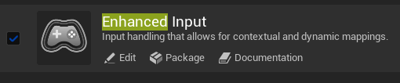

#### 模块

```
EnhancedInput
```

#### 项目设置

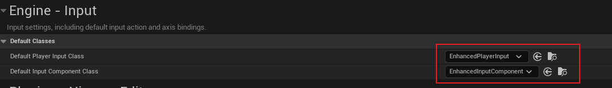

### Input Action

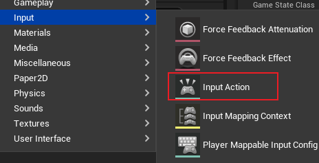

表示创建一个根据 轴向、数值(与之前老的 `input` 项目配置差不多) 的输入动作，这里创建一个二维的输入：

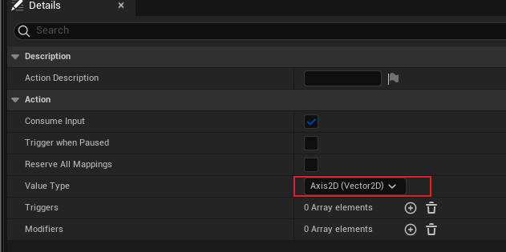

具体如何使用，需要配合 `Input Mapping Context`。

### Input Mapping Context

> `IMC` 用于 <u>指定用于配置的**设备输入来触发上述的 `Action`**</u>，同样也可以配置不同的触发方式。

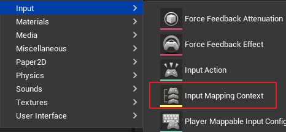

该内容用于绑定 `设备输入 <--> Input Action`，借用上述的二维输入为例：


> - `红色` 部分为 `Input Action`
> - `绿色` 部分为 对应的设备输入
> - `蓝色` 部分为 `Modifiers`，用于对 `Action` 的输入值进行修改

#### Modifiers

在上图中，`Action` 是一个 `Axis2D` 的输入值，其默认是一个 `Vector2D`。

当我们按下 `Mapping Context` 中的 `D` 时，默认会将 `X` 轴赋予 `1`，我们可以向上图一样通过 `Modifiers` 将值进行反转（ `Negate`），或者修改轴向顺序（`Swizzle Input Axis Value`，使 `XYZ -> YXZ`）。

## Player Controller

在 `PlayerController` 中我们需要应用 `Enhanced Input`，通过上述的项目设置，我们可以将默认的 `InputComponent` 设置为 `EnhancedInputComponent`。

头文件：

```C++
#include "EnhancedInputSubsystems.h"
#include "EnhancedInputComponent.h"
```

### BindAction

在 `UE` 为我们的 `PlayerController` 设置 `InputComponent` 时，即在 `SetupInputComponent`时，我们可以对其进行绑定 `Action`：

```C++
void AMyPlayerController::SetupInputComponent()
{
	Super::SetupInputComponent();

	//
	UEnhancedInputComponent* EnhanceInputComponent = CastChecked<UEnhancedInputComponent>(InputComponent);

	EnhanceInputComponent->BindAction(MoveAction, ETriggerEvent::Triggered, this, &AMyPlayerController::Move);
}
```

上述代码中的 `MoveAction` 为成员变量：

```C++
UPROPERTY(EditAnywhere, Category = "Input")
TObjectPtr<class UInputAction> MoveAction;
```

可以指定一个蓝图 `Input Action` 类：

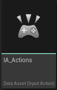


并且绑定一个被触发的方法：`AMyPlayerController::Move`

```c++
void AMyPlayerController::Move(const FInputActionValue& InputActionValue)
{
	const FVector2D InputAxisVector = InputActionValue.Get<FVector2d>();
	const FRotator Rotation = GetControlRotation();
	const FRotator YawRotation(0.0f, Rotation.Yaw, 0.0f);

	const FVector ForwardDirection = FRotationMatrix(YawRotation).GetUnitAxis(EAxis::X);
	const FVector RightDirection = FRotationMatrix(YawRotation).GetUnitAxis(EAxis::Y);

	if (APawn* ControlledPawn = GetPawn<APawn>()) {
		ControlledPawn->AddMovementInput(ForwardDirection, InputAxisVector.Y);
		ControlledPawn->AddMovementInput(RightDirection, InputAxisVector.X);
	}

}
```

> 这里简单解释一下 `GetControlRotation()`，在 [这篇博客](https://www.cnblogs.com/Tonarinototoro/p/13493626.html) 中提到，**<u>`ControlRotation` 其实就是 `ActorRotation`，只不过这个 `Rotation` 存在于 `Controller` 中</u>**。
>
> 为了降低代码耦合度，在上述代码中，通过 `GetControlRotation` 函数可以获得控制的 `Character` 的旋转。
>
> 来看看源代码：
>
> 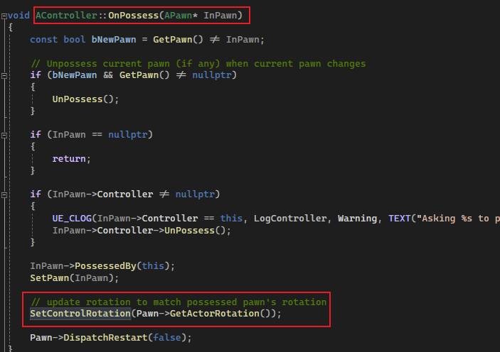
>
> 在 `Controller` 中，`OnProcess` 执行时（即控制了 `Pawn`），就会调用 `SetControlRotation`，将被控制的 `Pawn` 的 `Rotation` 赋值给 `ControlRotation`。

这里绑定一个有一个 `FInputActionValue` 类型参数的成员函数。

在该函数中，设置了 `ControlledPawn` 的 `Movement Input`。（以 `X` 轴为前，`Y` 轴为右）

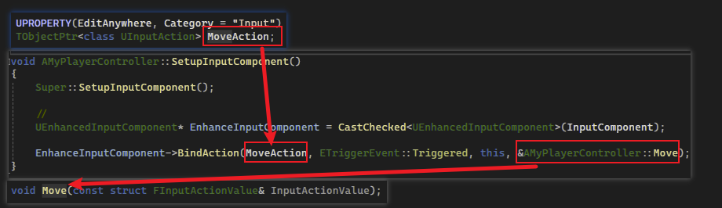

### AddMappingContext

在 `BeginPlay` 中，我们需要去添加 `IMC`：

```C++
//设置 subsystem
UEnhancedInputLocalPlayerSubsystem* Subsystem = 
  
   ULocalPlayer::GetSubsystem<UEnhancedInputLocalPlayerSubsystem>(GetLocalPlayer());

//只有当前Game instance 的 playercontroller 才是 LocalPlayer
//例: listen server 中会有多个playercontroller, 但只有自身的 game instance 才是 local player
//在 client 中会有 playercontroller 从服务端复制过来, 并且local player 为自身
if (Subsystem) {
    Subsystem->AddMappingContext(Context, 0);
}
```

如上述注释所言，`Subsystem` 会在服务端的情况下为空，但不影响运行，所以需要进行判断。

而最主要的就是获得 `UEnhancedInputLocalPlayerSubsystem`，然后将 `IMC` 给添加进去，和 `Action` 相同，可以在蓝图类中进行设置（`Context` 成员变量）：

```C++
UPROPERTY(EditAnywhere, Category = "Input")
TObjectPtr<class UInputMappingContext> Context;
```

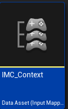

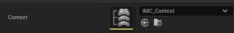

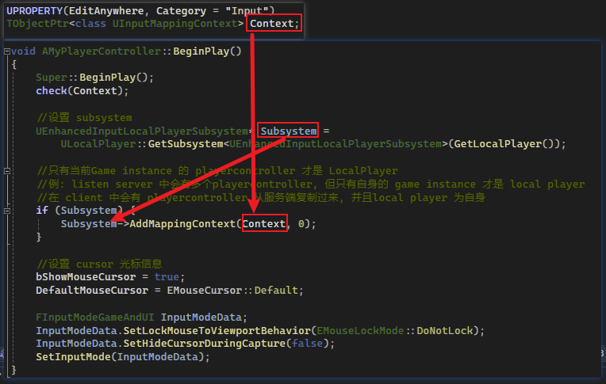

## Character

在 `Character` 中，我们需要修改一些 `MovementComponent` 的一些属性：

```C++
AMyControlCharacter::AMyControlCharacter()
{
	auto CharacterMovementComp = GetCharacterMovement();
	CharacterMovementComp->bOrientRotationToMovement = true;	//使角色朝向加速方向
	CharacterMovementComp->RotationRate = FRotator(0.f, 400.f, 0.f);	//旋转速率
	CharacterMovementComp->bConstrainToPlane = true;	//限制在一个平面
	CharacterMovementComp->bSnapToPlaneAtStart = true;

	bUseControllerRotationPitch = false;
	bUseControllerRotationRoll = false;
	bUseControllerRotationYaw = false;
}
```

## 补充

即然讲到玩家输入，那这里将补充 **<u>玩家输入如何通过 `PlayerController` 来控制当前角色的移动和转向。</u>**

> 参考 [【UE4】一图看懂移动同步（上）.png](https://github.com/xiaxia9/Game-Development-Notes/blob/main/UE/%E3%80%90UE4%E3%80%91%E4%B8%80%E5%9B%BE%E7%9C%8B%E6%87%82%E7%A7%BB%E5%8A%A8%E5%90%8C%E6%AD%A5%EF%BC%88%E4%B8%8A%EF%BC%89/%E3%80%90UE4%E3%80%91%E4%B8%80%E5%9B%BE%E7%9C%8B%E6%87%82%E7%A7%BB%E5%8A%A8%E5%90%8C%E6%AD%A5%EF%BC%88%E4%B8%8A%EF%BC%89.png)


首先是玩家输入部分，如上图：<u> `PlayerController` 会在**每一帧中监测玩家输入**，然后通过 `EnhancedInputComponent` 的 `IMC` **找到对应的 `Action`**，然后再根据 `BindAction` 绑定过的方法 **找到对应执行的函数**，**执行这个函数并且将输入的 `Value` 传入这个函数中**</u>。


然后就是 **移动**，`PlayerController` 找到绑定的函数后（在本篇中为 `AMyPlayerController::Move`），在该函数中 调用了 `AddMovementInput`，是个 `APawn` 的函数，这个函数会根据传入的方向和值的大小，进行移动组件相关属性的设置，然后移动组件在 `Tick` 中进行对应运算。

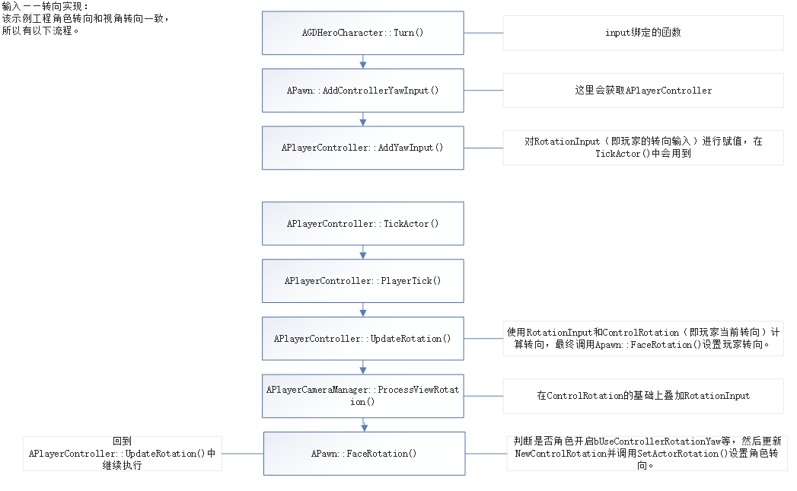

接着是没有涉及到的内容，**转向**。

如上图，同样是 `PlayerController` 找到对应的函数，在转向中，`APawn` 也提供了一些方法：`AddControllerYaw(Pitch/Roll)Input`。

这些方法会通过传入旋转值的大小，设置相关属性。然后 `PlayerController` 在 `Tick` 中，会通过 `CameraManager` 来改变视角的位置。

最后通过判断是否 `bUseControllerRotation`，判断 `APawn` 是否跟随旋转。