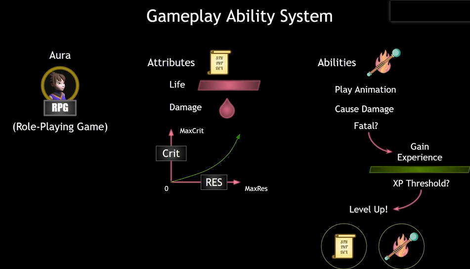
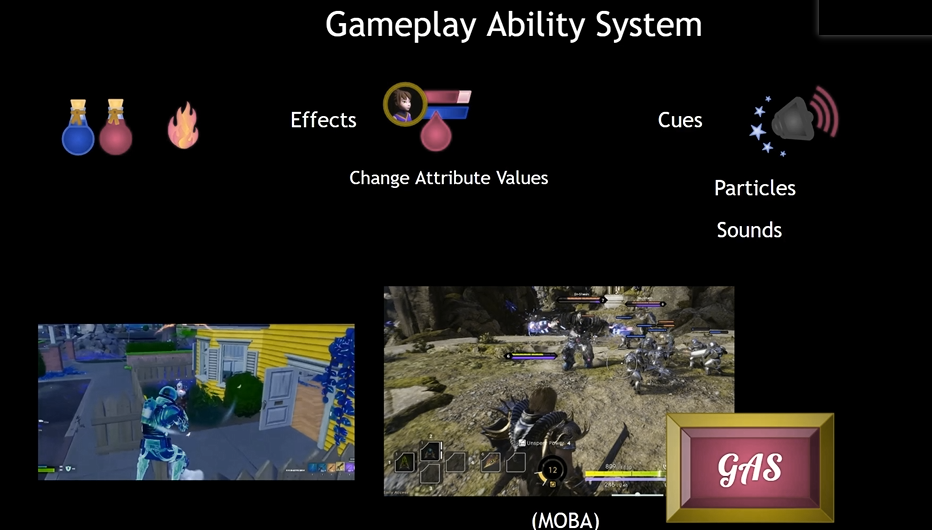
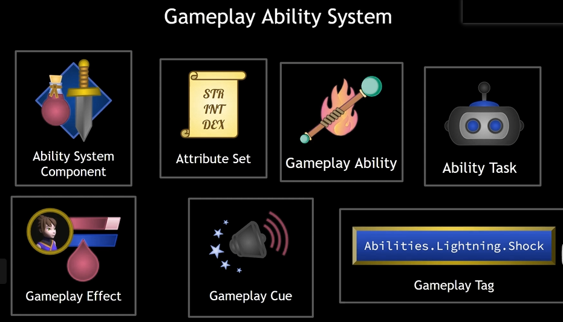
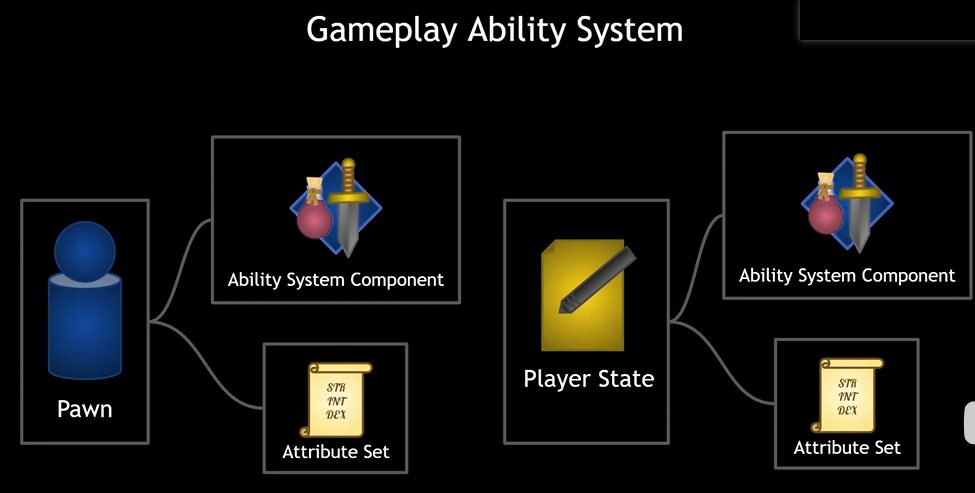
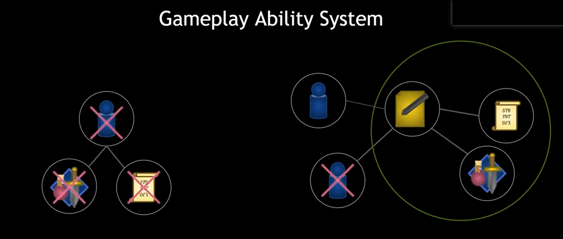
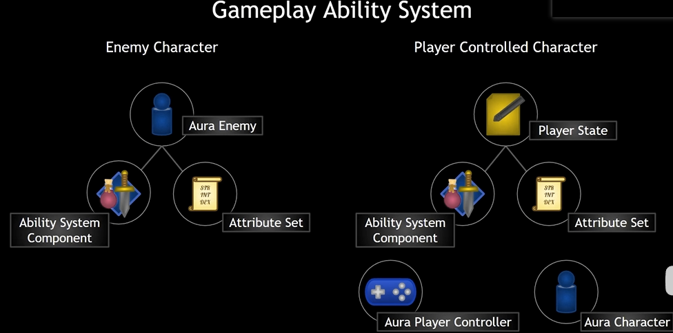

## 简介

**Gameplay Ability System（GAS）**  是一个高度灵活的框架，可用于构建你可能会在RPG或MOBA游戏中看到的技能和属性类型。你可以构建可供游戏中的角色使用的动作或被动技能，使这些动作导致各种属性累积或损耗的状态效果，实现约束这些动作使用的"冷却"计时器或资源消耗，更改技能等级及每个技能等级的技能效果，激活粒子或音效，等等。简单来说，此系统可帮助你在任何现代RPG或MOBA游戏中设计、实现及高效关联各种游戏中的技能，既包括跳跃等简单技能，也包括你喜欢的角色的复杂技能集。（摘抄自 [官方描述](https://dev.epicgames.com/documentation/zh-cn/unreal-engine/gameplay-ability-system-for-unreal-engine?application_version=5.0)）

## Attribute & Ability

属性与效果。

一个角色中可以有许多的属性值（`Attributes`），属性值可以记录角色的信息。

同样的，角色中会有许多的能力（`Abilities`），这些 `Ability` 包括了可以造成伤害、播放动画、或者说一些其他效果（击杀后获得经验）：

## Effect & Cue

同样的，还要一些可以 增强/削弱 角色的效果（`Effects`），这些 `Effects` 可以是一些道具，也可以通过 `Ability` 造成，用于改变角色的 `Attributes`。

另外，游戏的一些机制会给玩家一些提示（`Cue`），类似一些音效、视觉效果。

## 主要内容

### Ability System Component

这是最重要的一个组件，只有拥有这个组件的 `Actor`，才拥有<u>授予能力（ `Abilities` ）、激活这些能力、处理特定能力被激活/应用时的通知</u> 等等。

### Attribute Set

记录了角色应该拥有的 `Attributes`。

### Gameplay Ability

用于封装角色拥有的各种能力，通过异步任务 `Ability Task` 执行。

### Gameplay Effect

用于改变 `Attributes`，可以随着时间、周期进行改变。

### Gameplay Cue

用于一些游戏机制的提示，音效、视觉效果

### Gameplay Tags

独立于 `GAS` 之外，可以通过层级结构来定义一些游戏标签。

## 如何设计

如上图，我们可以得到左右两种设计方案，一种是将 `GAS` 作为 `Pawn` 的成员；另一种则是置于 `Player State` 中。

在多人游戏中，如果我们将 `GAS` 置于 `Pawn` 中时，当这个 `Pawn` 被销毁时，`GAS` 相关内容也会被销毁，那么 <u>**这些信息将无法被保存**</u>。当我们重新生成 `Pawn` 时，则会恢复为默认值。

而在 `Player State` 中，即使销毁 `Pawn` 也不会丢失信息：

因此我们可以进行如下设计：

玩家相关内容可以记录于 `Player State` 中，类似 `Enemy` 的角色则可以直接置于其角色中。