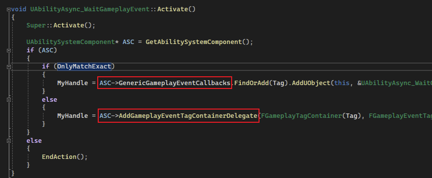

## 简介

经过一段 `GA` 的简介，从本篇开始介绍和 `GA` 相关的模块：`Ability Task`。

在正式介绍 `Ability Task` 之前，这里将从一个已经实现好的 `Ability Task` 作为切入点，先窥探其中的秘密：

如上图，这里调用一个经典的蓝图函数：`Play Montage And Wait`，这个是 `Ability Task` ：

如上图，这个蓝图函数是在 `UAbilityTask_PlayMontageAndWait` 实现的一个 `static` 的蓝图函数，其成员中：

包含了上图的四个委托，在创建这个类时，`Play Montage And Wait` 这个蓝图函数的四个输出引脚分别表示了这四个委托。

在静态函数的定义中：

上图所示中有一个非常重要的函数 `NewAbilityTask`，这个方法表示创建一个 `AbilityTask` 对象。

另外还有一个比较重要的函数 `Activate` ：

这个函数和 `GA` 的 `ActivateAbility` 一样，不需要手动调用，只需要在子类中重写，表示这个 `Ability Task` 真正去做的事情。

同样，它也不需要在上述的静态函数中手动调用。

> 以后我们要定义自己的 `Ability Task` 时，通常也需要像 `Play Montage And Wait` 一样：
>
> - 先定义一个创建对象的蓝图可调用的工厂方法；
>
> - 然后定义 `Activate` 函数，定义真正需要执行的操作。

> 现在肯定还很困惑，毕竟没有亲手实现，后续会慢慢介绍。

## Gameplay Event

除了上述介绍的 `PlayMontageAndWait` 以外，这里将介绍另一个很好用的 `Ability Task`，即 `WaitGameplayPlay` ：

如上图蓝图节点所示，其在底层和 `PlayMontageAndWait` 一样：

都是拥有一个创建对象的静态方法，以及一个蓝图可绑定的委托，在其 `Activate` 方法中：

可以看到，它实际上做的事情是将蓝图中可以绑定的委托，通过 `ASC` 添加到 `Gameplay Event Tag Container Delegate` 中：

即 `Tag` 和 `Event` 相关联的一个容器。

至于何时触发，可以通过 `UAbilitySystemBlueprintLibrary` 的 `SendGameplayEventToActor` 方法：

如上图，通过 `Tag` 找到对应的 `Event`，然后再进行触发，在这个 `Ability Task` 中即为蓝图的 `Event Received` 引脚。

## 使用

得知了 `Gameplay Event` 强大的功能后，现在我们开始考虑如何使用它。

在之前角色发射投射物的 `GA` 中，如果我们在激活 `GA` 时：需要播放播放一段动画，并且我们希望在动画播放到某一个时刻时，在进行投射物的生成。

我们便可以<u>使用 **`Anim Notify` 通知这一时刻的到来**，并且使用 **`SendGameplayEventToActor` 和 `Tag` 来通知事件调用**。</u>

首先我们需要一个 `Tag`、`Montage` 和 `AnimNotify`：

如上图，我们修改一下 `AnimNotify` ：

如上图，我们需要重写 `Received Notify` 函数，并且添加 `EventTag` 成员变量，然后在这个函数中调用 `SendGameplayEventToActor`，这样当这个 `Notify` 被 `Montage` 触发时，就会执行上述重写的函数，然后通过 `Tag` 去调用 `Gameplay Event`。

然后我们要在 `Montage` 中添加这个 `Notify` ：

如上图，在指定序列帧中添加 `Notify`，并且初始化 `EventTag` 成员，这样当 `Montage` 抵达这个序列帧时，就会执行 `Received Notify` 函数。

接着我们需要创建这个 `Tag` 对应的 `Gameplay Event`，显而易见，这个需要在 `GA` 中创建：

如上图所示，在激活 `GA` 时，我们需要 `Play Montage` 播放一段动画，然后添加一个 `GameplayEvent(指定 Tag)`，然后当这个 `Event` 触发时，调用对应生成投射物的函数：

只是挪了个位置，并且声明为 `BlueprintCallable`。

这样在播放 `Montage` 抵达 `Notify` 那一帧时，便会通过 `Tag` 调用 `GamplayEvent` ，然后生成投射物：

> 然而我们的问题还没完全解决，仍需努力~