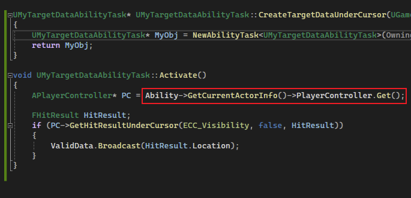
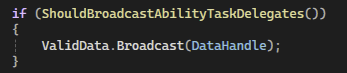

## 简介

通过前几篇的学习，我们制作了一个投掷物的 `GA`，并且使用了两个 `GAS` 中已经实现的 `Ability Task`。

在本篇中，我们将修复投掷物的问题，<u>让其能够往正确的方向去发射投掷物</u>。在这我们使用 `Ability Task` 来实现这一操作。

## 自定义 Ability Task

为了修复上述的问题，我们需要获取鼠标点击的位置，在这里我们通过自定义的 `Ability Task` 来实现：

和之前使用的 `Ability Task` 一样，我们需要定义静态的创建方法，并且实现 `Activate` 方法，然后定义一个动态的多播委托，这样在蓝图中调用静态创建方法时：

便会如上图所示。

> `Valid Data` 是一个委托成员，`Data` 是其参数，即在蓝图中进行绑定。

然后我们实现这些方法：

如上图，这里获取 `PlayerController` 的方法是通过 `Ability` 成员获取 `Actor Info`，然后通过其内置获得光标点击位置的方法，获得位置后将委托成员进行广播。

`Actor Info` 是一个有很多信息的数据集合（`AvatarActor`）：

> 只展示一部分。

然后我们修改一下 `GA` 蓝图：

获取点击位置后直接画一个球：

可以看到运行结果看上去还挺正确的，但是当我们 **进入多人模式** 后：

如上图所示，红色框中为客户端，正确运行，而在绿色框中的服务端中，应该出现的白色球却不见了。

究其原因，其实是在 `Activate` 中，`Client` 的 `GetHitResultUnderCursor` 能够获得鼠标点击位置：

但是在 `Server` 中，是获取不了的：

如上图，这是因为在 `Server` 中，虽然有客户端的 `PlayerController`，但却没有客户端的 `LocalPlayer`，因此是不能够获得 `HitResult` 的。

因此委托就没有执行，那么就不会 `DrawDebugSphere` 了。。。

## Target Data

出现上述的情况，究其原因，一个 `Instanced GA` 是一个可以网络复制的对象（也可以参考 [9_2.Gameplay Ability_Settings](./9_2.Gameplay Ability_Settings.md) 中的 <u>注意事项</u>）：

**<u>那么在 `Activate` 时，`Ability Task` 是在客户端中进行调用的</u>**。所以才会出现在 `Server` 中找不到 `LocalPlayer` 的情况。

为了将客户端产生的数据发送到服务端，我们一般会想到：

如上图，在客户端 `Activate` 后，计算好数据之后发送给服务端。但由于复杂的网络问题，客户端通知服务端执行 `Activate` 的时间 和 `RPC` 传输数据的时间不好控制。

所以 `GAS` 提供了一套解决方案，即 `Target Data System`：

如上图，在客户端中，通过 `ServerSetReplicatedTargetData` 将客户端的数据发送到服务端，服务端通过绑定的 `Delegate` 来获得这个数据，并且在服务端中维护一套 `Spec -> Data` 的关联表。

那么我们的整体流程将进行改变：

如上图，当客户端 `Activate` 时，我们可以调用上述的函数，将数据发送到服务端；服务端则需要绑定对应的接收数据的委托。

> 注意，执行 `RPC` 的时刻可能会早于数据传输，因此<u>**在服务端中执行 `CallReplicatedTargetDataDelegateIfSet`，表示当 `TargetData` 设置了时，才执行广播**</u>，相当于上一层保险。

## Send Mouse Cursor Data

由于上述在多人游戏中遇到的问题，导致我们在客户端拾取的操作时，服务端无法知晓，进而导致服务端无法正确的执行对应内容（例如 沿着某个方向发射投射物）。

因此在本章节我们将讲述如何在客户端使用 `Target Data` 进行数据传输。

首先我们修改 `Ability Task` 的 `Activate` 部分代码：

如上图，不再是简单的通过 `PlayerController` 进行拾取，而是先通过 `FGameplayAbilityActorInfo` 的 <u>`IsLocallyControlled` 方法进行判断，判断是否为客户端</u>。

其实这个方法在底层也是调用 `Pawn` 的对应方法来判断的，不过在这基础上还添加了一些额外的判断条件：

判断结果为客户端，就需要向服务端发送数据：

如上图，我们一个一个看：

> - 首先忽略掉任何 `Prediction(预测)` 相关的内容，这部分内容在下篇会将
>
> - 先看红色框的部分：**通过 `GAS` 为我们准备的 `FGameplayAbilityTargetData_SingleTargetHit` 类**，这个类是继承自 `FGameplayAbilityTargetData`：
>
>   
>   如上图，在注释中写的很清楚，是一个单独的拾取数据载体，`GAS` 已经预料到并且已经为我们准备好了。
>
>   然后我们需要 <u>**用它来创建 `TargetDataHandle` （注意要在堆上分配）**</u> ：
>
>   
>
> - 然后我们看蓝色框中部分，如上述的发送数据的方法名称相同，我们这里调用 `ASC` 的 `ServerSetReplicatedTargetData` 方法，来向服务端发送我们的数据，而在发送时，需要准备一些参数：
>
>   - `AbilitySpecHandle` ：用于标记具体的 `GA`
>   - `PredictionOriginKey` ：（暂时不要管） 类似一个原点的 `key` 用于标记预测原点
>   - `TargetDataHandle` ： 用于标记 `TargetData`
>   - `Tag` ： 回调时会获取（暂时没有使用）
>   - `CurrentPredictionKey` ： （暂时也不知道有什么用）
>
> - 在向服务端发送完数据后，我们便可以在客户端执行自己的内容了（在客户端中广播数据）
>
>   
>
>   上图的 `ShouldBroadcastAbilityTaskDelegates` 其实是判断 `Ability` 是否有效和处于激活状态：
>
>   

## Receiving Target Data

说完如何发送数据，接下来将讲解在服务端中如何进行接收：

同样我们一步一步看：

> - 首先看红色部分，同样的，通过 `ASC` 来获取从客户端传输的数据，即 <u>**通过方法 `AbilityTargetDataSetDelegate` 来获得对应的委托，并且添加对应的绑定方法**</u>。
>
>   `AbilityTargetDataSetDelegate` 这个方法表示获得委托：
>
>   
>
>   如上图，这个委托是当 `Target Data` 可用时可以执行对应的回调。
>
>   而这个获得委托的方法也很有意思：
>
>   
>
> 
>
> 
>
> 如上图所示，<u>**在 `ASC` 中存储了一套 `AbilityTargetDataMap` 的容器，这个容器存储了 `AbilitySpec`、`PredicationKey` 以及 `TargetData` 的关联关系** （在上面的 图例中 有）</u>，这就是为什么 `AbilityTargetDataSetDelegate` 时需要传入两个参数：
>
> 
>
> > - `GA Spec` ： 标记 `GA`
> > - `Predication Origin Key` ： 标记原 `Key`，和发送时对应
>
> 通过这两个参数才能够从容器中获得对应的委托。
>
> - 然后看具体的执行：
>
>   
>
> 首先 <u>**获得 `TargetDataHandle` 后，直接进行广播，然后再调用 `ConsumeClientReplicatedTargetData`，来清除缓存**</u>：
>
> 
>
> 
>
> - 绑定完委托后，这里我们需要 **手动广播**，*没看错，确实是手动广播 😓，一开始还以为是自动*：
>
>   
>
>   
>
>   如上图所示，这个方法就是从 `TargetDataMap` 中寻找 `TargetData`，然后再进行广播。
>
>   当没有接收到客户端的 `TargetData` 时，则需要去等待数据：
>
>   
>
>   > *目前还不知道是怎么个等待法。。。。*

## 初始化

最后别忘了初始化，这是 `TargetData` 可以使用的必要条件。

在 `AssetManager` 中初始化即可（[8_1.展示数据至 Attribute Menu_01_DataAsset](./8_1.展示数据至 Attribute Menu_01_DataAsset.md)）

## 效果

我们需要先改一下蓝图：

如上图，通过 `UAbilitySystemBlueprintLibrary` 的 `Get Hit Result From Target Data` 方法，通过 `FGameplayTargetDataHandle` 获得对应的 `HitResult Target Data`。

如上图，当我们在客户端点击 `AI` 触发了 `GA` 时，服务端同样也可以看到相同的效果了。