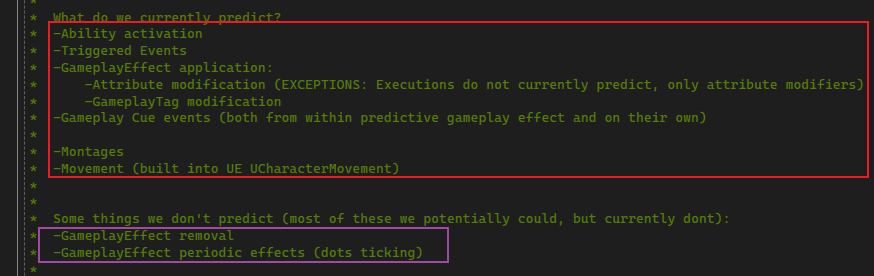

## 简介

> 本篇纯属概念性的介绍，不涉及任何编码的内容。

为了防止客户端作弊，所有的执行结果应该在服务端执行，最后返回结果给客户端，但是这样会因为复杂的网络原因，导致出现延迟过高影响游戏体验，因此 `Prediction` 应运而生：

客户端可以先进行效果的执行，然后通知服务端，服务端判断是否有效，若无效则进行回滚。

感觉在介绍本篇内容之前，真的需要好好的补习一下 `UE` 网络复制的内容，这里给出一篇博客：

> [UE5 -- Replication（网络复制）](https://zhuanlan.zhihu.com/p/578480318)

关于 `Prediction` 预测方面的内容，简单理解为：

我们希望在使用 `GA` 时，`GA` 执行了 "`X->Y->Z`" 的功能，我们就可以去预测其中的部分，而不是通过 ` if Authority：Do X，Else：Do predictive version of X ` 编写两种逻辑来实现预测的功能。

关于可以预测哪些内容：

> 这部分解释来自于 `GAS` 的 `GameplayPrediction.h` 的部分注释。
>
> 关于翻译部分，可以查看博客：[UE4 GameplayAbility 预测概述](https://zhuanlan.zhihu.com/p/43713451)

## Prediction Key

如上图，`Prediction Key` 是一个在预测系统中基本的概念，是一个由唯一 `ID` 组成的数据结构，关联了预测的 `Action` 以及 `Side Effects(副作用)`；

客户端将这个 `Key` 发送给服务端，服务端回响 接受 / 拒绝，并且同样会关联服务端创建的副作用。。。

关于 `Prediction Key` 的复制，其会先复制到服务端，服务端响应后，只会复制到拥有这个 `Key` 的客户端，其他则是复制一个 `ID = 0` 的 `Key` 。

## Ability Activation

`Ability Activation`是优先被预测的行为。无论客户端什么时候预测性地激活了一个 `Ability`，他都会明确地询问服务器，服务器也会明确地响应。 

一旦一个 `Abiltiy` 被预测性地激活了，客户端就会有一个有效的 **"预测窗口"**，在这个窗口中预测性的副作用会发生，而不会被明确地询问

> （例如，我们不明确询问，我可以减少这个魔法吗，我能让这个Ability冷却吗，这些行为被认为是激活Ability的逻辑基础） 

在上图中：

> 1. 客户端调用 `TryActivateAbility`，它会生成一个新的 `FPridectionKey` 并且调用`ServerTryActivateAblity` 
> 2.  客户端继续（在监听到服务器返回之前）并且使用生成的 `PredictionKey` 调用`ActivateAbility`，这个 `Key` 是与 `Ability` 的 `ActivationInfo` 关联的。 
> 3.  任何副作用（在调用 `ActivateAbility` 结束之前）拥有与他们关联的生成的 `FPredictionKey` 
> 4.  服务器决定 `Ability` 是否真实发生在 `ServerTryActivateAbility` 里面，调用`ClientActivateAbility`（`Fail/Suceed`）并且将`UAbiltiySystemComponent::ReplicatedPredictionKey` 设置为已发送的生成密钥 。 
> 5.  如果客户端收到 `ClientAblityFailed`，他会立刻结束这个 `Ability` 并且回滚与预测密钥关联的副作用。 
> 6.  如果接受，客户端必须等到属性复制更新（成功的RPC会立刻发送，属性复制会自己发生）。一旦 `ReplicatedPredictionKey` 更新了前面用到的密钥，客户端可以撤销他做的预测性副作用。<u>参见See `UAbilitySystemComponent::OnRep_PredictionKey`</u>。 

## Gameplay Effect Prediction

 `GameplayEffect` 被认为是预测的 副作用（`Side Effect`） 并且不会被明确地询问。 

在上图中：

> 1.  如果有一个有效的预测密钥，`GameplayEffect` 只在客户端应用。（如果没有预测密钥，很简单，就跳过客户端上的应用） 
>
> 2.  如果 `GemplayEffect` 被预测，`Attributes`，`GameplayCues`，和 `GameplayTags` 都会被预测。 
>
> 3.  当 `FActiveGameplayEffect` 被创建，他会储存预测密钥 (`FActiveGameplayEffect::PredictionKey`) 
>
> 4.  在服务器，也会在 `FActiveGameplayEffect` 中设置同样的预测密钥，并且复制下来。 
>
> 5.  作为客户端，如果你得到了一个复制的 `FActiveGameplayEffect`，并且带有一个有效的预测密钥，你会检查是否有一个相同密钥的 `ActiveGameplayEffect`，如果匹配上，我们不会执行 `"On applied"` 类型的逻辑。
>
>    例如 `GameplayCues`。这就解决了 `"Override"` 的问题。然而我们将会临时地在我们的 `ActiveGameplayEffects` 的容器里，存放2个“同样” 的 `GameplayEffect`。 

