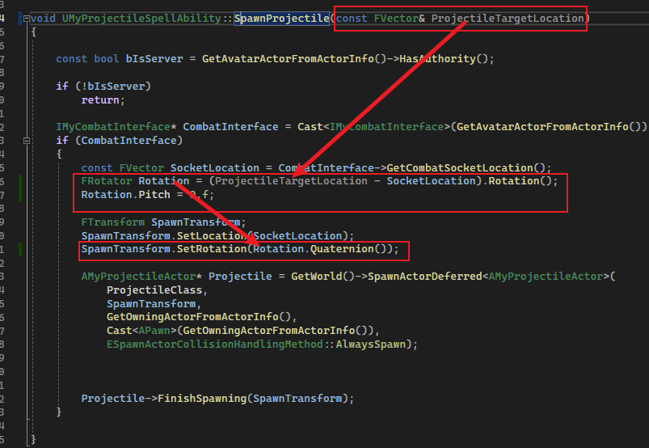
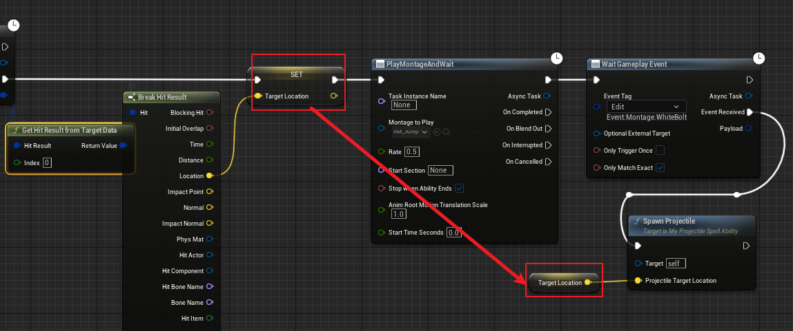

## 简介

继续 [10_1.Ability Task_Target Data](./10_1.Ability Task_Target Data.md) 的内容，我们已经可以从客户端向服务端发送数据，那么我们趁热打铁，让发射投射物时，<u>让其沿着鼠标点击的位置进行发射</u>。

## 修改 GA

如上图所示，我们为 `SpawnProjectile` 方法添加一个目标位置的参数，通过 `FVector` 的 `.Rotation` 方法获得朝向的旋转。

在 [9_5.Gameplay Ability_Porjectile](./9_5.Gameplay Ability_Porjectile.md) 中提到了投射物移动组件 `ProjectileMovementComponent`，这个组件会让拥有其的 `Actor` 沿着 `X轴` 方向移动，我们通过改变旋转（即改变 `X` 轴）的方向，让投射物沿着我们改变的方向进行移动。

## 修改蓝图

紧接着我们修改蓝图：

将获得的目标位置传入函数即可。

## 效果

