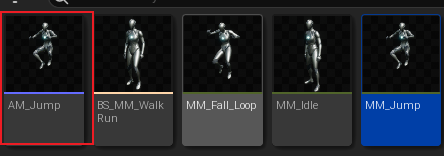
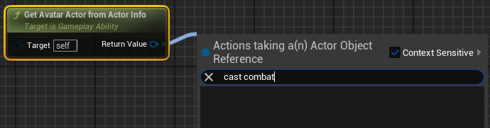
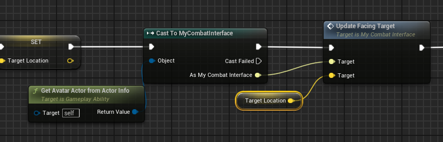

## 简介

通过设置，我们已经可以让角色沿着鼠标拾取位置发射投射物，但其实还剩下一个问题，就是 <u>角色并没有面向鼠标拾取的方向</u>。

在 `UE5` 中，提供了一个插件，名为 **`Motion Warping`，是一种可以<u>动态调整角色的根骨骼运动以对齐目标的功能</u>。**

> 在官方网站中有简单介绍这个组件：[运动扭曲](https://dev.epicgames.com/documentation/en-us/unreal-engine/motion-warping-in-unreal-engine?application_version=5.1)

现在我们来使用这个插件。

记得要启用这个插件，但是这个插件只在 `UE5` 中，并且它还处于测试阶段。

## 添加组件

如上图，我们并没有在 `C++` 代码中添加这个插件，而是直接在蓝图类中进行添加。

## 设置 Notify State

首先，我们要在我们的 <u>动画资产</u> 中，**启动根骨骼运动** ：

然后找到我们要使用的对应的 `Montage`，在其中添加 `Notify State` ：

如上图，这个 `MotionWarping` 的 `Notify State` 可以控制一段 `Montage` 中的一段帧数；

当在 `Motion Warping` 中设置要 `Target` 的目标时，在这段帧数中，该组件就会在这段帧数中通过 `Blend` 的方式来扭曲根骨骼运动。

然后我们在配置一下这个 `Notify State` 的属性：

如上图，我们来解释红色框中这些选项的含义：

> - **扭曲目标名称（`Warp Target Name`）** ：用于查找此扭曲目标的名称。关联到 **Add or Update Warp Target Point** 蓝图节点。
> - **`Warp Translation`** ： 扭曲根骨骼位置。在本篇中只需要更改朝向，因此将其取消勾选。
> - **`Warp Rotation` && `Rotation Type`** ：扭曲根骨骼旋转，以及旋转类型。这里将旋转类型给改为 `Facing`，表示旋转将 <u>以朝向的形式进行扭曲</u>。

## 蓝图调用

我们回到 `Character` 蓝图中，可以看到，`Motion Warping` 组件之对外提供了简单的几个蓝图方法，其中全部都是 <u>根据 `Target Name` 找到 `Notify State`，然后根据配置改变根骨骼运动</u>，只是输入的参数不同。

关于如何更改 `Location` ，这里就不解释了；但是关于 `Rotation` 旋转如何更新，这里有几种情况：

> - 当传入参数只有 `Location` ：
>
>   
>
>   如上图，首先将会根据 `Warp Translation`，然后当 `Warp Rotation` 时，仅当 `Rotation Type` 为 `Facing` 时，`Motion Wapping` 将会让根骨骼面朝该 `Location`。
>
> - 当传入参数为 `Transform` ：
>
>   
>
>   那么根骨骼将会扭曲至该 `Transform`；这里注意，`Facing` 时才会面对该 `Transfor` 下的姿态。

## 整体实现

通过上述的描述，我们知道，在蓝图中可以调用 `Motion Warping` 方法，实现根骨骼运动，那么我们就会想，*<u>在 `GA` 中，我们需要通过 `Cast` 来调用这些方法</u>*。

显然这样做降低了灵活性，我们还是希望通过接口来调用这些方法：

如上图，我们在之前的 [7_3.Custom Calculations](./7_3.Custom Calculations.md) 中创建了这个接口，并且解释了何为 `BlueprintImplementableEvent`，以及与 `BlueprintCallable` 作用。

现在我们在蓝图中实现这个接口：

然后我们在 `GA` 中：

> *诶！发现并不能转换为接口，这是为什么呢？*

原来我们要将接口类声明为 `BlueprintType` 啊 😓。。。。

然后我们就可以调用接口中的函数啦：

效果也是正确的：

