## 简介

在本篇中，我们将丰富我们的投射物，包括粒子效果、声音 以及 `GE`。

## Impact

先介绍如何添加 粒子、声音等效果吧

> 虽然现在暂时没有这些资产

### Overlap

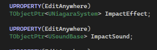

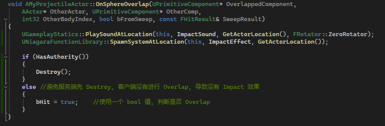

如上图，我们在 `ProjectileActor` 中添加 `Niagara System` 以及 `Sound Base` 成员，然后在其 `Overlap` 函数（`SphereComponent`）中，当叠加时，播放对应的粒子效果，并且播放声音。

但是这里需要注意一个问题，服务端销毁 `Actor` 后，会将这个销毁的动作复制到客户端，所以 **<u>在客户端中可能会出现销毁的执行先于 `Overlap`</u>**，所以这里需要使用一个 `bHit` 成员，表示是否触发了 `Overlap`，并且重写 `Destroyed` 方法：

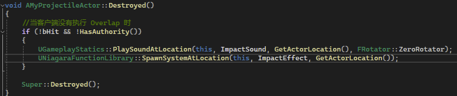

这个方法在 `Actor` 确定要被 `Destroy` 时会被执行，这里当客户端发现 `Actor` 要被销毁，但是却没执行 `Overlap` 后，便会将这些 `Imapact` 进行播放。

这里简单介绍一下一个音频组件：

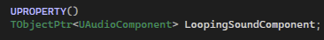

这个组件可以被 `Attach`，即跟随 `Actor` ：

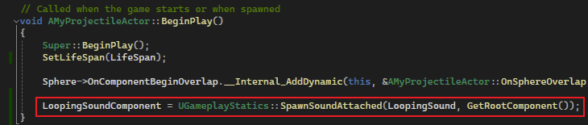

用于播放投掷物本身的音效。

### 效果

> 这里只能看销毁的效果。。。。

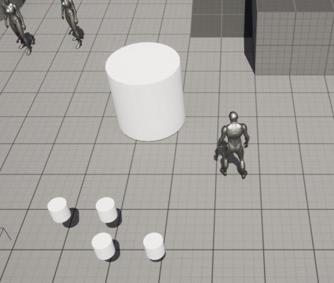

可以看到，投射物销毁了，但是遇到之前制作的 [5_2.Duration & Periodic](./5_2.Duration & Periodic.md)，会一并销毁。

这显然不是我们希望的。

## Collision

如上图中的效果一样，引起这个问题的原因，是我们在 `Collision` 中设置的规则 （[9_5.Gameplay Ability_Porjectile](./9_5.Gameplay Ability_Porjectile.md)）：

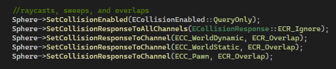

在这里我们将 `WorldDynamic` 和 `WorldStatic` 碰撞通道的物体都设置了 `Overlap` 响应，即：

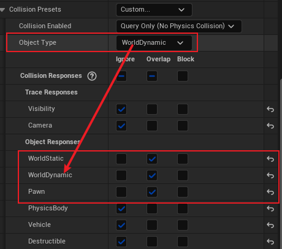

如上图，我们的投射物的 `Object Type` 为 `WorldDynamic`，然后我们的 `Effect Actor` ：

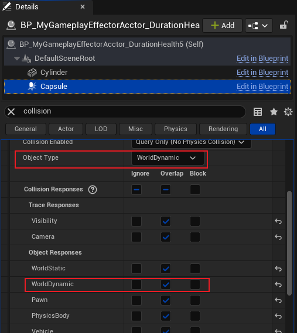

如上图，同样是 `WorldDynamic`。

那么这样就会产生如下效果：

> 1. 当 投射物 与 `Effect Actor` 重叠时，两者都会进行判断
> 2. 投射物 <u>根据 `Effect Actor` 的 `Object Type` 查找 `WorldDynamic` 通道，发现是 `Overlap`，**于是就去执行自己的 `Overlap` 事件**</u>，于此同时，`Effect Actor` 也得出了相同的结论
> 3. 两者均执行 `Overlap` 事件。

当我们改变 `Effect Actor` 的通道检测类型时：

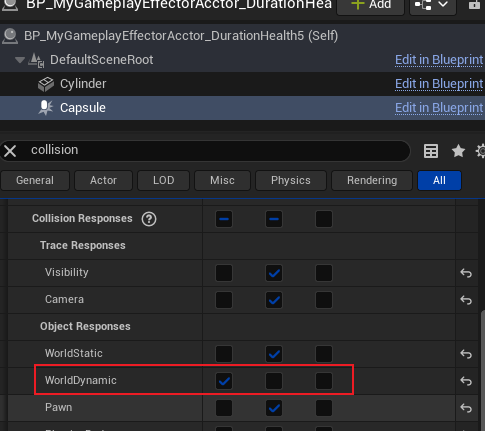

> 这时再运行会发生什么呢？
>
> 此时我相信大多数人会觉得：
>
> - 投射物 根据 `Effect Actor` 的 `WorldDynamic` 的对象类型后，查找通道发现是 `Overlap`，就会去执行自己的事件
> - `Effect Actor` 发现是 `Ignore`，则什么都不敢

> 真的是这样吗？我们来看结果：

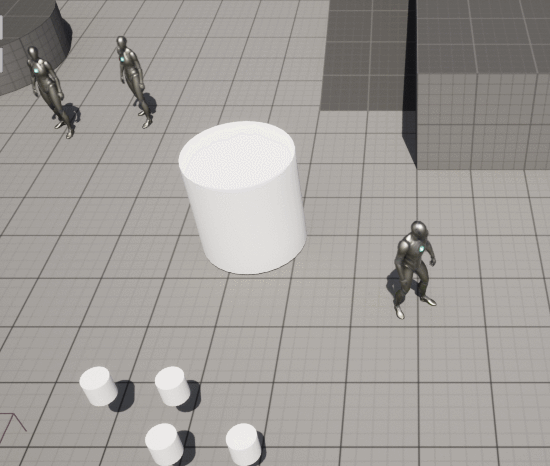

可以发现，两边均没有执行 `Overlap`。

这是因为：

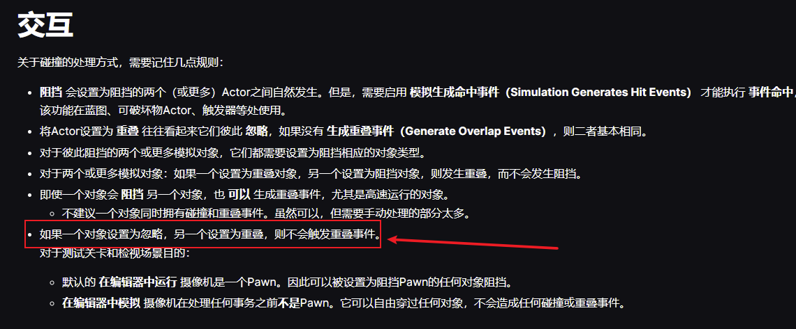

参考官方文档： [碰撞概述](https://dev.epicgames.com/documentation/zh-cn/unreal-engine/collision-in-unreal-engine---overview)

### 新建 Channel (Object Type)

为了修复投射物乱 `Overlap`，我们为其定义一个特殊的 `Channel` ，并且默认设置为 `Ignore`：

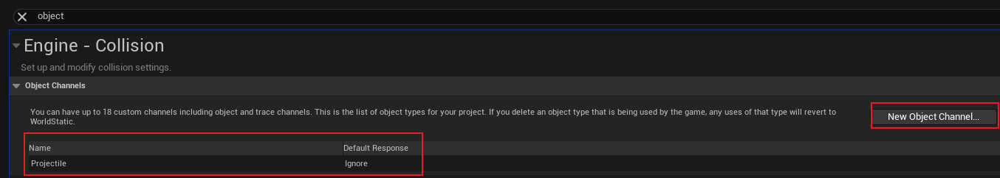