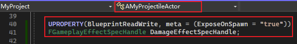
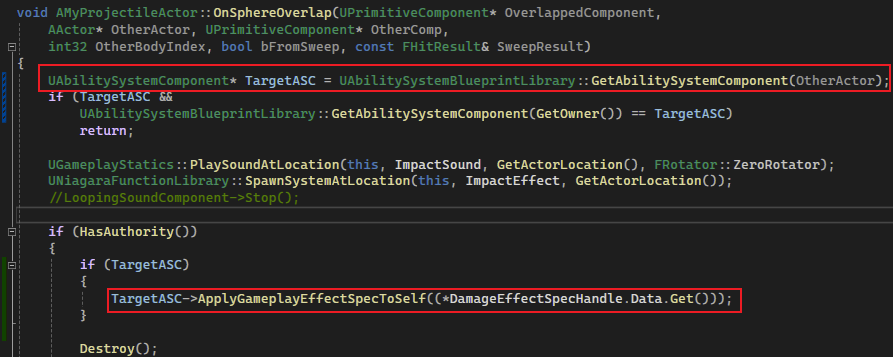
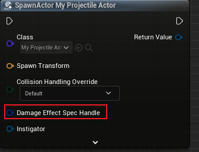
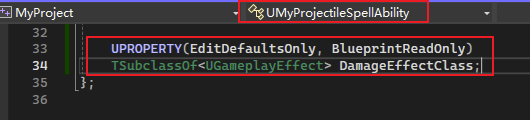
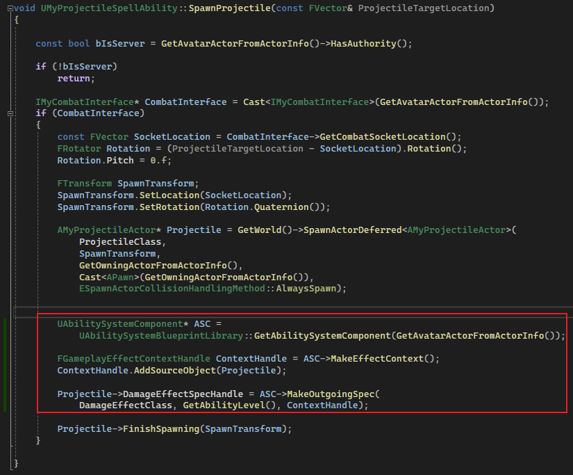
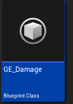
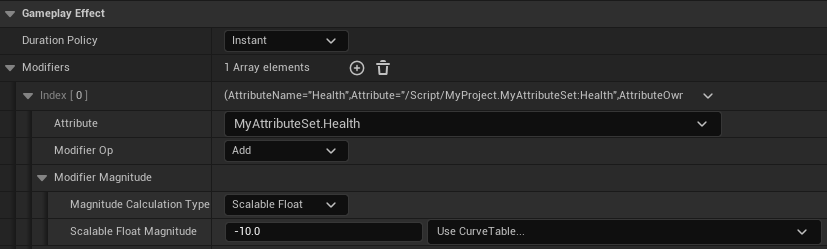
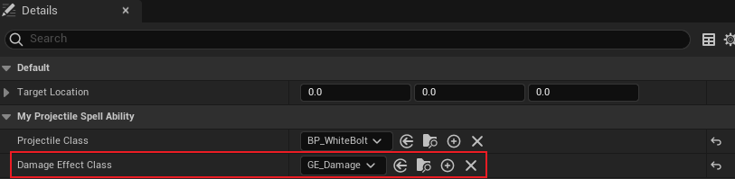

## 简介

在经过一些列的设置后，在本篇中，我们将真正的赋予投射物 `GE`。

## 基本逻辑

首先我们要理清楚基本逻辑：

> 1. `PlayerController` 输入触发 `ASC` 的 `Input` 方法
> 2. `ASC` 激活预设的 `GA`
> 3. `GA` 激活后生成 投射物
> 4. 投射物击中后销毁

基于上述的基本逻辑，我们应该如何使投射物正确的应用 `GE` 呢？大致可分为三步：

> 1. 首先我们要确认 `GE` 的类型；
> 2. 然后将这种类型的 `GE` 赋予投射物；
> 3. 投射物击中对应的目标后，对其应用 `GE`。

## Apply GE

虽然应用 `GE` 是最后一步，但是从后往前看，可以预测在最开始需要进行哪些内容的编码。

在 [5.GameplayEffect](./5.GameplayEffect.md) 中，我们知道应用 `GE` 时，需要使用 `ASC`，并且需要提前根据 `ASC` 进行 `GE Spec` 的构造。

 那么我们在 投射物 中应用 `ASC` 时，可以通过外部设置 `FGameplayEffectSpecHandle` 类型成员，来进行 `GE` 的应用：

> 这里需要注意的是，应用 `GE` 的过程，是在服务器中发生的，应用完后的结果（例如修改 `Attribute`），会通过网络复制到对应的客户端中。

另外，关于 `meta = (ExposeOnSpawn = "true")` 的 `UPROPERTY` 的标识，作用是在蓝图节点中：

在 `SpawnActor` 中暴露出来，来解决蓝图中不能 `SpawnActorDeferred` 的问题。

## GA

接下来要确认 `GE` 的类型，我们可以将其作为 `GA` 的成员：

然后当我们需要在生成投射物时，构造好对应的 `GE Spec Handle` ：

## 蓝图配置

首先是创建 `GE` ：

如上图，创建一个 `Health` `-10` 的 `GE`。

然后再配置 `GA` ：

如上图，在 `GA` 中需要明确 `GE` 类型。