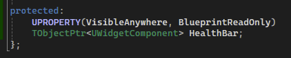
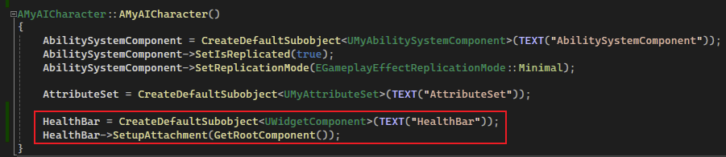
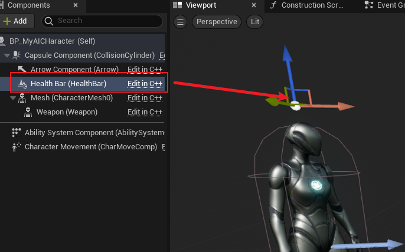
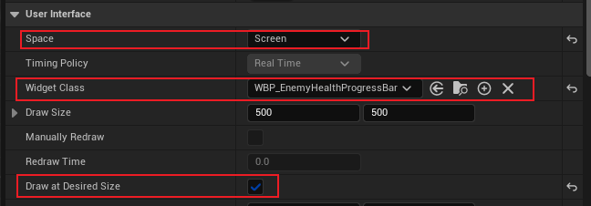
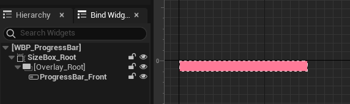
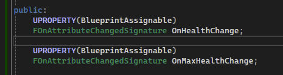
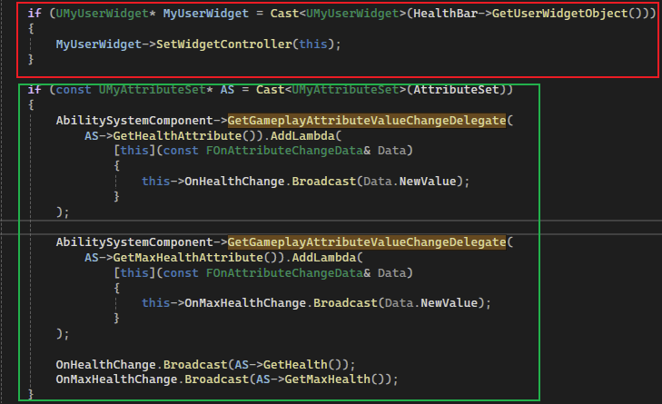
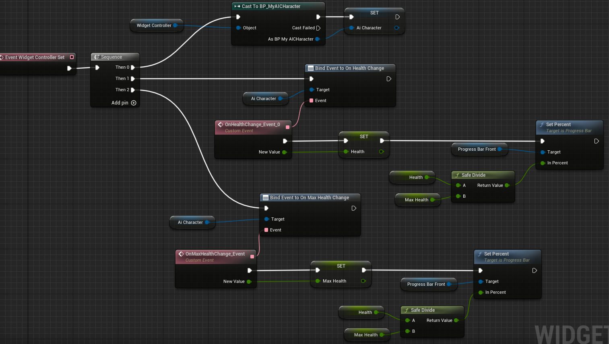

## 简介

当我们拥有了造成伤害的 `GE`，我们需要将其显示在窗口中。

那么本篇将介绍如何制作 `Enemy Health Bar`。

## Widget Component

在 `AI Controll Character` 类中，添加 `WidgetComponent` 组件，<u>该组件可以根据具体的 `UMG` 类型，将其放置在场景中</u>：

然后更改一下 `Health Bar` 的设置：

首先将其设置为屏幕空间（`Screen`）；然后设置 `UMG`（稍后）；最后将 `Draw at Desired Size` 进行勾选，意为不受 `3D` 对象 `Attach` 的影响。

## Progress Bar

如上图，简单制作一下即可。

## Widget Controller

在 [4.游戏UI架构](./4.游戏UI架构.md) 中介绍到，在基类 `MyUserWidget` 中，包含了一个类型为 `UObject` 的 `WidgetController` 成员，用于分离数据和界面。

在这里，我们将会把 `Ai Control Character` 自己作为 `WidgetController` 进行设置：

如上图，在红色框中，先<u>通过 `WidgetComponent` 找到 `UMG` ，并且将自身作为 `WidgetController` 传入</u>；然后在绿色框中，<u>绑定对应属性更改的委托</u>。

最后在蓝图 `ProgressBar` 中：

进行绑定即可。

## 效果

可以看到，通过 `Damage GE` 可以对敌人造成伤害了！

## Health Bar 效果提升

在这里，将去提升 `Health Bar` 的效果。

> 这部分是提升效果的部分，了解即可

我们将对 `Health Bar` 进行重影效果的制作，即当 `Health Bar` 减少时，在前面的部分直接减少，而在背景部分会有一条重影的进度条缓慢减少。这种效果被称为 `Ghost Bar`。

> 描述比较抽象。。。等会直接看效果吧。

