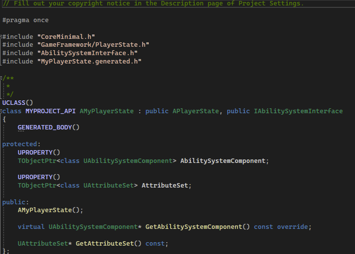
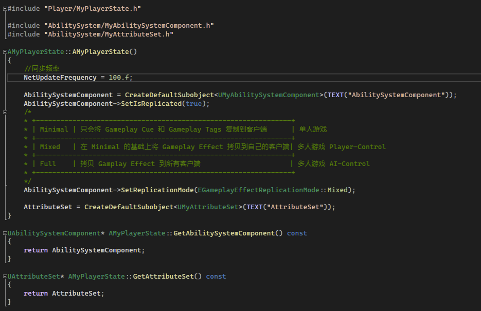
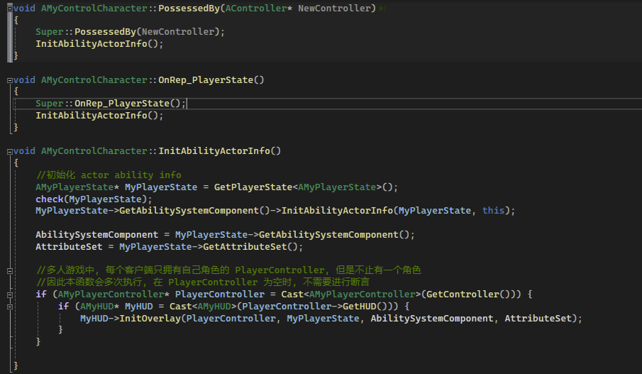
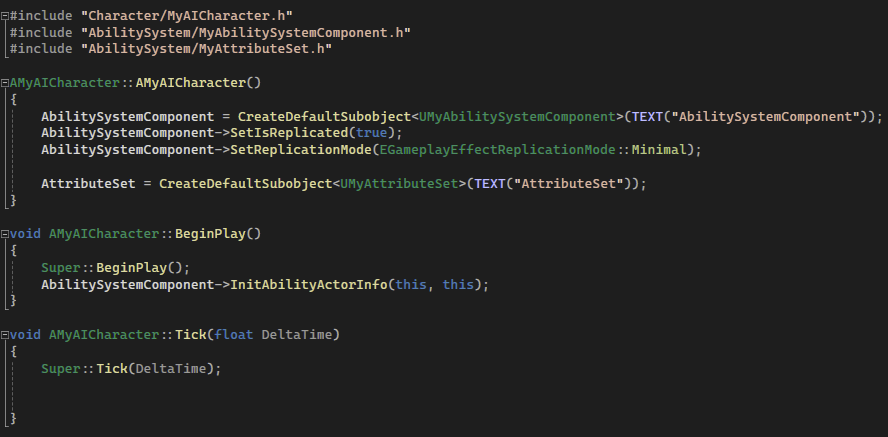

## 简介

基于 [GAS概述](./1.GAS概述.md) 中的框架信息，来构建初始的项目。

## Ability System Component & Attribute Set

先定义最基础的 `ASC` 和 `AS`：

```C++
UCLASS()
class MYPROJECT_API UMyAbilitySystemComponent : public UAbilitySystemComponent
{
	GENERATED_BODY()
	
};
```

```C++
#include "AttributeSet.h"

UCLASS()
class MYPROJECT_API UMyAttributeSet : public UAttributeSet
{
	GENERATED_BODY()
public:
	UMyAttributeSet();
};
```

## Player State

然后定义 `Player State`，需要拥有 `Ability Gameplay Component` 和 `Attribute Set`：

```C++
#include "AbilitySystemInterface.h"
```

```C++
UCLASS()
class MYPROJECT_API AMyPlayerState : public APlayerState, public IAbilitySystemInterface
{
	GENERATED_BODY()

protected:
	UPROPERTY()
	TObjectPtr<class UAbilitySystemComponent> AbilitySystemComponent;

	UPROPERTY()
	TObjectPtr<class UAttributeSet> AttributeSet;

public:
	AMyPlayerState();

	virtual UAbilitySystemComponent* GetAbilitySystemComponent() const override;

	UAttributeSet* GetAttributeSet() const;
};
```

这里需要注意，`IAbilitySystemInterface` 一般可选，但是一般都选择继承，这个接口定义了 `ASC` 的获取（`GetAbilitySystemComponent`）。

然后我们再将 `ASC` 和 `AS` 进行初始化：

```C++
AMyPlayerState::AMyPlayerState()
{
	//同步频率
	NetUpdateFrequency = 100.f;

	AbilitySystemComponent = CreateDefaultSubobject<UMyAbilitySystemComponent>(TEXT("AbilitySystemComponent"));
	AbilitySystemComponent->SetIsReplicated(true);
	/*
	* +-------------------------------------------------------------——+
	* | Minimal | 只会将 Gameplay Cue 和 Gameplay Tags 复制到客户端	  | 单人游戏
	* +---------------------------------------------------------------+
	* | Mixed   | 在 Minimal 的基础上将 Gameplay Effect 拷贝到自己的客户端| 多人游戏 Player-Control
	* +---------------------------------------------------------------+
	* | Full	| 拷贝 Gamplay Effect 到所有客户端                      | 多人游戏 AI-Control
	* +---------------------------------------------------------------+
	*/
	AbilitySystemComponent->SetReplicationMode(EGameplayEffectReplicationMode::Mixed);

	AttributeSet = CreateDefaultSubobject<UMyAttributeSet>(TEXT("AttributeSet"));
}
```

这里初始化为我们定义的 `ASC` 和 `AS`，另外，这里需要注意的是 `EGameplayEffectReplicationMode` 网络复制模式，在注释中解释了：

|         |                                                          |                         |
| ------- | -------------------------------------------------------- | ----------------------- |
| Minimal | 只会将 Gameplay Cue 和 Gameplay Tags 复制到客户端        | 单人游戏                |
| Mixed   | 在 Minimal 的基础上将 Gameplay Effect 拷贝到自己的客户端 | 多人游戏 Player-Control |
| Full    | 拷贝 Gamplay Effect 到所有客户端                         | 多人游戏 AI-Control     |

> *这里先留个疑问吧，后续解答*





## Character

创建基类 `Character`，该 `Character` 需要拥有 `Ability Gameplay Component` 和 `Attribute Set`：

```C++
UCLASS(Abstract)
class MYPROJECT_API AMyCharacter : public ACharacter, public IAbilitySystemInterface
{
	GENERATED_BODY()
protected:
	UPROPERTY()
	TObjectPtr<class UAbilitySystemComponent> AbilitySystemComponent;

	UPROPERTY()
	TObjectPtr<class UAttributeSet> AttributeSet;

//~ Begin Character Interface
//...
//~ End Character Interface

public:
	virtual UAbilitySystemComponent* GetAbilitySystemComponent() const override;

	virtual UAttributeSet* GetAttributeSet() const;
};

```

不同的是，在 <u>玩家控制的角色</u> 和 <u>`Ai` 控制的角色</u> 会略有不同：

当角色被玩家控制时，我们需要在 `PlayerState` 被网络复制、角色被控制时将 `Ability System` 信息进行初始化，即在 `PossessedBy` 和 `OnRep_PlayerState` 方法中：

> 这里分别代表了两个时机：
>
> - 第一个时机是服务端的 `PlayerController` 控制了这个 `Character` 时，服务端会进行信息初始化，<u>**这部分代码将在服务端执行**</u>。
> - 第二个时机是当服务端的 `PlayerState` 通过网络复制到客户端时，客户端会通过 `PlayerState` 进行初始化，<u>**这部分代码加载客户端执行**</u>。

> 具体的网络复制规则，可以参考 [这篇博客](https://zhuanlan.zhihu.com/p/684597439)

```C++
void AMyControlCharacter::PossessedBy(AController* NewController)
{
	Super::PossessedBy(NewController);
	InitAbilityActorInfo();
}

void AMyControlCharacter::OnRep_PlayerState()
{
	Super::OnRep_PlayerState();
	InitAbilityActorInfo();
}

void AMyControlCharacter::InitAbilityActorInfo()
{
	//初始化 actor ability info
	AMyPlayerState* MyPlayerState = GetPlayerState<AMyPlayerState>();
	check(MyPlayerState);
	MyPlayerState->GetAbilitySystemComponent()->InitAbilityActorInfo(MyPlayerState, this);

	AbilitySystemComponent = MyPlayerState->GetAbilitySystemComponent();
	AttributeSet = MyPlayerState->GetAttributeSet();
}
```



这里比较关键的是 `ASC` 的 `InitAbilityActorInfo` 初始化方法，这里需要定义 `Owner Actor` （该组件的拥有者） 以及 `Avatar Actor` （能力作用的对象）。

而 `Ai` 控制的角色则比较简单，直接在 `BeginPlay` 中进行初始化即可：

```C++
AMyAICharacter::AMyAICharacter()
{
	AbilitySystemComponent = CreateDefaultSubobject<UMyAbilitySystemComponent>(TEXT("AbilitySystemComponent"));
	AbilitySystemComponent->SetIsReplicated(true);
	AbilitySystemComponent->SetReplicationMode(EGameplayEffectReplicationMode::Minimal);

	AttributeSet = CreateDefaultSubobject<UMyAttributeSet>(TEXT("AttributeSet"));
}

void AMyAICharacter::BeginPlay()
{
	Super::BeginPlay();
	AbilitySystemComponent->InitAbilityActorInfo(this, this);
}
```



