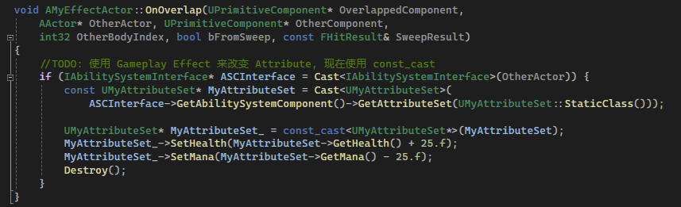

## 简介

我们先从最基础的属性 `Attribute` 入手。

## 添加属性

```C++
#define ATTRIBUTE_ACCESSORS(ClassName, PropertyName) \
	GAMEPLAYATTRIBUTE_PROPERTY_GETTER(ClassName, PropertyName) \
	GAMEPLAYATTRIBUTE_VALUE_GETTER(PropertyName) \
	GAMEPLAYATTRIBUTE_VALUE_SETTER(PropertyName) \
	GAMEPLAYATTRIBUTE_VALUE_INITTER(PropertyName)

UCLASS()
class MYPROJECT_API UMyAttributeSet : public UAttributeSet
{
	GENERATED_BODY()

public:
	UPROPERTY(BlueprintReadOnly, ReplicatedUsing = OnRep_Health, Category = "Vital Attributes")
	FGameplayAttributeData Health;
	ATTRIBUTE_ACCESSORS(UMyAttributeSet, Health);

	UPROPERTY(BlueprintReadOnly, ReplicatedUsing = OnRep_MaxHealth, Category = "Vital Attributes")
	FGameplayAttributeData MaxHealth;
	ATTRIBUTE_ACCESSORS(UMyAttributeSet, MaxHealth);

	UPROPERTY(BlueprintReadOnly, ReplicatedUsing = OnRep_Mana, Category = "Vital Attributes")
	FGameplayAttributeData Mana;
	ATTRIBUTE_ACCESSORS(UMyAttributeSet, Mana);

	UPROPERTY(BlueprintReadOnly, ReplicatedUsing = OnRep_MaxMana, Category = "Vital Attributes")
	FGameplayAttributeData MaxMana;
	ATTRIBUTE_ACCESSORS(UMyAttributeSet, MaxMana);

public:
	UMyAttributeSet();

	//~ Begin UObject Interface
	virtual void GetLifetimeReplicatedProps(TArray< class FLifetimeProperty >& OutLifetimeProps) const override;
	//~ End UObject Interface
    
    UFUNCTION()
	void OnRep_Health(const FGameplayAttributeData& OldHealth) const;

	UFUNCTION()
	void OnRep_MaxHealth(const FGameplayAttributeData& OldMaxHealth) const;

	UFUNCTION()
	void OnRep_Mana(const FGameplayAttributeData& OldMana) const;

	UFUNCTION()
	void OnRep_MaxMana(const FGameplayAttributeData& OldMaxMana) const;
};

```


我们为先前定义的 `Attribute Set` 定义四个属性：`Health`、`MaxHealth`、`Mana`、`MaxMana`。这些属性的数据类型均是 `FGameplayAttributeData`。

在这里需要特别注意，`ATTRIBUTE_ACCESSORS` 宏是官方在源码中推荐的定义，定义了属性的 初始化、设置、获取值、获取 `Attribute` 等操作：


## 网络复制

另外，我们的 `Attribute Set` 需要能够被网络复制，除了将成员定义为 `ReplicatedUsing = OnRep_...` 之外，我们还需要实现 `GetLifetimeReplicatedProps` 方法：

```C++
void UMyAttributeSet::GetLifetimeReplicatedProps(TArray<class FLifetimeProperty>& OutLifetimeProps) const
{
	//设置replicate条件的
	//https://zhuanlan.zhihu.com/p/412517987

	Super::GetLifetimeReplicatedProps(OutLifetimeProps);

	//COND_None 无条件的 REPNOTIFY_Always 总是复制 Health
	DOREPLIFETIME_CONDITION_NOTIFY(UMyAttributeSet, Health, COND_None, REPNOTIFY_Always);
	DOREPLIFETIME_CONDITION_NOTIFY(UMyAttributeSet, MaxHealth, COND_None, REPNOTIFY_Always);
	DOREPLIFETIME_CONDITION_NOTIFY(UMyAttributeSet, Mana, COND_None, REPNOTIFY_Always);
	DOREPLIFETIME_CONDITION_NOTIFY(UMyAttributeSet, MaxMana, COND_None, REPNOTIFY_Always);
}
```


`DOREPLIFETIME_CONDITION_NOTIFY` 表示属性在何种条件进行复制，`COND_None` 表示无条件复制，`REPNOTIFY_Always` 表示为总是复制。

另外在复制结束后，客户端可以获取通知：

```C++
void UMyAttributeSet::OnRep_Health(const FGameplayAttributeData& OldHealth) const
{
	//通知 ability system 数值发生变化, 可用于回滚
	GAMEPLAYATTRIBUTE_REPNOTIFY(UMyAttributeSet, Health, OldHealth);
}

void UMyAttributeSet::OnRep_MaxHealth(const FGameplayAttributeData& OldMaxHealth) const
{
	GAMEPLAYATTRIBUTE_REPNOTIFY(UMyAttributeSet, MaxHealth, OldMaxHealth);
}

void UMyAttributeSet::OnRep_Mana(const FGameplayAttributeData& OldMana) const
{
	GAMEPLAYATTRIBUTE_REPNOTIFY(UMyAttributeSet, Mana, OldMana);
}

void UMyAttributeSet::OnRep_MaxMana(const FGameplayAttributeData& OldMaxMana) const
{
	GAMEPLAYATTRIBUTE_REPNOTIFY(UMyAttributeSet, MaxMana, OldMaxMana);
}
```


使用 `GAMEPLAYATTRIBUTE_REPNOTIFY` 宏，在对应属性复制后，通知 `Gameplay Ability System`。

## 如何影响

```C++
const UMyAttributeSet* MyAttributeSet = Cast<UMyAttributeSet>(
    ASCInterface->GetAbilitySystemComponent()->GetAttributeSet(UMyAttributeSet::StaticClass()));

UMyAttributeSet* MyAttributeSet_ = const_cast<UMyAttributeSet*>(MyAttributeSet);
MyAttributeSet_->SetHealth(MyAttributeSet->GetHealth() + 25.f);
MyAttributeSet_->SetMana(MyAttributeSet->GetMana() - 25.f);
```



如上图，使用 `ASC` 的 `GetAttribute` 方法，指定 `TSubclassOf<UAttributeSet>` 属性的类型来获取 `AttributeSet`。

并且通过属性的 `Setter` 来设置属性值。

### Ability System Component 如何获取 Attribute Set

如上述代码，<u>发现我们并没有为 `ASC` 指定任何的 `AS`，为什么 `ASC` 可以直接获得 `AS` 呢？</u>

从 `GetAttributeSet` 这个方法开始：


可以发现 `ASC` 会从自身成员 `SpawnedAttributes` 去查找 `AttributeSet`，而这个成员变量在组件初始化函数 `InitializeComponent` 中得以初始化：


通过 `GetObjectWithOuter` 来获取 `Owner` 的孩子对象（即 `UPROPERTY` 标记的成员），然后将 `AttributeSet` 类型的成员放入 `SpawnedAttributes` 中。