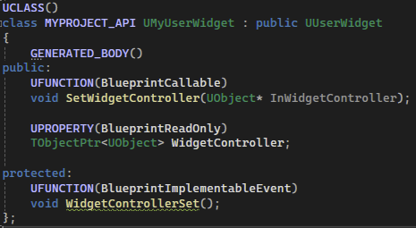

## 简介

在游戏中，`UI` 是十分重要的。`UI` 用于显示数据，但是直接与数据进行逻辑交互，程序将会高度耦合。

这里将介绍 `UI` 如何设计一个良好可扩展、高灵活度的 `UI` 架构：


如上图，在 `View(视图)` 和 `Model(数据)` 之间，添加一个 `Widget Controller(窗口控制器)`，这个控制器可以用于在数据进行更改或者需要数据进行更改时，同步 `View` 和 `Model` 的信息。

主要的实现方式，是 **在 `WidgetController` 中定义各种 <u>委托</u>**，当 <u>数据进行改变时，那么这些委托将进行广播</u>，来达到实现数据同步的效果。

基于上述架构，我们需要创建三个大类：

> - `MyUserWidget`：拥有 `WdigetController` 的 `UserWidget`
> - `MyWidgetController`
> - `MyHUD`：由于存储 `Widget` 相关组件，并且将其进行构建和初始化。

## MyUserWidget & MyWidgetController

### My User Widget

```C++
UCLASS()
class MYPROJECT_API UMyUserWidget : public UUserWidget
{
	GENERATED_BODY()
public:
	UFUNCTION(BlueprintCallable)
	void SetWidgetController(UObject* InWidgetController);

	UPROPERTY(BlueprintReadOnly)
	TObjectPtr<UObject> WidgetController;

protected:
	UFUNCTION(BlueprintImplementableEvent)
	void WidgetControllerSet();
};
```

```C++
void UMyUserWidget::SetWidgetController(UObject* InWidgetController)
{
	WidgetController = InWidgetController;
	WidgetControllerSet();
}
```




`MyUserWidget` 的声明和定义都非常简单，仅仅时拥有一个 `WidgetController`，一个值得注意的事情是有一个 `BlueprintImplementableEvent` 蓝图去实现的一个事件，用于 `WidgetController` 被设置时触发，可以合理的去管理整个生命周期。


### Widget Controller

首先，需要分析一下 `Widget Controller` 需要的基础成员。由于大多数的属性改变均与 `Attribute Set` 相关，因此将 `GAS` 部分的内容进行存储是个必要的选择；

然后我们可以去存储一些玩家的信息，毕竟 `UI` 多于玩家相关，因此我们的 `MyWdigetComponent` 类可以进行如下声明：

```C++
USTRUCT(BlueprintType)
struct FWdigetControllerParams {
	GENERATED_BODY();

	FWdigetControllerParams() {}

	FWdigetControllerParams(APlayerController* PC, APlayerState* PS, 
		UAbilitySystemComponent* ASC, UAttributeSet* AS) :
		PlayerController(PC), PlayerState(PS), AbilitySystemComponent(ASC), AttributeSet(AS)
	{}

	UPROPERTY(EditAnywhere, BlueprintReadWrite)
	TObjectPtr<APlayerController> PlayerController = nullptr;

	UPROPERTY(EditAnywhere, BlueprintReadWrite)
	TObjectPtr<APlayerState> PlayerState = nullptr;

	UPROPERTY(EditAnywhere, BlueprintReadWrite)
	TObjectPtr<UAbilitySystemComponent> AbilitySystemComponent = nullptr;

	UPROPERTY(EditAnywhere, BlueprintReadWrite)
	TObjectPtr<UAttributeSet> AttributeSet = nullptr;
};
```

```C++
UCLASS()
class MYPROJECT_API UMyWidgetController : public UObject
{
	GENERATED_BODY()

public:
	UFUNCTION(BlueprintCallable)
	void SetWidgetControllerParams(const FWdigetControllerParams& Params);
	virtual void BroadcastInitalValues();
	virtual void BindCallbacksToDependecies();

protected:
	UPROPERTY(BlueprintReadOnly, Category = "WidgetController")
	TObjectPtr<APlayerController> PlayerController;

	UPROPERTY(BlueprintReadOnly, Category = "WidgetController")
	TObjectPtr<APlayerState> PlayerState;

	UPROPERTY(BlueprintReadOnly, Category = "WidgetController")
	TObjectPtr<UAbilitySystemComponent> AbilitySystemComponent;

	UPROPERTY(BlueprintReadOnly, Category = "WidgetController")
	TObjectPtr<UAttributeSet> AttributeSet;
};
```


另外需要定义 **`BroadcastInitalValues` 初始化时的广播**，以及 **`BindCallbacksToDependecies` 绑定委托** 的两个接口。

在子类中，我们以改变 `MyAttributeSet` 为例，去构建一个控制显示 `Health、MaxHealth、Mana、MaxMana` 的一个 `Widget Controller`：

```C++
DECLARE_DYNAMIC_MULTICAST_DELEGATE_OneParam(FOnHealthChangedSignature, float, NewHealth);
DECLARE_DYNAMIC_MULTICAST_DELEGATE_OneParam(FOnMaxHealthChangedSignature, float, NewMaxHealth);
DECLARE_DYNAMIC_MULTICAST_DELEGATE_OneParam(FOnManaChangedSignature, float, NewMana);
DECLARE_DYNAMIC_MULTICAST_DELEGATE_OneParam(FOnMaxManaChangedSignature, float, NewMaxMana);

/**
 * 
 */
UCLASS(Blueprintable, BlueprintType)
class MYPROJECT_API UMyOverlayWidgetController : public UMyWidgetController
{
	GENERATED_BODY()
	
public:
	virtual void BroadcastInitalValues() override;
	virtual void BindCallbacksToDependecies() override;

	UPROPERTY(BlueprintAssignable, Category = "GAS|Attributes")
	FOnHealthChangedSignature OnHealthChanged;

	UPROPERTY(BlueprintAssignable, Category = "GAS|Attributes")
	FOnMaxHealthChangedSignature OnMaxHealthChanged;

	UPROPERTY(BlueprintAssignable, Category = "GAS|Attributes")
	FOnManaChangedSignature OnManaChanged;

	UPROPERTY(BlueprintAssignable, Category = "GAS|Attributes")
	FOnMaxManaChangedSignature OnMaxManaChanged;

protected:
	void HealthChanged(const FOnAttributeChangeData& Data) const;
	void MaxHealthChanged(const FOnAttributeChangeData& Data) const;
	void ManaChanged(const FOnAttributeChangeData& Data) const;
	void MaxManaChanged(const FOnAttributeChangeData& Data) const;
};
```


首先我们使用 `DECLARE_DYNAMIC_MULTICAST_DELEGATE_OneParam` 定义多播委托，该类型的委托不仅可以绑定普通的 `C++` 函数，还能够绑定蓝图事件。

> 这里将其声明为 `BlueprintAssignable` 即可以让蓝图进行分配，这里不需要声明为  `BlueprintCallable`。
>
> 参考 [属性说明符](https://docs.unrealengine.com/4.27/zh-CN/ProgrammingAndScripting/GameplayArchitecture/Properties/Specifiers/)

然后将这些委托作为成员变量声明在 `Widget Controller` 中。

这里需要注意，为了在更改 `AttributeSet` 中的属性时得到这个更改事件，我们需要使用 `Ability System Component` 的功能：

```C++
void UMyOverlayWidgetController::BindCallbacksToDependecies()
{
	UMyAttributeSet* MyAttributeSet = CastChecked<UMyAttributeSet>(AttributeSet);

	//通过 AttributeSet 获取 Attribute, 然后通过 ASC 添加该 Attribute 更改时的委托
	AbilitySystemComponent->GetGameplayAttributeValueChangeDelegate(
		MyAttributeSet->GetHealthAttribute()
	).AddUObject(this, &UMyOverlayWidgetController::HealthChanged);

	AbilitySystemComponent->GetGameplayAttributeValueChangeDelegate(
		MyAttributeSet->GetMaxHealthAttribute()
	).AddUObject(this, &UMyOverlayWidgetController::MaxHealthChanged);

	AbilitySystemComponent->GetGameplayAttributeValueChangeDelegate(
		MyAttributeSet->GetManaAttribute()
	).AddUObject(this, &UMyOverlayWidgetController::ManaChanged);

	AbilitySystemComponent->GetGameplayAttributeValueChangeDelegate(
		MyAttributeSet->GetMaxManaAttribute()
	).AddUObject(this, &UMyOverlayWidgetController::MaxManaChanged);
}
```


如上述代码：通过 <u>`ASC` 的 `GetGameplayAttributeValueChangeDelegate` 来 **获得某个 `Attribute` 更改时的委托**</u>，这个 `Attribute` 通过 `AttributeSet` 获得，并且这个 `AttributeSet` 必须被 `ASC` 获得。

然后再通过 `Add` 方法，`Widget Controller` 的相关属性更改时的方法进行委托构造。

而在这些被绑定的方法中，也是非常的简单：

```C++
void UMyOverlayWidgetController::HealthChanged(const FOnAttributeChangeData& Data) const
{
	OnHealthChanged.Broadcast(Data.NewValue);
}

void UMyOverlayWidgetController::MaxHealthChanged(const FOnAttributeChangeData& Data) const
{
	OnMaxHealthChanged.Broadcast(Data.NewValue);
}

void UMyOverlayWidgetController::ManaChanged(const FOnAttributeChangeData& Data) const
{
	OnManaChanged.Broadcast(Data.NewValue);
}

void UMyOverlayWidgetController::MaxManaChanged(const FOnAttributeChangeData& Data) const
{
	OnMaxManaChanged.Broadcast(Data.NewValue);
}
```

即将声明的属性更改方法进行广播，仅此而已。

### 蓝图实现

我们创建一个拥有 `Progress Bar` 的 `UserWidget`，并且将其作为成员置于 `Overlay User Widget` 中，并且在蓝图中实现 `Widget Controller` 的设置事件：


在`Progress Bar` 中，我们提前定义好了更新进度的方法，然后同样去实现 `Widget Controller` 的设置事件：


如上图所示，我们为 `Widget Controller` 中的委托添加蓝图事件，那么这样在该委托进行广播时，这里的事件也可以被调用。

## MyHUD

`HUD` 作为 `Widget` 相关的存储结构，并且管理其中的初始化过程，那么我们进行如下定义：

```C++
UCLASS()
class MYPROJECT_API AMyHUD : public AHUD
{
	GENERATED_BODY()
	
public:
	UPROPERTY()
	TObjectPtr<class UMyUserWidget> OverlayWidget;

	TObjectPtr<class UMyOverlayWidgetController> GetOverlayWidgetController(const struct FWdigetControllerParams& Params);

	void InitOverlay(APlayerController* PC, APlayerState* PS, class UAbilitySystemComponent* ASC, class UAttributeSet* AS);

private:

	UPROPERTY(EditAnywhere)
	TSubclassOf<class UMyUserWidget> OverlayWidgetClass;

	UPROPERTY()
	TObjectPtr<class UMyOverlayWidgetController> OverlayWidgetController;

	UPROPERTY(EditAnywhere)
	TSubclassOf<class UMyOverlayWidgetController> OverlayWidgetControllerClass;

protected:
	virtual void BeginPlay() override;
};
```

将 `OverlayWidgetController` 作为一个单例，只是希望在 `InitOverlay` 中进行构造：

```C++
void AMyHUD::InitOverlay(APlayerController* PC, APlayerState* PS, UAbilitySystemComponent* ASC, UAttributeSet* AS)
{
	checkf(OverlayWidgetClass, TEXT("Overlay Widget Class Uninitalized"));
	checkf(OverlayWidgetControllerClass, TEXT("Overlay Widget Controller Class Uninitalized"));

	UUserWidget* Widget = CreateWidget<UUserWidget>(GetWorld(), OverlayWidgetClass);
	OverlayWidget = Cast<UMyUserWidget>(Widget);

	const FWdigetControllerParams WidgetControllerParams(PC, PS, ASC, AS);
	UMyOverlayWidgetController* WidgetController = GetOverlayWidgetController(WidgetControllerParams);

	OverlayWidget->SetWidgetController(WidgetController);
	WidgetController->BroadcastInitalValues();

	Widget->AddToViewport();
}
```

### 初始化

在实现了上述初始化 `InitOverlay` 方法后，我们应该思考的是：

> *在何时进行调用呢？*

在 [2.项目构建](./2.项目构建.md) 中提到了 `PlayerState` 的初始化 `ASC` 方法，用样的，初始化 `Overlay` 在 `ASC` 初始化结束之后执行，是一个不错的选择，所以我们在 `InitAbilityActorInfo` 方法中添加初始化 `Overlay` 的执行：

```C++
	//多人游戏中, 每个客户端只拥有自己角色的 PlayerController, 但是不止有一个角色
	//因此本函数会多次执行, 在 PlayerController 为空时, 不需要进行断言
	if (AMyPlayerController* PlayerController = Cast<AMyPlayerController>(GetController())) {
		if (AMyHUD* MyHUD = Cast<AMyHUD>(PlayerController->GetHUD())) {
			MyHUD->InitOverlay(PlayerController, MyPlayerState, AbilitySystemComponent, AttributeSet);
		}
	}
```


这里的注释中提到了多人的情况，和 [0.Input](./0.Input.md) 中解释的 `EnhancedInput` 的子系统(`SubSystem`)在不同的 `GameInstance` 中会有不同情况，然而为空的情况下是被允许且可以继续执行的。

这里的 `PlayerController` 也是一样的道理，多人游戏时，当这些 `Character` 进行网络复制时，则 <u>**每个客户端会有多个`Character`，所以 `InitAbilityActorInfo` 方法会被调用多次(`OnRep_PlayerState`)**</u>，而在 <u>**每个客户端中的 `PlayerController` 却只有一个(自身)**</u>，因此会为空，但是不影响整体执行，所以不需要进行断言。

