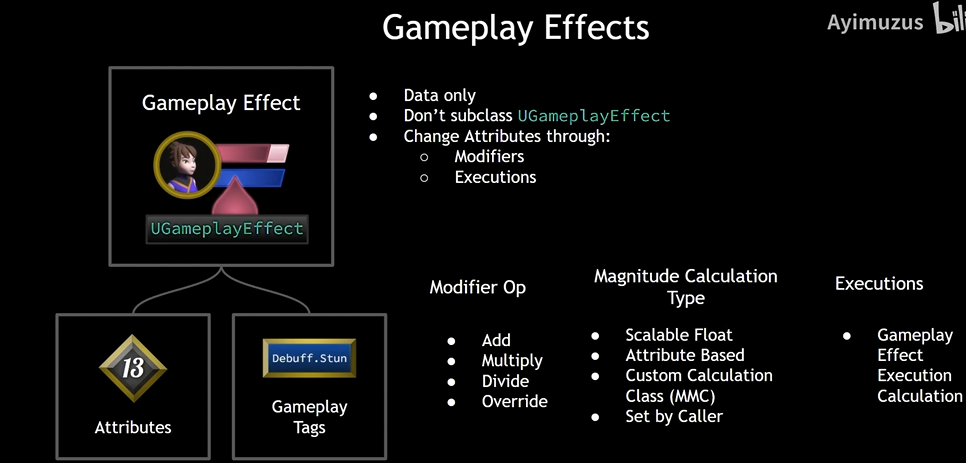
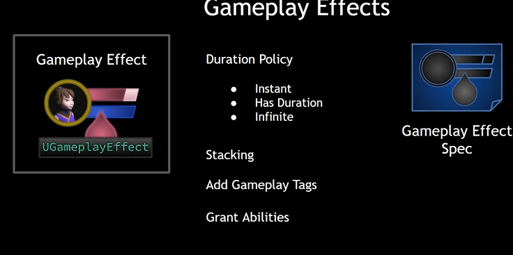
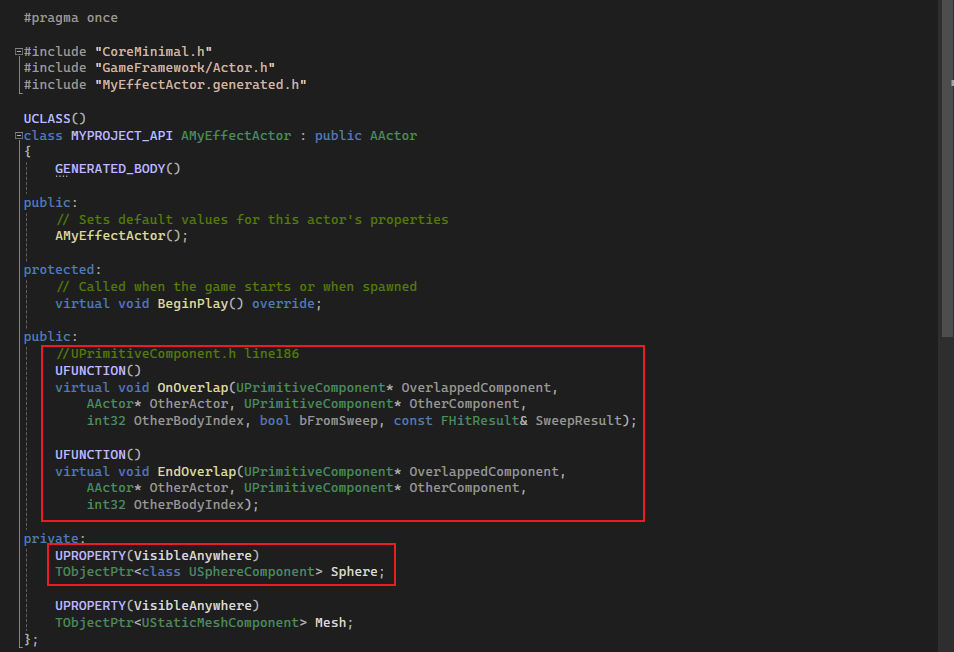
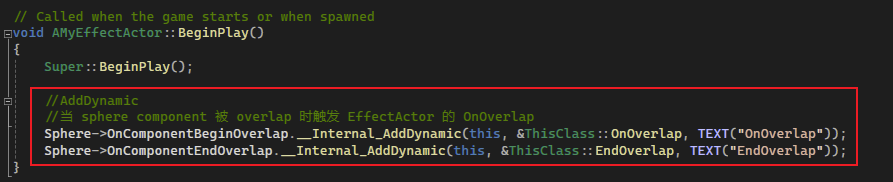
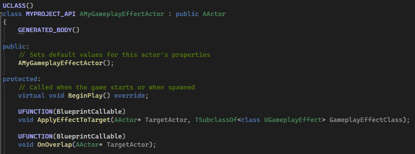
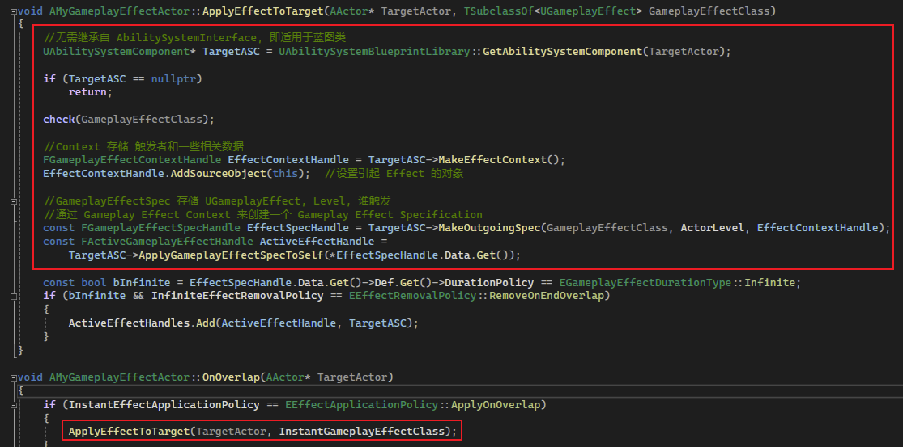
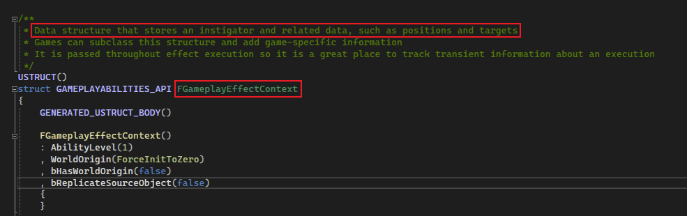
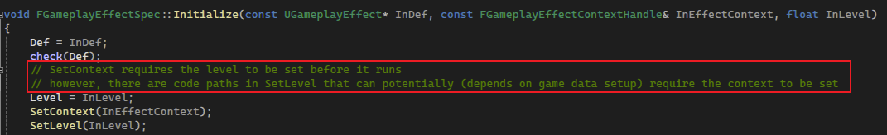

## 简介

`Gameplay Effect(GE)` 是一个 `UGameplayEffect` 类型的对象，我们通常使用它对 `Attributes` 和 `Gameplay Tags` 进行更改。

`GE` 是一个仅仅拥有数据(`Data Only`)、蓝图类型(不需要创建 `UGameplayEffect` 子类)、使用 `Modifiers` 和 `Executions` 来更改 `Attribute` 的对象：



其中，`Modifier` 包括了 `Add` 、`Multiply` 、`Divide`、`Override` 四个操作，用于对指定 `Attribute` 进行 <u>加减、乘、除、覆盖</u>  四个操作，而这些操作的数值则通过 `Magnitude Calculation Type` 数值计算类型来指定。

其中可以指定的数值类型右四种：`Scalable Float`、`Attribute Based`、`Custom Calculation Class`、`Set By Caller`。这四种分别表示：<u>基于指定的浮点数(通过配置具体数值、表格)、基于某个属性(让该属性继续另外的属性进行计算)、自定义计算类型、触发器(暂时不解释，和 `Tags` 相关)</u>。

> 这里暂时就不介绍 `Executions` 了。。。

同样的，`Gameplay Effect` 还可以配置 <u>持续策略、堆叠、添加 `Gameplay Tags`、基于能力</u> 等。



另外，我们可以直接应用 `GE`，但在这里我们会经常通过应用 `Gameplay Effect Spec`，一个用于描述 <u>`GE` 类型、存储上下文(触发者和接收者)、等级(用于获取 `Table` 值)</u> 等 的一个对象，来代替直接应用 `GE`。

## 重新设计 Effect Actor

在 [3.Attributes & Effect Actor](./3.Attributes & Effect Actor.md) 中介绍了如何影响 `Attribute`，主要通过一个很蹩脚的方式获取 `AttributeSet`，然后更改其值。

（这里在上述篇章中并为介绍）并且我们还提前定义了一个 `SphereComponent` 用于描述碰撞范围，若是需要其他形状的范围还需自行添加。。。。





诸多种种不合理，我们不得不重新设计 `Effect Actor`。

我们的初衷还是希望当角色触碰到这种类型 `Actor` 时，则会触发设定好的 `GE`，同样我们还希望使用上 `GE Spec`，因此我们这里声明一些函数：

```C++
UCLASS()
class MYPROJECT_API AMyGameplayEffectActor : public AActor
{
	GENERATED_BODY()
	
public:	
	// Sets default values for this actor's properties
	AMyGameplayEffectActor();

protected:
	// Called when the game starts or when spawned
	virtual void BeginPlay() override;

	UFUNCTION(BlueprintCallable)
	void ApplyEffectToTarget(AActor* TargetActor, TSubclassOf<class UGameplayEffect> GameplayEffectClass);

	UFUNCTION(BlueprintCallable)
	void OnOverlap(AActor* TargetActor);
}
```

```C++
void AMyGameplayEffectActor::ApplyEffectToTarget(AActor* TargetActor, TSubclassOf<UGameplayEffect> GameplayEffectClass)
{
	//无需继承自 AbilitySystemInterface, 即适用于蓝图类
	UAbilitySystemComponent* TargetASC = UAbilitySystemBlueprintLibrary::GetAbilitySystemComponent(TargetActor);

	if (TargetASC == nullptr)
		return;

	check(GameplayEffectClass);

	//Context 存储 触发者和一些相关数据
	FGameplayEffectContextHandle EffectContextHandle = TargetASC->MakeEffectContext();
	EffectContextHandle.AddSourceObject(this);	//设置引起 Effect 的对象

	//GameplayEffectSpec 存储 UGameplayEffect, Level, 谁触发
	//通过 Gameplay Effect Context 来创建一个 Gameplay Effect Specification
	const FGameplayEffectSpecHandle EffectSpecHandle = TargetASC->MakeOutgoingSpec(GameplayEffectClass, ActorLevel, EffectContextHandle);
	const FActiveGameplayEffectHandle ActiveEffectHandle =
		TargetASC->ApplyGameplayEffectSpecToSelf(*EffectSpecHandle.Data.Get());
}

void AMyGameplayEffectActor::OnOverlap(AActor* TargetActor)
{
		ApplyEffectToTarget(TargetActor, InstantGameplayEffectClass);
}
```





在上述代码中，我们先看函数 `ApplyEffectToTarget` 的定义，需要一个 `TargetActor(目标)` 以及一个 `GameplayEffectClass(GE类型)`。

在我们获得目标的 `ASC` 后，为了创建 `GE Spec`，首先需要一个上下文(`Context`)，用于记录一些诸如：引起者（<u>关于这个引起者，可以看 [5_5.PreAttributeChange & PostGameplayEffectExecute](./5_5.PreAttributeChange & PostGameplayEffectExecute.md)，其中详细介绍了本例中的各种角色，以及其是如何规定的</u>）、能力等级等（具体看 `FGameplayEffectContext` 类型）：



这里我们直接通过 `ASC` 进行创建，并且设置来源 `Actor`：

```C++
//Context 存储 触发者和一些相关数据
FGameplayEffectContextHandle EffectContextHandle = TargetASC->MakeEffectContext();
EffectContextHandle.AddSourceObject(this);	//设置引起 Effect 的对象
```

然后就是创建 `GE Spec`，同样通过 `ASC` 进行创建：

```C++
//GameplayEffectSpec 存储 UGameplayEffect, Level, 谁触发
//通过 Gameplay Effect Context 来创建一个 Gameplay Effect Specification
const FGameplayEffectSpecHandle EffectSpecHandle = TargetASC->MakeOutgoingSpec(GameplayEffectClass, ActorLevel, EffectContextHandle);
```

这里需要注意的是这个 `Level`，在 `GE Spec` 的初始化函数中，提到了 `Context` 也管理 `Level`，至于使用哪个，可以通过设置来取舍。



最后我们需要应用这个 `GE Spec`，直接使用 `ASC` 的 `ApplyGameplayEffectSpecToSelf` 即可：

```C++
TargetASC->ApplyGameplayEffectSpecToSelf(*EffectSpecHandle.Data.Get());
```

