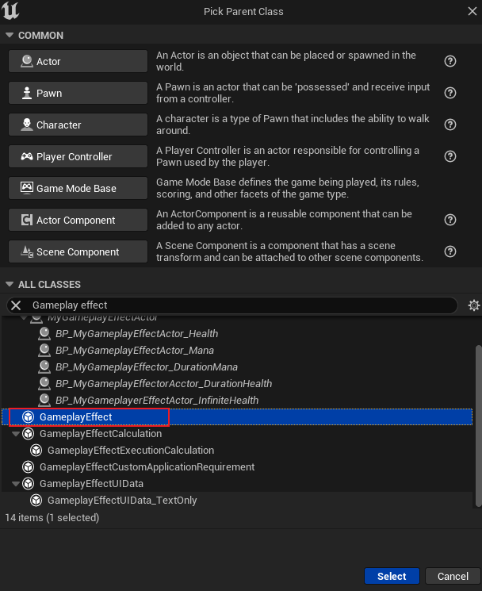
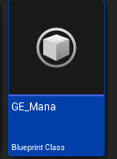
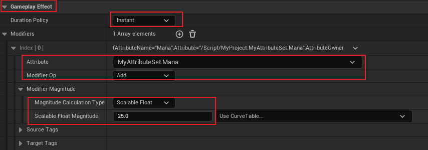
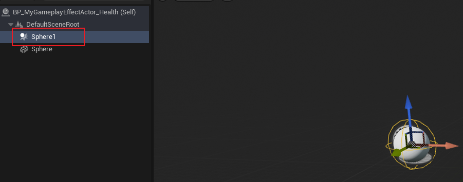
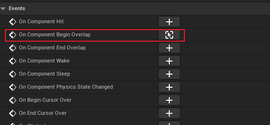
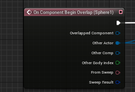
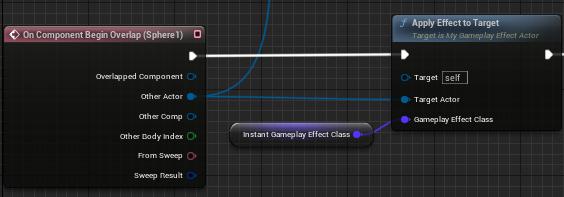

## 简介

这里介绍 `GE` 的一种 `Modifier`，即 `Instant` 即时修改。

## 创建 GE

这里直接创建一个蓝图的 `Gameplay Effect` 类：





然后我们打开它进行配置：



如上述配置，我们便得到了一个即时的 `GE`，这个效果是将 `Attribute` 为 `MyAttributeSet.Mana` 的属性，通过 `Add` 增加的操作，增加一个 `Scalable Float` 为 `25` 的数值。

> *那我们应该如何应用它呢？*

我们在 [上一篇 GameplayEffect](./5.GameplayEffect.md) 中重新设计了 `Effect Actor`，其中的 `ApplyEffectToTarget` 函数则是应用 `GE` 的方法，那么我们需要获取 `Target(目标)` 以及 `Gameplay Effect Class(GE类型)`，在这里我们通过继承的方式获得蓝图类：

添加一个球体碰撞，并且添加 `Sphere` 的 `Begin Overlap` 事件：







这样我们就可以获取 `Target(目标)`。关于获取 `GE Class`，我们可以通过修改 `C++` 基类，也可以通过蓝图类添加成员的方式，这里直接就在 `C++` 中进行更改：

```C++
UPROPERTY(EditAnywhere, BlueprintReadOnly, Category = "Applied Effects")
TSubclassOf<class UGameplayEffect> InstantGameplayEffectClass;
```

这样在蓝图中可以进行编辑：


然后调用：



## 效果


可以看到，`Mana` 属性立刻添加了 `25`。