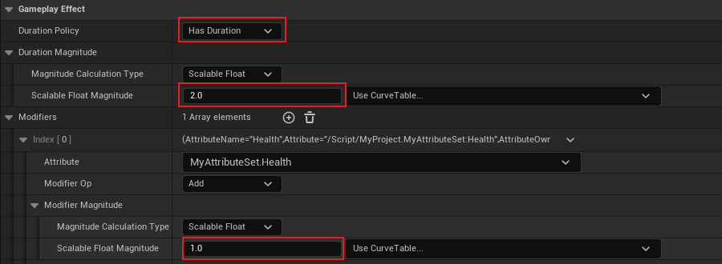
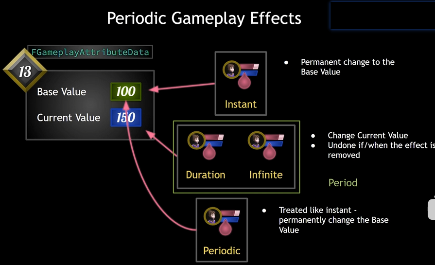

## 简介

这里介绍 `GE` 的第二种 `Modifier`，即 `Duration` 持续修改。以及其周期 `Period`。

## 创建 GE

### Duration

如上图，在配置中，将 `Duration Policy(持续策略)` 更改为 `Has Duration`，<u>然后在 `Duration Magnitude(持续数值)` 中，定义一个基础数值 `2`，表示这个 **`GE` 会持续 `2` 秒的时间，当持续时间结束后，该效果会移除**</u>。

即 `Modifiers` 会在定义的持续时间结束后，移除相应效果。

### Periodic

这里先来介绍一些区别，方便我们更加深入的了解这些 `GE` 的持续策略：

在各种持续策略中：`Instant` 即时的持续策略可视为永久的修改，其修改的是 `Attribute` 中的 `Base Value`；

而 `Duration(持续)` 和 `Infinite(无限)` 则不同，它们修改的 `Current Value`，在持续时间结束 / 手动移除 `GE` 时，`GAS` 将会把这些 `GE` 的效果进行撤销；

`Periodic(周期)` 的更改可以作为 `Duration` 和 `Infinite` 的一种特殊处理，和 `Instant` 一样，该修改同样是被视为永久修改，即修改的是 `Base Value`。

> 所以我们在为 `Duration` 和 `Infinite` 配置了 `Peroid(周期)` 后，`GAS` 在持续时间结束 / 手动移除 `GE` 时 也不会对修改进行撤销。

> 这里需要注意的是：<u>只有 `Duration` 和 `Infinite` 才能够配置 `Period`。</u>

接下来我们进行配置：

如上图所示，`Period` 为执行一次的周期间隔，`0.1` 则是周期为 `0.1s`，即 `1` 秒内执行 `10` 次；而第二个选项则是判断是否立刻执行，如果取消勾选，则需要等待一个周期，然后再执行。

## 效果

可以看到，在 `2s` 的持续时间中，以 `0.1s` 的周期添加 `1` 的 `Health`。