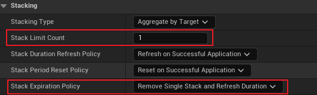

## 简介

这里介绍 `GE` 的 `stack`，即堆叠。

在之前的配置的 `Effect` 中，如果我们不设置任何的 `stack` 效果，那么当多个效果应用时，则每个效果都独立计算。这显然也是正确的。

但有时我们并不想要这样的效果，而是希望刷新持续时间，并且限制数量，这些效果就必须得用 `stack(堆叠)` 来实现。

## 配置 GE

### 数量限制

如上图，为 `stack(堆叠)` 的配置项，首先介绍 `stacking type` 和 `stack limit count`，为 <u>**堆叠的类型**</u> 和 <u>**限制数量**</u>，堆叠的类型分为 `Source` 和 `Target` 两种：

这两种的区别在于，在限制数量时，`GAS` 会根据设置的类型，来判断堆叠的 `GE` 是否超过限制数量：

当堆叠类型是 `By Source` 时，`GAS` 会判断该 `GE` 的发起者是否超出了限制，而 `By Target` 则相反：

`GAS` 则会去访问 `GE` 的目标，判断是否存在超出限制的 `GE`。

> <u>**当判断超出 `Limit` 时，整个 `GE` 则不会起到效果。**</u>

### 持续时间刷新、周期重置策略

接下来看 `Stack Duration Refresh Policy` 和 `Stack Period Reset Policy`，即 <u>**持续时间刷新策略**</u> 和 <u>**周期重置策略**</u>：

这两个策略拥有相同的配置选项，当配置 `Never Reset` 时，当有同种类型的 `GE` 堆叠时，其拥有的 `Duration(持续) / Period(周期)` 效果将不会重置，仅仅根据 `Limit` 进行 `Modifier` 效果；

否则，其持续时间将重置，并且重一个新的周期开始。

### GE 结束策略

最后来看一个 `Stack Expiration Policy`：

该选项表示 <u>`GE` 效果结束时堆叠更新策略</u>。

这里举一个例子，当我们拥有一个 `Duration(持续)` 的 `GE` 时，根据配置的堆叠效果，可以进行周期刷新，来延长其持续时间。而当这个 `GE` 持续时间结束时，则会去根据上述配置，对所有堆叠类型的效果进行相关操作：

- `Clear Entire Stack` 则是将所有堆叠在一起的 `GE` 移除；

- `Remove Single Stack and Refresh Duration` 则是移除该 `GE` 的堆叠效果，并且刷新持续时间；

- `Refresh Duration` 则是指刷新时间，并且不会移除该 `GE`，因此会产生一个 `Infinite(无限)` 的效果。

## 效果

这里配置一个持续 `3s`，周期为 `0.1s` 每次增加 `0.1` 的 `GE`，这里展示不同配置时的效果，每次都是经过 `1s` 后进行堆叠，用于展示不同配置下的效果。

堆叠配置如下：

这里我们将堆叠上限设置为 `1`，并且结束策略为移除单个并且刷新持续时间：

可以看到，经过 `1s` 多的时间后，`GE` 的持续时间进行了刷新，再次经过 `3s(即 Mana 为 14)` 时，整个效果便停止了。

可以看到结束策略并未重新刷新持续时间，<u>因为 `Limit` 规定了只有 `1` 个 `GE` 可进行堆叠，而 `GE` 结束后就把自己删除了，所以并没有其他的 `GE` 被刷新持续时间。</u>

接下来更改一下 `Limit` 和 结束策略：

> 做这样的更改，是为了后续对比结束策略的影响

可以看到，对比上一个配置，最大的更改为最终的值由 `14+` 变成了 `17+`，这是因为设置了堆叠数量 <u>`Limit` 为 `2` 的缘故，其堆叠效果（即 `Modifier`）也被堆叠，导致每秒从 `+0.1` 变为 `+0.2`</u>。

然后当持续时间结束后，<u>`GE` 移除了所有的 `Stack`，因此堆叠之后经过 `3s` 后增长停止</u>，也就是说整体时间经过了大致 `(1 + 3) s`。

接下来更改结束策略：

这里将结束策略重新设置了回去，我们来看看效果：

可以看到，在 `Mana` 为 `11+` 的时刻，我们进行了一次堆叠，然后它就从 `11+` 一直升到了 `20+`，相比较上一个设置，理论提升了 `3.0` 左右；

然后再仔细观察，发现其增长速率在 `11+ ~ 17+` 为每次增加 `0.2`，这是由于其堆叠效果，<u>不仅刷新了持续时间，还使其 `Modifier` 进行了堆叠</u>，因此增长速率提升了一倍；

最后持续时间结束后，<u>某个 `GE` 执行结束策略，将自身从 `Stack` 中移除，并且刷新 `Stack` 中其他 `GE` 的持续时间</u>，然后我们就看到 `Mana` 以 `0.1` 的增加速率持续了 `3s`。