## 简介

这里将介绍 `GE` 的第三种持续策略：`Infinite`，即无限。

除此之外，由于 `Infinite` 的特性，我们会需要将其进行移除，本篇同样会去介绍如何将执行的 `GE` 从 `Target` 中移除。

## 配置 GE

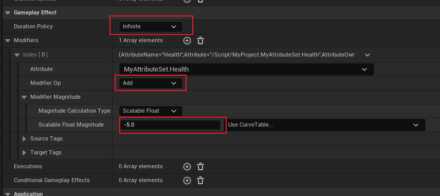

首先来到 `Gameplay Effect` 标签，<u>将其持续策略更改为 `Infinite`</u>，这样就获得了一个无限持续时长的一个 `GE (buff?)`，然后配置 `Modifier`，让其 `Add -5(即 减5)`；

除此之外，我们需要将其设置一个周期，意为 <u>无限周期地去更改属性</u>：

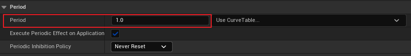

这里设置周期为 `1.0s`。

> 然后我们就得到了一个能够无限减少生命值的`GE`

> 但是这样会存在一个问题：
>
> 当我们的 `Effect Actor` 被角色 `Overlap` 后，上述的 `GE` 将会被应用到角色上，这一切正常；
>
> 但是，当我们的角色 **<u>离开了 `Effect Actor` 后，发现还是会被 `GE` 影响，并且无法停下来，这是需要修改的。</u>**

## 移除 GE

### 制定移除策略

在这里我们需要明确 `Effect Actor` 中 `Infinite GE` 的移除策略，这里将其定义为 `OnEndOverlap` 时移除；同样的，这也是需要成为可配置的选项，那么我们将修改代码：

```C++
UENUM(BlueprintType)
enum class EEffectRemovalPolicy : uint8 {
	RemoveOnEndOverlap,
	DoNotRemove
};
```

```C++
UPROPERTY(EditAnywhere, BlueprintReadOnly, Category = "Applied Effects")
EEffectRemovalPolicy InfiniteEffectRemovalPolicy = EEffectRemovalPolicy::RemoveOnEndOverlap;
```

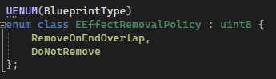

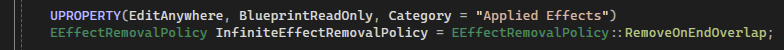

首先添加枚举类，然后在 `Effect Actor` 中添加其成员，并且通过 `UPROPERTY` 将其声明为可编辑成员。

### 添加 GE 管理

制定完移除策略后，为了实现将对应 `GE` 进行移除，我们需要在将 `GE` 至角色时，将其进行存储。

> *那要如何进行存储呢？*

首先我们观察一下 `ApplyEffectToTarget`：

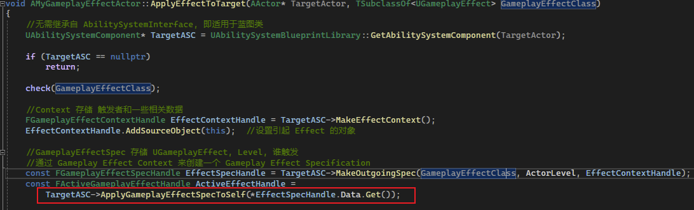

其中在 `ASC` 中应用 `GE Spec` 的函数引起了我们的注意：

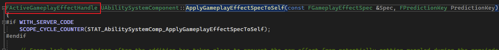

去到定义，我们可以发现这个函数会返回一个 `FActiveGameplayEffectHandle`，关于这个结构体是怎么回事，在 [这片文章 [原创]UE技能系统—2.GameplayEffect 你用废了吗？(一)](https://zhuanlan.zhihu.com/p/544114620) 中解释道：

>  `ApplyGameplayEffect` 成功以后，<u>ASC 会将 Apply 成功的 **非瞬时** 的 GE 放入可同步的属性 `ActiveGameplayEffects`</u>（类型是： `FActiveGameplayEffectsContainer`）内，它的主要作用是存储和管理所有已激活 `GE`（以 `FActiveGameplayEffect` 结构体存储，它包含了`FGameplayEffectSpec`，生效开始时间等） ：
>
> 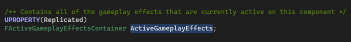
>
> `FActiveGameplayEffectHandle` 则是用来定位 `FActiveGameplayEffect` 的，但它的原理和上文提到的`FGameplayEffectSpecHandle` 不太一样。它不是通过 `TSharedPtr` 去获取，而是存储了一个全局唯一的索引值（`int32`），通过它去 `ActiveGameplayEffects` 内获取 `FActiveGameplayEffect` 指针 

因此，我们需要一个成员，来记录 `Infinite` 的 `GE`，并且需要将其作用的 `ASC` 进行映射：

```C++
TMap<FActiveGameplayEffectHandle, UAbilitySystemComponent*> ActiveEffectHandles;
```

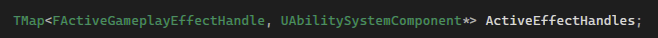

这时我们需要修改 `ApplyEffectToTarget` 函数：

```C++
const FActiveGameplayEffectHandle ActiveEffectHandle =
    TargetASC->ApplyGameplayEffectSpecToSelf(*EffectSpecHandle.Data.Get());

const bool bInfinite = EffectSpecHandle.Data.Get()->Def.Get()->DurationPolicy == EGameplayEffectDurationType::Infinite;
if (bInfinite && InfiniteEffectRemovalPolicy == EEffectRemovalPolicy::RemoveOnEndOverlap) 
{
    ActiveEffectHandles.Add(ActiveEffectHandle, TargetASC);
}
```

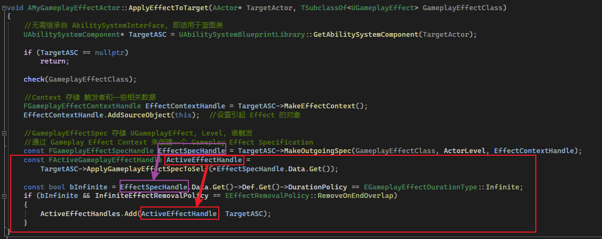

我们可以通过上下文 `GE Spec` 来获得 `GE` 的定义 `Def`，即通过 `FGameplayEffectSpec` 成员获得：

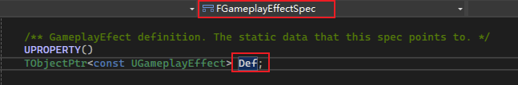

然后通过获取 `UGameplayEffect` 成员 `DurationPolicy` 来获取其持续策略：

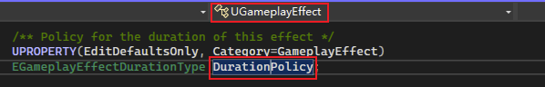

当然也可以简单一点，`FActiveGameplayEffectHandle` 和 `ASC` 的 `GetGameplayEffectDefForHandle` 来获取 `UGameplayEffect`：

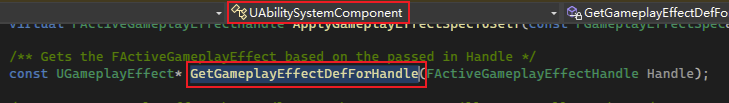

总而言之，在获取到 `Infinite` 的 `GE` 后，需要将其 `Handle` 和 作用的 `ASC` 进行映射并且存储。

### 移除 GE

在 `OnEndOverlap` 中需要做如下修改：

```C++
void AMyGameplayEffectActor::OnEndOverlap(AActor * TargetActor)
{
	//Removal
	if (InfiniteEffectRemovalPolicy == EEffectRemovalPolicy::RemoveOnEndOverlap)
	{
		UAbilitySystemComponent* TargetASC = 
			UAbilitySystemBlueprintLibrary::GetAbilitySystemComponent(TargetActor);

		if (!IsValid(TargetASC))
			return;

		TArray<FActiveGameplayEffectHandle> HandlesToRemove;
		for (auto HandlePair : ActiveEffectHandles)
		{
			if (HandlePair.Value == TargetASC)
			{
				TargetASC->RemoveActiveGameplayEffect(HandlePair.Key, 1);
				HandlesToRemove.Add(HandlePair.Key);
			}
		}

		for (auto& Handle : HandlesToRemove)
		{
			ActiveEffectHandles.FindAndRemoveChecked(Handle);
		}
	}
}
```

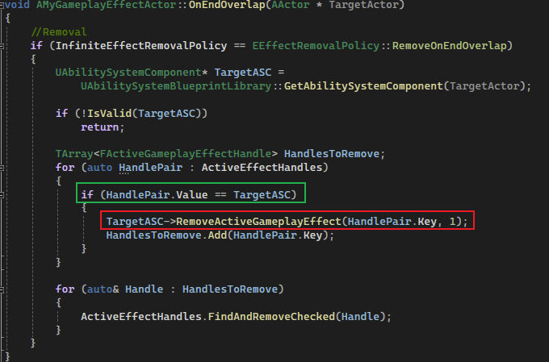

从上述代码中可以看出，我们做 `ASC` 的映射，是为了在移除 `GE` 时和特定的 `ASC` 对应上，避免出现误删的情况。

> 这样我们就获得了一个效果正确的 `Infinite GE`。

## 效果


可以看到走进范围扣血，出来后就不扣了。。。。。