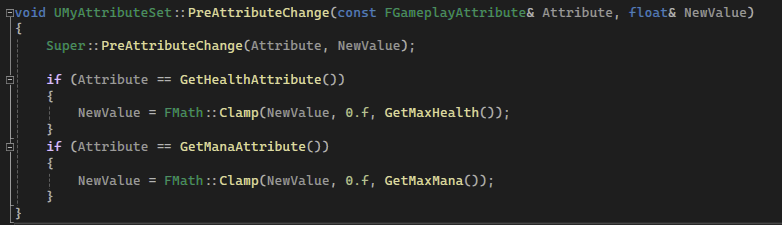
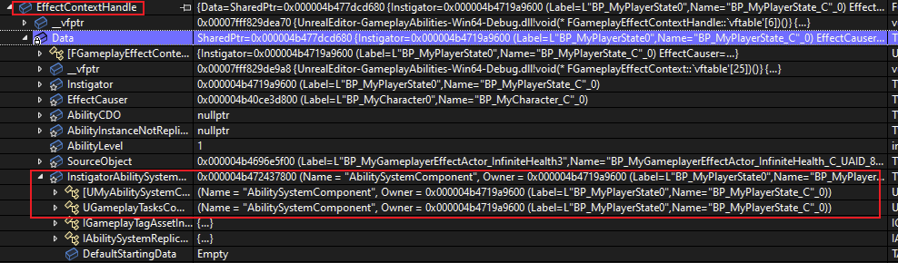

## 简介

这里将介绍 `AttributeSet` 中两个十分好用的方法：`PreAttributeChange` 和 `PostGameplayEffectExecute`。


这两个方法是 `UAttributeSet` 的基类方法，`GAS` 会在修改 `AS` 时，在不同的时期去调用这些方法。

- `PreAttributeChange`：这个方法很好理解，就是指在修改 `Attribute` 之前便会去调用，当然无论修改那个属性。
- `PostGameplayEffectExecute`：这个用于目前还不太清楚，看注释指的是在 `GE` 去执行修改 `Base Value` 之前调用，并且会传入一个 `FGameplayEffectModCallbackData` 类型的参数，用于获取诸如 `GE Spec(存储了 Contex、GE 等)`、`Target ASC` 等数据。


## 限制属性区间

经过了多种 `GE` 的制作后，我们发现一个问题：`AS` 中的属性有时会超出它应该在的区间范围。

这时我们需要在一个地方对其进行判断，这个地方可以是在 `GAS` 执行属性修改之前，也就是 `PreAttributeChange`：


那么我们在重写这个方法后：

```C++
void UMyAttributeSet::PreAttributeChange(const FGameplayAttribute& Attribute, float& NewValue)
{
	Super::PreAttributeChange(Attribute, NewValue);

	if (Attribute == GetHealthAttribute())
	{
		NewValue = FMath::Clamp(NewValue, 0.f, GetMaxHealth());
	}
	if (Attribute == GetManaAttribute())
	{
		NewValue = FMath::Clamp(NewValue, 0.f, GetMaxMana());
	}
}
```



属性便有了自身的区间，并且不会超出这个区间。

## 获取 GE 执行的信息

先看代码吧：

```C++
USTRUCT()
struct FEffectProperties
{
	GENERATED_BODY();

	FEffectProperties() {}

	FGameplayEffectContextHandle EffectContextHandle;

	UPROPERTY()
	UAbilitySystemComponent* SourceASC = nullptr;

	UPROPERTY()
	AActor* SourceAvatarActor = nullptr;

	UPROPERTY()
	AController* SourceController = nullptr;

	UPROPERTY()
	ACharacter* SourceCharacter = nullptr;

	UPROPERTY()
	UAbilitySystemComponent* TargetASC = nullptr;

	UPROPERTY()
	AActor* TargetAvatarActor = nullptr;

	UPROPERTY()
	AController* TargetController = nullptr;

	UPROPERTY()
	ACharacter* TargetCharacter = nullptr;
};
```

```C++
void UMyAttributeSet::PostGameplayEffectExecute(const FGameplayEffectModCallbackData& Data)
{
	Super::PostGameplayEffectExecute(Data);

	//获取 引起 & 接受 Gameplay Effect 的对象
	FEffectProperties Props;
	SetEffectProperties(Data, Props);
}

void UMyAttributeSet::SetEffectProperties(const FGameplayEffectModCallbackData& Data, FEffectProperties& Props) const
{
	// Source = 引起 Effect 的对象, Target = Effect 的作用目标 (owner of this as)

	Props.EffectContextHandle = Data.EffectSpec.GetContext();
	Props.SourceASC = Props.EffectContextHandle.GetOriginalInstigatorAbilitySystemComponent();

	if (IsValid(Props.SourceASC) && 
		Props.SourceASC->AbilityActorInfo.IsValid() && 
		Props.SourceASC->AbilityActorInfo->AvatarActor.IsValid())
	{
		Props.SourceAvatarActor = Props.SourceASC->AbilityActorInfo->AvatarActor.Get();
		Props.SourceController = Props.SourceASC->AbilityActorInfo->PlayerController.Get();

		if (Props.SourceController == nullptr && Props.SourceAvatarActor != nullptr)
		{
			if (const APawn* Pawn = Cast<APawn>(Props.SourceAvatarActor))
			{
				Props.SourceController = Pawn->GetController();
			}
		}

		if (Props.SourceController != nullptr)
		{
			Props.SourceCharacter = Cast<ACharacter>(Props.SourceController->GetPawn());
		}
	}

	if (Data.Target.AbilityActorInfo.IsValid() && Data.Target.AbilityActorInfo->AvatarActor.IsValid())
	{
		Props.TargetAvatarActor = Data.Target.AbilityActorInfo->AvatarActor.Get();
		Props.TargetController = Data.Target.AbilityActorInfo->PlayerController.Get();
		Props.TargetCharacter = Cast<ACharacter>(Props.TargetAvatarActor);

		Props.TargetASC = UAbilitySystemBlueprintLibrary::GetAbilitySystemComponent(Props.TargetAvatarActor);
	}
}
```


可以看到我们定义了一个结构体 `FEffectProperties`，用于记录 `Source(来源)` 以及 `Target(目标)` 的各种属性，包括了 `ASC`、`AvatarActor`、`Controller`、`Character` 。

这时我们可以进行调试，观察一下这个函数：


> *我们很惊讶的发现，为什么 `Source` 和 `Target` 是一模一样的呢？*

虽然我们在 [5.GameplayEffect](./5.GameplayEffect.md) 中，在 `Context` 中设置了：

```C++
EffectContextHandle.AddSourceObject(this);
```

但这其实并不表示 `Source` 就是这个 `GE` 对象，可以看源码中的注释：


他仅仅只是表示 `GE` 的创建者，和 `ASC` 中的 `Instigator` 发起者的概念不相同，这时我们看一看 `Context`：



可以看到这时的 `Instigator` 就已经是 `PlayerState`，也就是自身。引起这个现象的原因，是在 **<u>创建 `Context` 时，使用的 `ASC` 本身就是自己</u>**：


所以 `ASC` 创建 `Context` 后，自然的将自己作为 `Instigator` ，也就是发起者，然后随着 `GE Spec` 的构造，并且应用：


那么 `Instigator` 发起者 和 `Target` 目标 都是自身，也就自然理所应当。

