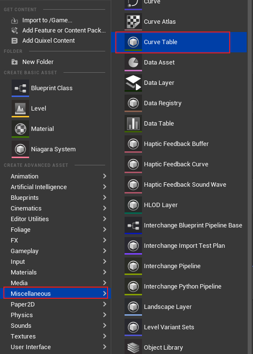

## 简介

在 [5.GameplayEffect](./5.GameplayEffect.md) 中介绍到可以使用一个 `Curve Table` 和 `Level` 来表示修改值的大小，本篇就来介绍一下这是如何使用的。

## 创建 Curve Table

如上图，我们创建一个 `Curve Table` 的资产，然后添加曲线：

如上图所示，点击红色框中的 `+Curve` 可以添加曲线，然后点击绿色框中的按钮，可以添加列数，紧接着就可以编辑曲线的内容了。

## 应用 Curve Table

如上图所示，在添加完 `Curve Table` 后，看绿色部分的内容：

- 左边绿色框中的内容为 **基数**，右边的为等级(列)中对应的值，最终的预览值结果为 `基数 * 曲线值` 

### 调整 Level

> *那么我们要如何调整曲线应用的列数呢？*

在 `GE Spec` 构造的时候，需要设置一个 `Level`：

这个 `Level` 其实就代表着当前的 `GE` 应该应用 `Curve` 的哪一列。

上述为 `GE Spec` 中 `Level` 的定义和注释。