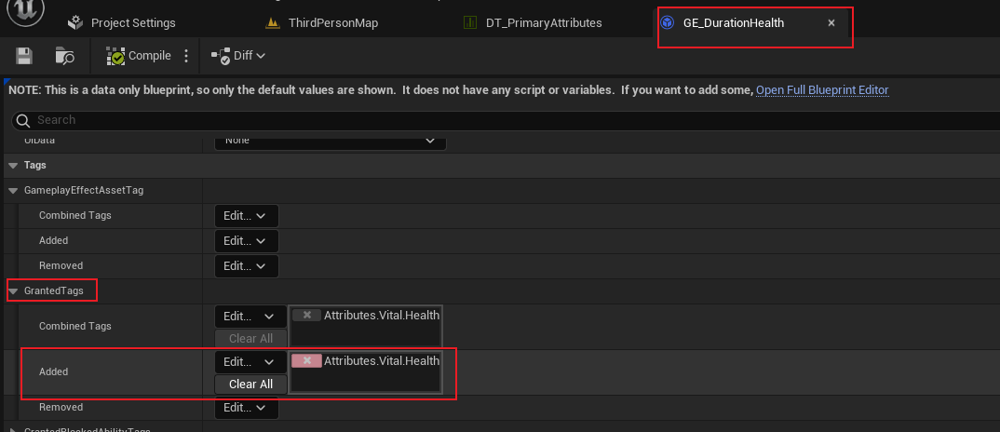

## 简介

本章节将介绍 `Gameplay Tags`，即游戏标签。

这是 `GAS` 中必不可少的一部分，虽然说它可以独立于 `GAS` 之外，也可以用在非 `GAS` 框架下。

如上图，`Gameplay Tags` 是一个拥有多层级的一个字符结构。这些层级使用一个 `.` 进行分割。

相较于 `FString / FName`，它的优势在于 **<u>可以在不同的 `Tags` 之间匹配拥有相同的 `root`</u>**，并且在 `ASC` 中包括了对 `Tags` 进行处理的接口，对其支持度较高。

另外，`Tags` 通过 `Gameplay Tag Manager` 进行管理，并且通过特殊容器 `Gameplay Tag Container` 进行存储。

关于 `Tags` 的使用，这里简单列举一些：

- 在 `GE` 的作用下，可以将 `Tag` 赋予目标 `ASC`；若 `GE` 有持续时间，那么对应的，在持续时间结束后，`Tag` 将会移除
- `ASC` 中，可以拥有很多的 `GA(Gameplay Ability)`，这些能力可以被标签阻塞，即拥有该标签时，不会触发这个能力；或者说必须拥有某个标签才能够触发该能力。
- 另外，可以使用 `Tags` 来识别多种数据，例如：输入、属性、消息等等。。

当然这并不是 `Tag` 的全部。

## 创建 Gameplay Tag

### Editor

如上图，打开项目设置，确定好层级，并且直接添加 `Gameplay Tag` 即可。

> 在配置文件 `DefaultGameplayTags.ini` 可以看到

### Data Table

同样的，`Gameplay Tags` 也可以通过 `Data Table` 进行配置。

首先创建资产：

这里需要注意，`Data Table` 的数据结构需要选择上图中的 `GamplayTagTableRow`，然后我们就可以对其进行编辑：

和项目配置同理，同样可以添加标签和注释，只是这里需要手动编辑 `Tags` 的层级，不如项目设置中方便。

然后我们在项目设置中进行应用：

往 `Gameplay Tag Table List` 将其添加进去，那么可以发现，`Editor` 自动帮我们将这些 `Tag` 添加至 `Gameplay TagList` 中。

## 使用 GE 应用 Tags

如上图，在 `GE` 配置中，`Tags -> GrantedTags` 标签下，表示将 `Tags` 授予一个被 `GE` 影响的目标，`Added` 表示将配置的 `Tags` 添加到影响的目标上。

那么运行效果如下：

可以看到，在调试窗口中看到 `Owned Tags` 中，`GE` 配置的 `Tag` 成功的添加到了角色的 `ASC` 中。然后在 `GE` 持续时间结束后，标签也会自然消失。

这里需要注意一个细节：`Tag` 在最后会有一个 `(1)` 的字样，这里表示 `GE` 应用了多少次这个 `Tag`。但需要注意的是，<u>配置了 `Stack(堆叠)` 的 `GE`，是不会多次应用标签的</u>。只有没有配置堆叠的 `GE` 才会对目标多次应用 `Tag`。