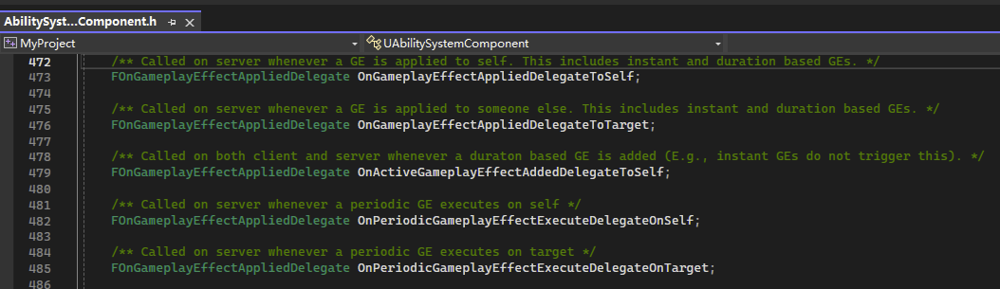
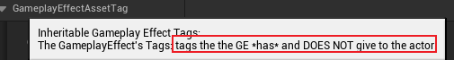
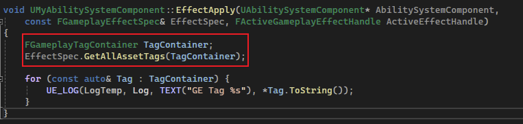

## 简介

这里将介绍如何使用 `ASC` 中的各种 `OnGameplayEffectAppliedDelegate` 即 `GE` 被应用时触发的委托，配合 `Gameplay Tags` 使用：



如上图，是 `ASC` 中定义的各种 `GE` 被应用时的委托，分别是 `To Self / Target`，和 `Execute` 时进行触发。

## 绑定委托

在 [2.项目构建](./2.项目构建.md) 中提到，关于使用了 `GAS` 的角色，都使用了一个初始化函数 `InitAbilityActorInfo`，这个函数在不同的角色中的调用时机不同，例如：在玩家控制的角色中则是 `PossessedBy` 和 `OnRep_PlayerState`；而 Ai 控制的则是在 `BeginPlay`。

这个初始化函数包括了对 `ASC` 进行 `ActorInfo` 的初始化：


因此他对 `ASC` 绑定不同的 `GE Apply` 委托时机是一致的，那么我们更改一下 `ASC` 部分的代码：


上图是委托的定义，接下来在我们自己的 `ASC` 中定义被绑定的函数：


在上图中我们可以看到，`EffectApply` 是被绑定函数，而 `AbilityActorInfoSet` 其实是进行绑定的过程，这个函数在 `ASC` 进行初始化过程，应当被调用，所以修改初始化函数：


将其进行调用（`AICharacter` 同理）。

接下来我们可以看到，当 `GE` 应用到角色上时，那么这个被绑定的函数将会触发（`Effect Actor` 调用目标的 `ApplyGameplayEffectSpecToSelf`）：


这个当 `GE` 被应用时触发的委托可以说是非常有用的，目前看来只是打印了一些日志，但是其可以返回 `ASC`、`GE Spce`、`Active GE` 这些信息的特性，可以有相当多的操作空间。

> 例如在 `GE` 被应用时，显示在界面上等。。

下面我们将介绍一些对其的应用。

## 获取 GE Asset Tag

上面介绍了 `GrantedTag`，意为 `GE` 被应用时，目标将会 获得 / 移除 的 `Tag`。

而这里的 `AssetTag`，意为 `GE` "拥有" 的 `Tag`：



如上图中的注释，为 `GE` 拥有的 `Tag`，但并不会将其授予给目标。在这里主要使用这种类型的 `Tag`。

这里需要修改上述被绑定的函数 `EffectApply`：

```C++
void UMyAbilitySystemComponent::EffectApply(UAbilitySystemComponent* AbilitySystemComponent,
	const FGameplayEffectSpec& EffectSpec, FActiveGameplayEffectHandle ActiveEffectHandle)
{
	FGameplayTagContainer TagContainer;
	EffectSpec.GetAllAssetTags(TagContainer);

	for (const auto& Tag : TagContainer) {
		UE_LOG(LogTemp, Log, TEXT("GE Tag %s"), *Tag.ToString());
	}
}
```



可以看到，通过 `GE Spec` 中 `GetAllAssetTags` 方法可以获得 `AssetTag` 的一个容器，通过遍历这个容器，可以获得其中的 `Tag`：


在源码中，`FGameplayTagContainer` 其中主要成员就是`Tarray<FGameplayTag>`类型的成员，即一个成员类型为 `Gameplay Tag` 的数组。

现在回到 `Editor`，为 `GE` 添加 `AssetTag`：


然后我们看运行效果：


可以看到，当 `GE` 被应用时，被应用的目标出发了被绑定的函数 `EffectApply`，并且获得了 `GE Asset Tags`。

## 获取 Asset Tag 时进行广播

在通过 `GE Spec` 获取了所有的 `Asset Tags` 时，我们可以进行多种操作，但是为了使程序更加优雅、降低程序的耦合度，需要使用委托，在获取这些 `Tags` 时将需要的操作广播出去（依赖倒置）：


这里在 `ASC` 中定义一个委托，该委托接收一个只有 `FGameplayTagContainer` 参数的可调用对象，并且在 `EffectApply(被 GE Apply 绑定函数)` 中进行广播：


在 `OverlayWidgetController` 中（[4.游戏UI架构](./4.游戏UI架构.md)）和属性更改时绑定委托的时机中进行绑定：


### 使用 Data Table 记录消息

若我们想要通过 `Tag` 的内容关联相应的消息，`Data Table` 无疑是一个很好的选择，那么在创建数据表之间，必须要定义每一行的数据结构：

```C++
USTRUCT(BlueprintType)
struct FUIWidgetRow : public FTableRowBase 
{
	GENERATED_BODY()

	UPROPERTY(EditAnywhere, BlueprintReadOnly)
	FGameplayTag MsgTag = FGameplayTag();

	UPROPERTY(EditAnywhere, BlueprintReadOnly)
	FText Message = FText();

	UPROPERTY(EditAnywhere, BlueprintReadOnly)
	TSubclassOf<UMyUserWidget> MessageWidget;

	UPROPERTY(EditAnywhere, BlueprintReadOnly)
	UTexture2D* Image = nullptr;
};

```


如上图所示，这里简单定义里面的成员；而需要注意的是，这个数据结构必须继承自 `FTableRowBase`：


而这个 `FTableRowBase` 其实也很简单，仅仅是定义了两个虚方法，我们也不需要去实现它。

紧接着我们去创建 `Data Table`，并且去编辑它：


为了简化流程，我们将 `Row Name` 设置为和 `Tag` 内容相同，在后续检索时可以简化相当多的操作。

然后就是编辑一些信息，这里先简单编辑。

然后我们需要在 `OverlayWidgetController` 中设置对应的 `Data Table` 资产，并且去遍历它：


首先我们定义一个 `Data Table` 的成员变量，`EditDefaultsOnly` 表示它只能通过属性窗口进行编辑：


然后再上述绑定的 `Lambda` 中遍历这个数据表：

```C++
Cast<UMyAbilitySystemComponent>(AbilitySystemComponent)->EffectAssetTags.AddLambda(
    [this](const FGameplayTagContainer& AssetTags) 
    {
        for (const auto& Tag : AssetTags) {
            FUIWidgetRow* Row = 
                MessageDataTable->FindRow<FUIWidgetRow>(Tag.GetTagName(), TEXT(""));
        }
    }
);
```


注意：`UDataTable` 中的 `FindRow` 函数是一个模板函数，需要传入 `Row` 对应的结构，然后通过 `RowName` 将这个结构返回出来。（当然，若结构错误，则返回为空）。

### 添加委托

同样的，在这个 `Widget Controller` 中，为了实现和通知 `Attribute` 改变时进行广播相同的操作，我们一样需要定义一个委托，而这个委托就是将 `Data Table` 中的每一行（`Row`）的信息传出，因此定义如下委托：


并且定义成员，然后在接收到 `EffectApply` 的广播后，将上述定义的委托也进行广播：


这里的 `ReuqestGameplayTag`，其作用是像 `GameplayTagManager` 去请求 `Message` 标签，如果有这个标签，则进行返回，否则返回错误。

那么在这里，我们在请求 `Message` 标签时，会得到根标签 `Message`：


接着我们将 `GE` 的标签设置为 `Data Table` 中对应的标签：


然后在 [4.游戏UI架构](./4.游戏UI架构.md) 的基础上，将该委托进行绑定：


运行效果如下：


可以看到正好对应 `DataTable` 中的 `Message` 列。

> 这里的 `Server:` 只是当前运行模式为 `Listen Server`，若为 `StandAlone` 就不会出现这个前缀了。

