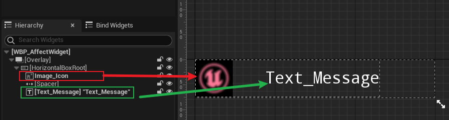
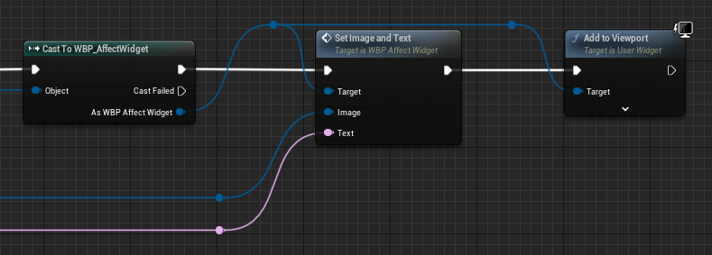

## 简介

通过 [6_1.Gameplay Effect Apply Delegate & Gameplay Tag](./6_1.Gameplay Effect Apply Delegate & Gameplay Tag.md) ，我们在 `GE` 应用时，可以通过广播的方式，执行 `Widget` 里的一些方法。

在本片中，我们将制作一些 `UI` 效果，比较偏向应用；另外对我们 `WidgetController` 部分的代码进行重构。

## 添加 Message Widget

现在我们在可以 `Overlay Widget` 中在 `GE` 被应用时通过 `Tag` 获得对应的一些数据，并执行一些操作了，目前是将这个数据打印出来，然而 <u>**我们希望将这些信息展示到屏幕上**</u>。

因此我们创建一个 `Message Widget`：

如上图，`AffectWidget` 表示在 `GE` 被应用后，弹出的一个消息框，简单编辑一下，让其拥有图片和消息功能：

并且可以进行设置：

然后我们将其放入 `DataTable` 中：

最后我们在 `Overlay Widget` 中进行调用，当然是在被绑定的事件中进行调用：

将其创建，并且设置 `Image`、`Text`，最后 `AddToViewport`。

然后我们就可以看到效果：

可以看到，我们的 `UI` 成功生成。

但是有个问题，这个 `UI` 会不断地叠加，效果还是不太好。

## 提升 UI 效果

虽然这个章节不是重点，但还是介绍一下吧。

### 动画效果

如上图，我们在左小角的 `Animations` 中，为 `Widget` 添加动画效果，这些效果可以是 `Transform` 的改变，也可以是 `Render Opacity(透明度)` 的修改。

先点击 `+Animation` 添加动画，然后添加轨道 `+Track`，每个 `Track` 可以对空间进行操作。

> *这里简单将制作移动和透明度渐变的效果*

然后就是播放这段动画：

可以看到，在函数中可以获得添加的动画，然后通过函数 `Play Animation` 进行播放就可以了。

关于 `Destroy Delay` 延迟销毁，是一个事件：

由于函数中不能使用 `Delay`，只能通过事件来执行 `Delay` 操作；延迟的事件为动画的播放事件，动画播放结束后，即可销毁（即 `Remove from Parent`）。

### 最终效果

来看看最终效果：

