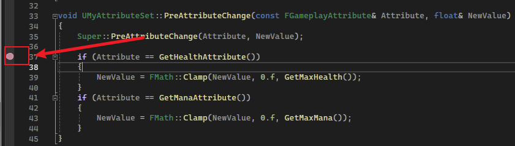
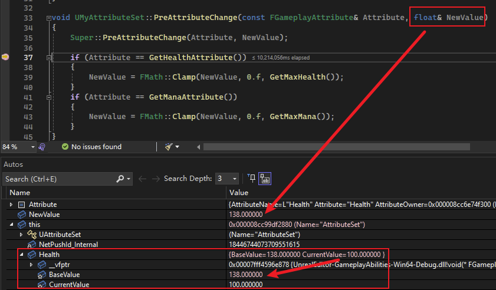
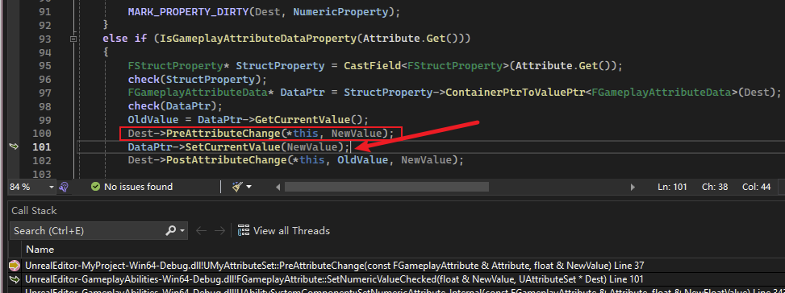
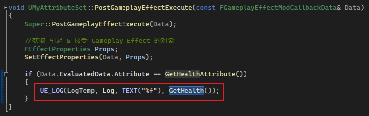
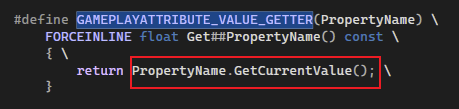
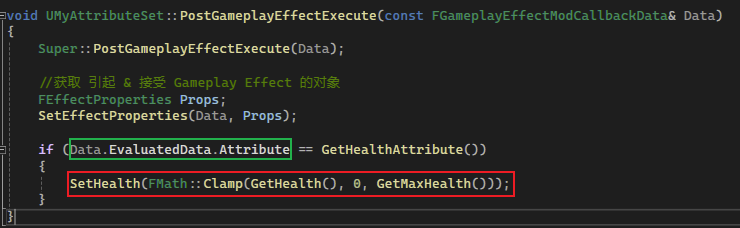
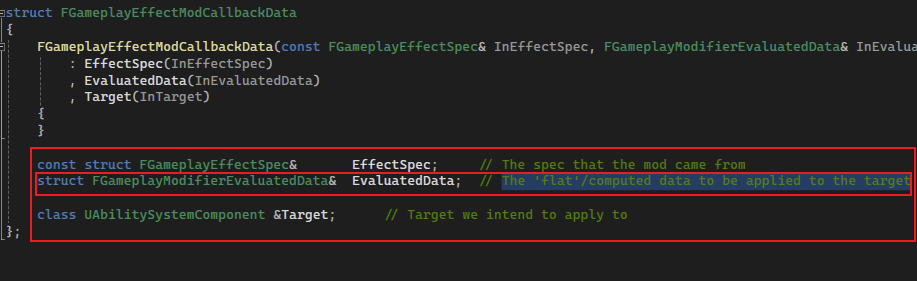
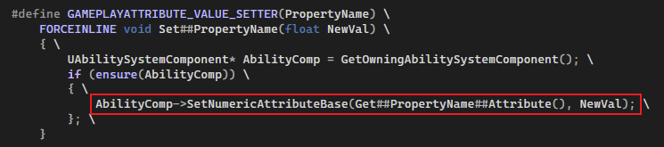

## 简介

在 [5_5.PreAttributeChange & PostGameplayEffectExecute](./5_5.PreAttributeChange & PostGameplayEffectExecute.md) 中，简单介绍了这两个 `UAttributeSet` 方法被调用的时机，并且我们通过重写，简单的制作了一些属性限制（`Clamp`）和 获取信息的方法。

但在本篇要说明的是，在上述的属性限制（`Clamp`）的操作中，其实不甚正确。

## Base Value & Current Value

`BaseValue`**由`Instant`(立即)的GE改变，另外`Periodic`（周期性）的GE也会像`Instant`一样改变`BaseValue`**

`CurrentValue`**由`Duration`(持续)、`Infinite`(永恒) 的GE改变**。 

`FGameplayAttributeData`的两个float(`BaseValue、CurrentValue`)值，被GE修改前，分别会调用2个变化函数。

- `BaseValue`改变前`PostGameplayEffectExecute()`函数被调用
- `CurrentValue`改变前`PreAttributeChange()`函数会被调用

> 引用： [文章 UE-GAS架构分析（二）](https://zhuanlan.zhihu.com/p/464303056)

如上述文章描述一般，之前我们在 `Clamp` 处理时，是在 `PreAttributeChange()` 做处理，那么会出现下面的问题：

首先我们将 `Health` 拉满：


然后我们再打开调试面板，并且进行扣血的操作：


可以发现，血量并没有扣除。。。

> *这是为什么呢？*

这时我们进入调试状态，看看 `PreAttributeChange` 函数在做些什么：





当我们进入断点时，我们发现 `NewValue` 居然超过了 `MaxHealth` ！并且发现此时 `AttributeSet` 中的 `Health` 属性的 `BaseValue` 也已经超过了 `MaxHealth`

> *这是为什么呢？*

其实结合上述文章的描述，我们就大致知道了。

1. `PreAttributeChange` 是在更改 `CurrentValue` 之前会被调用，那么在此时做 `Clamp`，是更改 `CurrentValue` 的值。

   

   上图是函数栈调用情况，可以看到该函数结束之后就是通过 `NewValue` 去改变 `CurrentValue`。

2. 由于调用更改的 `GE` 拥有 `Infinite` 和 `Period` 效果，而 `BaseValue` 在每个周期（`period`）结束后会被更改，因此 `BaseValue` 被更改了。

3.  `CurrentValue` 的结果为 `BaseValue` 加上 `GE Modifier` 的结果。

综上所述，我们在 `PreAttributeChange` 中进行限制，并没有作用到 `BaseValue` 上，然而 `CurrentValue` 的计算是基于 `BaseValue` 的，所以会导致上述的 `Health` 没有下降的效果。

> 这里再引用 [同一系列的文章 UE-GAS架构分析（三）](https://zhuanlan.zhihu.com/p/464329488)

`GE` 修改 `BaseValue` 的流程如下：

```cpp
ApplyGE() //应用一个GE
FGameplayEffectSpec::Initialize() //初始化GESpec
FGameplayEffectSpec::CaptureDataFromSource()//捕获来源处的属性快照
UAbilitySystemComponent::ExecuteGameplayEffect()//执行GE
FActiveGameplayEffectsContainer::ExecuteActiveEffectsFrom()//执行GE
FGameplayEffectSpec::CalculateModifierMagnitudes()//开始计算ModifierMagnitudes，根据以上表格的四种MagnitudeCalculationType，分别计算
FGameplayEffectSpec::GetModifierMagnitude()//根据堆叠的层数，计算堆叠后的值
FActiveGameplayEffectsContainer::InternalExecuteMod()//前面只是计算出了修改器的值，但还没有修改属性。在此函数中才是真正的执行修改器
AttributeSet->PreGameplayEffectExecute()//修改属性前调用，在此函数中返回true或false，还可以控制是否继续修改该属性
FActiveGameplayEffectsContainer::ApplyModToAttribute()//修改BaseValue
FActiveGameplayEffectsContainer::SetAttributeBaseValue()
AttributeSet->PostGameplayEffectExecute()//此处还可以对BseValue进行一个Clamping操作
```

> 上述说的 `PostGameplayEffectExecute` 是在 `BaseValue` 改变之前完成，其实可能会让人困惑（*当然是可能*）：
>
> **<u>这里的 "改变" 会让人理解为 `Set`，那么 "改变之前" 会让人认为是 `Set之前`，其实不是，这里的改变指的是 `BaseValue` 整个改变的过程，而不是 `Set` 单个步骤</u>。**

## Clamp

因此，我们需要在 `PostGameplayEffectExecute` ，在 `BaseValue` 改变之前，限制其值：

> 这里有一个小插曲：
>
> 
>
> 当我们通过 `Get` 方式获取属性的值时，获取的其实是 `CurrentValue`：
>
> 



注意看绿色部分：

```C++
Data.EvaluatedData.Attribute
```

`Data` 的成员如下：



其中 `EvaluatedData` 如注释所写，表示准备更改的 `Data`，即 `AttributeData`，这里通过 `.Attrubute` 和 `GetHealthAttribute()` 作比较，比较两者是否相同，来判断具体更改的属性。

然后进行 `Clamp` 即可。

另外，不同于 `Getter`，`Setter` 改变的是 `BaseValue`：



