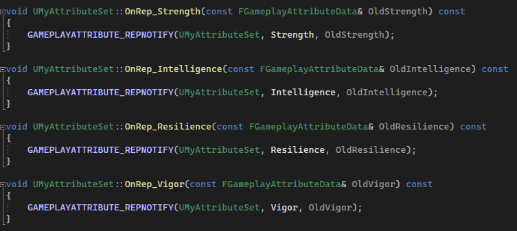

## 简介

在 [3.Attributes & Effect Actor](./3.Attributes & Effect Actor.md) 中，我们首次介绍了 `Attribute`，并且在 `AttributeSet` 中添加了各种各样的属性。仅此而已。

接下来，我们将深入使用 `Attribute`。

> 在本篇中，将介绍其 **初始化方法**。

在之前我们十分简单的讲属性的初始化，放在 `AttributeSet` 的构造函数中，然而这硬编码的方式，是其灵活性降低。现在我们需要考虑通过配置的手段来初始化这些值，提高其灵活性。

然而在这之前，我们先做点前置工作，添加一些属性：

如上图所示，添加和之前 [6.Gameplay Tags](./6.Gameplay Tags.md) 中相同的属性。

## 使用 Data Table

在这里其中一个初始化方法，那就是使用数据表：

> 注意这里要选择的数据结构为 `AttributeMetaData`。

然后我们添加属性的初始化信息：

> 注意，这里的 `RowName` 为 `AttributeSet.xxx`，为`属性集合的名字.属性名字`，和 `Tag` 的层级结构一致。

填上 `RowName` 和 `BaseValue` 即可。

接下来我们要应用这个属性表，这个属性表要在 `ASC` 中启用：

当然，我们在 `PlayerState` 中需要把 `ASC` 声明为 `VisibleAnywhere`，才能在 `Editor` 中可见：

然后我们应用 `Data Table`：

选择好 `AttributeSet` 和 `Data Table` 即可，然后我们就可以看到属性进行初始化了：

> 这里可以回顾 `ASC` 如何获得 `AS`：同样在 [3.Attributes & Effect Actor](./3.Attributes & Effect Actor.md) 中提到，`ASC` 在初始化时会遍历所有的 `AS`。

而 `ASC` 通过 `Data Table` 来设置 `AS` 的主要数据结构为 `FAttributeMetaData` ：

可以看到，这仍然是一个正在进行中的一个工作（即尚未成熟）。所以用的较少。

> 了解即可

## 使用 GE

更多时候，我们偏向于使用 `GE` 去初始化属性。

那么既然如此，使用 `GE` 初始化属性的过程必定和角色自身的初始化过程有一定的趋同，这里我们更改一下 `MyCharacter` 部分代码：

这里我们添加默认的 `GE SubClass`，然后添加初始化函数：

这个函数和 [5.GameplayEffect](./5.GameplayEffect.md) 中应用 `GE` 的函数相同，只是把设置的初始化属性的 `GE` 应用到自己身上。

然后我们在 `ControlCharacter` 中进行调用：

关于 `InitAbilityActorInfo` 函数，可以参考 [2.项目构建](./2.项目构建.md) 。

然后我们打开 `Editor`，创建对应的 `GE`：

创建一个 `Instant` 的 `GE`，并且将对应的 `Primary Attribute` 进行 `Override`。然后再将这个 `GE` 设置到 `Character` 中去：

然后我们在打开游戏时，对应的 `Attribute` 就初始化好了：

