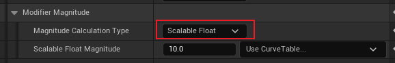
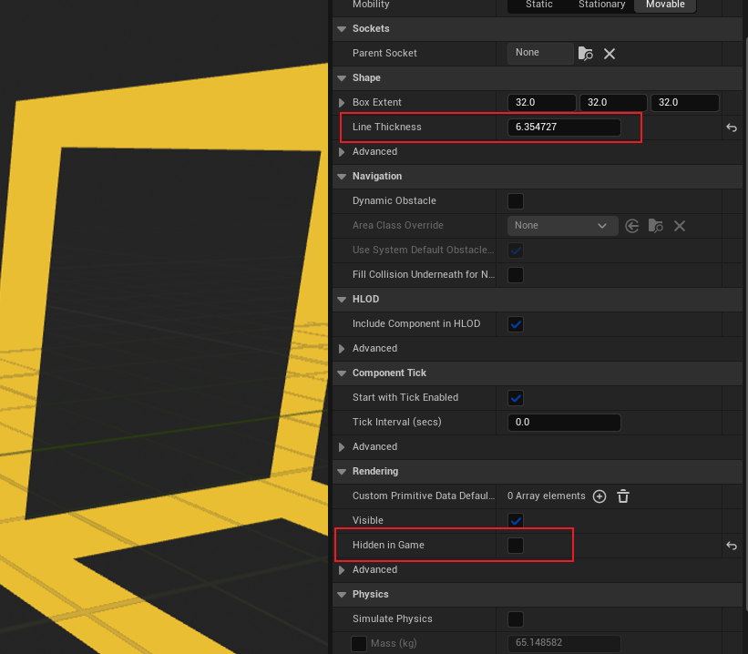
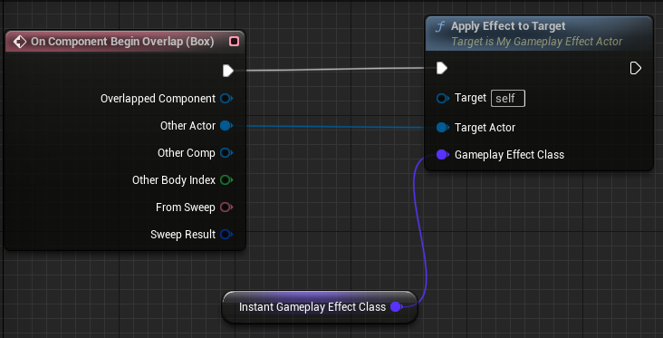
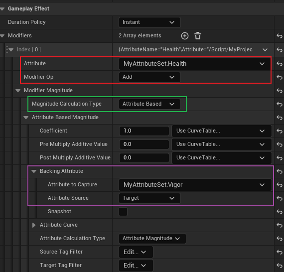

## 简介

本篇将讲解 `GE` 中，`Attribute Base` 的 `Modifier`。

在之前的章节中，我们使用 `GE` 修改 `Attribute`，使用的都是一个 `float` 浮点数：

而本篇将介绍，当这个选项为 `Attribute Based` 时，我们应当如何配置，并且这些配置将会起到怎样的作用。

## 初探

我们这里创建一个 `TestActor`，同样在其 `Overlap` 函数中应用 `GE`：

这里介绍一些技巧，如右边的面板设置所示，我们在调试时，可以将 `BoxComponent` 设置为游戏中不隐藏，并且将其粗细调大。

这里的应用 `GE` 方法如下，和之前的 `GE` 一样（参考 [5_1.Instant](./5_1.Instant.md)）：

然后我们需要创建一个 `GE`，并且其是基于 `Attribute Based` 来更改属性：

如上图，红色框部分为要影响的属性，以及操作方式；

绿色的为操作的基础数值，这里选择为 `Attribute Based`（然后才会出现下面的面板）；

最后是紫色部分，这个部分表示准备去捕获的 `Attribute`，用于 `Modifier` 基础数值的填充；然后是 `Attribute Source`，这个选项表示需要捕获属性的来源，这里选择 `Target`，表示选择使用 `GE` 作用目标的属性；最后是 `Attribute to Capture`，表示需要捕获的属性类别。

> 通过这样的配置，`GE` 被应用时，`Health` 将会 `Add` 自己的 `Vigor` 属性。

来看效果：

可以看到，`Health` 从 `50 -> 69`，这是因为额外配置了一个 `Attribute Based` 的`Modifier`，基于 `Strength`，所以最后 `Health` 将会 `+Vigor+Strength`。

