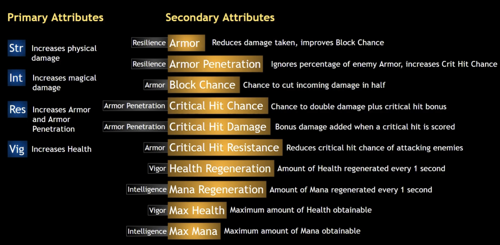
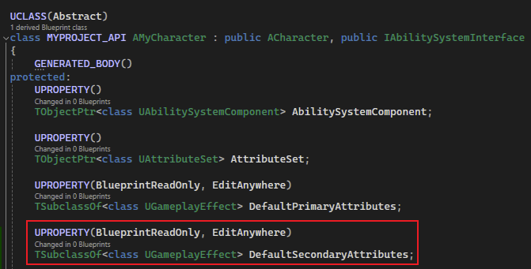
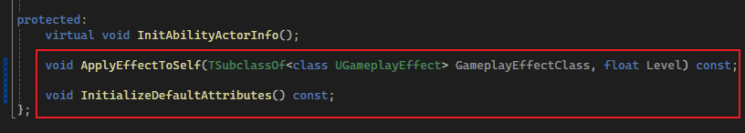
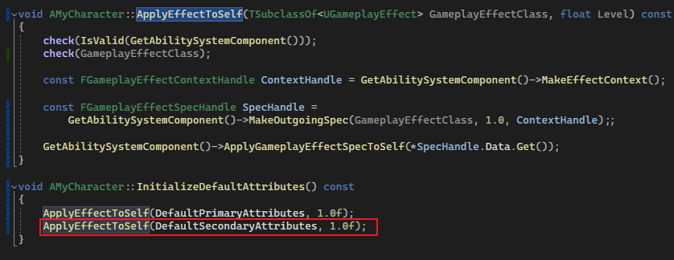
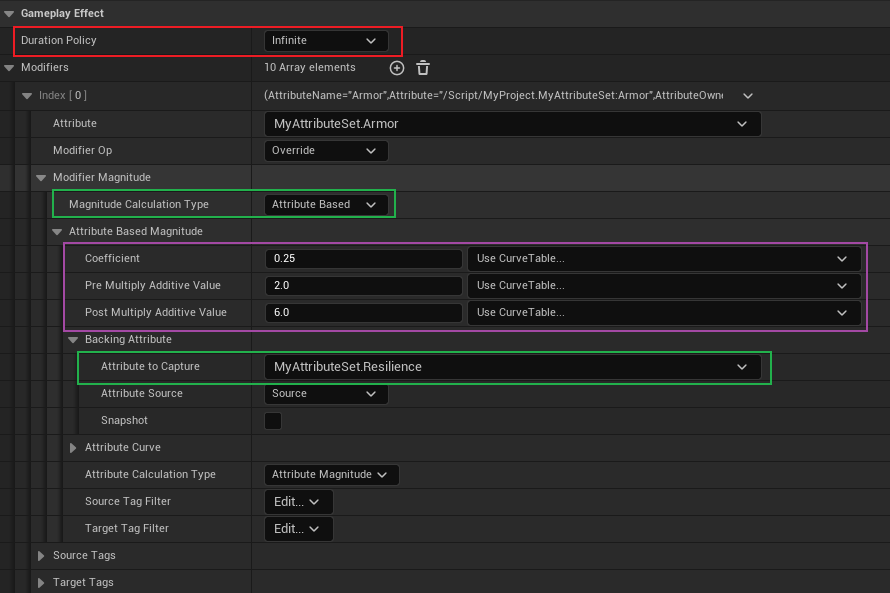

## 简介

在本篇中，将介绍如何创建 `Secondary Attribute(次要的属性)`，这些属性往往会根据主属性的改变而改变：

不管如何，我们现在 `Attribute Set` 中将这些属性添加进去：

> 参考 [7. Attribute 深入使用_初始化](./7. Attribute 深入使用_初始化.md) 添加 `Primary Attribute` 时的操作。

## Derived Attribute

关于 `Derived Attribute`，其意在当我们更改某一个属性时，其他依赖这个属性的属性，将会根据设定的方式进行改变。

> 如上图，`Armor(护甲)` 将根据 `Resilience(韧性)` 进行改变。

同样的，我们需要对这些 `Secondary Attribute` 进行初始化，同时这些属性还要随着 `Primary Attribute` 的改变而改变。

那么同样的，我们可以使用一个 `GE` 来对其进行初始化；而这个 `GE` 不同点在于，**<u>它是一个 `Infinite` 的 `GE`</u>**，这是因为在 `Primary Attribute` 改变时，这些属性也会随着改变，我们没有必要通过 `Tick` 的方式来改变这些属性，那么 `Infinite` 的 `GE` 将是不错的选择。

首先我们更改一下代码：

> （做一些小小的重构）

然后我们创建 `GE`：

首先持续策略必须是 `Infinite`，然后通过 `Attribute Base` 作为更改的基础数值，并且通过配置系数，来 `Override` 这些属性，通过上面的配置，我们知道 `Armor = 0.25 * (Resilience + 2) + 6`，`Resilience = 12` 时，`Armor` 为 `9.5`。

> 剩下的就按需配置，这里就不再演示了。

