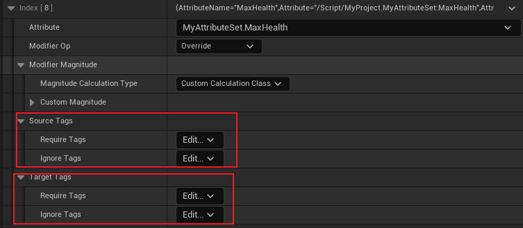

## 简介

在之前的 `GE` 中，通过 `Modifiers` 来修改属性，通常是配置了比较简单的计算方法，这些方法通常时通过以具体数值、某个属性为基准来更改某个属性，而且计算过程也比较简单。

但是当我们修改属性时，需要其他的、独立于 `Attribute` 之外的变量时，`Modifier` 将无法满足我们的需求，这时我就需要自定义计算方法，换句话说，就是 `Modifier Magnitude Calculation(即 MMC)`。

这里举一个简单的应用例子，来作为本篇的设计内容：

如上图所示，`Level` 是一个独立于外部的变量，当我们改变 `Attribute` 时，将会最为一个系数参与计算。

## Interface

现在我们回忆一下，`GE` 应用的对象是一个 `ASC`（即一个 `Actor`），我们不希望通过具体的 `Actor` 类型来获取对应的 `Level`，因此我们需要 <u>通过一个接口类，只有继承自该接口类才能够获取 `Level` 属性</u>。

如上图所示，此时我们声明获取 `Level` 方法：

然后我们需要在拥有 `Level` 这个属性的，且被 `GE` 作用的 `Actor` 继承并实现这个接口，那么在本工程中，最重要的就是那几个 `Character` 类，看 [2.项目构建](./2.项目构建.md)。

这里需要注意的是，玩家本身的信息是记录在 `PlayerState` 中的，并不记录在 `Character` 中，所以 `Character` 需要通过 `PlayerState` 获得 `Level` 属性：

> 大致就这些。

## Modifier Magnitude Calculations

在实现完上述的接口后，我们就可以制作一个自定义计算类（即 MMC），这样我们 <u>修改属性是不仅可以取决于之前说过的数值，而且还可以取决于其他变量。</u>

> 这部分有很多重要的内容，请认真阅读。

### 创建

创建 `MMC`：

如上图，`UGameplayModMagnitudeCalculation` 便是 `MMC` 的基类。

### 重写

我们在创建好子类后，需要实现一个方法：

如上图，是我们要重写的方法，这个方法将传入 `GE Spec`。

`CalculateBaseMagnitude_Implementation`，这个方法有一个 `_Implementation` 的后缀，是：

`CalculateBaseMagnitude` 的具体声明：

这里注意看，该方法是一个 `BlueprintNativeEvent`，关于这个标签的作用，可以参考这篇 [博客](https://zhuanlan.zhihu.com/p/62480255):

> **`BlueprintNativeEvent`**：在 **C++可以声明和定义函数**，**在C++里调用该函数**，**蓝图重写实现该函数**（蓝图可以重写或不重写C++父类函数）
>
> **`BlueprintImplementableEvent`**：在 **C++可以声明函数（不能定义，蓝图重写）**，在**C++里调用该函数**，蓝图重写实现该函数

> 这里需要注意，上述解释的只能在 `C++` 中进行调用，那如果想要在蓝图中调用，应该如何实现呢？
>
> 其实跟所有的蓝图可调用函数一样，只需进行 `BlueprintCallable` 即可。

我们如果要去定义 `BlueprintNativeEvent` 方法，需要在函数名后添加 `_Implementation` 标签并且将其实现。

回到正题，当我们重写了 `CalculateBaseMagnitude_Implementation` 这个方法后，自定义计算将调用定义的实现方式。

### 捕获 Attribute

在自定义的计算方法中，由于 `GE` 的基准数值的独立性（即 使用了 `Attribute Based` 就无法使用 `MMC`）：

那么若我们使用了 `MMC`，并且还想要根据其他属性来计算时，我们就需要去捕获这些属性。

> 那我们应该如何获取呢？

这里主要依赖于 `MMC` 的方法：

`GetCapturedAttributeMagnitude`，获取捕获的属性。

首先介绍一下 `AttributeCapture(属性捕获)`，该数据结构记录了需要捕获的 `Attribute` 的元数据（`Attribute`）、来源（`Source`）、是否快照（以后介绍）等信息：

如上图，我们将 `Capture` `MyAttributeSet` 的 `Vigor` 属性，并且来自于 `Target`（这里的 `Target` 指的是 `GE` 应用后的目标）。

另外，就是 `FAggregatorEvaluateParameters` 参数，这个参数用于存储 `SourceTags` 和 `TargetTags` 两种标签：

这些标签来自 `GE` 的配置：

然后我们就可以通过 `GetCapturedAttributeMagnitude` 来捕获具体的属性值：

按需传入参数即可，然后获取对应的 `PlayerLevel` ，并且返回计算结果（这里暂时硬编码）即可。

> 这里需要注意的是，关于 `GetSourceObject`，参考 [5_5.PreAttributeChange & PostGameplayEffectExecute](./5_5.PreAttributeChange & PostGameplayEffectExecute.md) 中 `SourceObject` 的设置，该设置需要在 `Context` 创建时设置：
>
> 

### 修改 GE

如上图，我们在初始化 `Secondary Attribute` 的 `GE` 中将 `MMC` 进行应用，可以看到，通过 `MMC` 得到的结果甚至可以进行更多的系数相乘、相加等操作。。

然后我们查看结果：

可以看到我们的 `MaxHealth` 被初始化为了 `112.5`， `Vigor` 为 `9.0` 的情况下确实没问题。