## 简介

通过之前一系列属性的添加，我们发现 `Show Debug AbilitySystem` 已经不能将所有属性完整的显示出来，所以在本篇中，我们将制作一个属性菜单，用于展示所有的属性，大致效果如下：

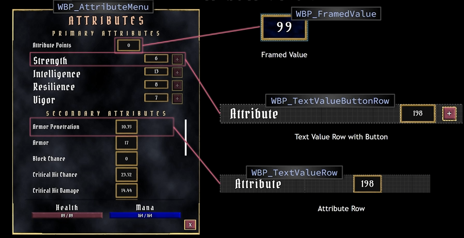

## Row

按照上图所示，我们先创建几个行相关的蓝图 `UI` 控件：

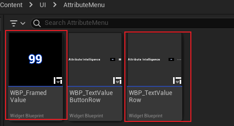

先看 `Framed` 和 `TextValue`：

如上图，是 `Framed` 控件，特别的点不多，主要注意 `SizeBox`、`Overlay` 的配合使用，另外这里还设置了一点 `Text` 的 `Outline Color`，仅此而已。

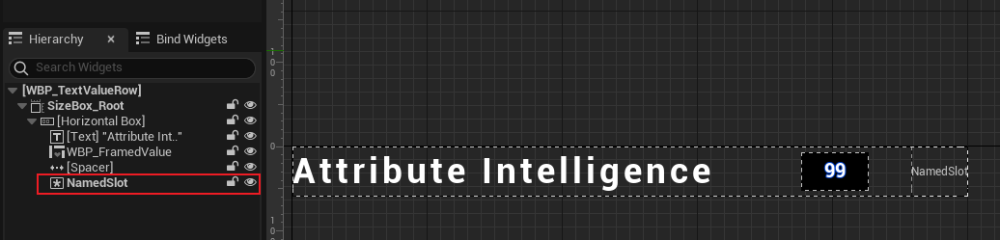

而 `TextValueRow` 比较值得我们注意，除了组合了 `Framed` 用于显示数值外，还添加了一个 `NamedSlot`，这个控件的作用是：<u>当有 `UI` 继承时，那么它将有一个 `NamedSlot` 的根布局</u>。

> *如何理解呢？* 且看 `TextValueButtonRow`：

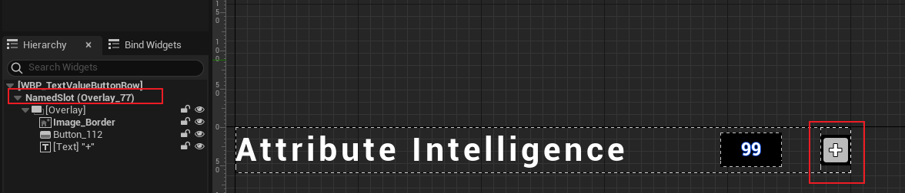

可以看到，`ButtonRow` 继承自 `TextValueRow`，那么其 `NamedSlot` 则会进入到子类 `UI` 中（但是其他的控件不会），然后可以通过往这个控件（`NamedSlot`）中添加新的控件。

## Button

在上述的各种控件的创建过程中，可以看到按钮是一个重复的过程，那么我们可以将其做成一个蓝图控件：

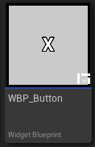

然后将需要设置的属性暴露出来：

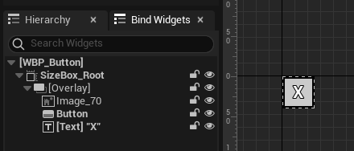

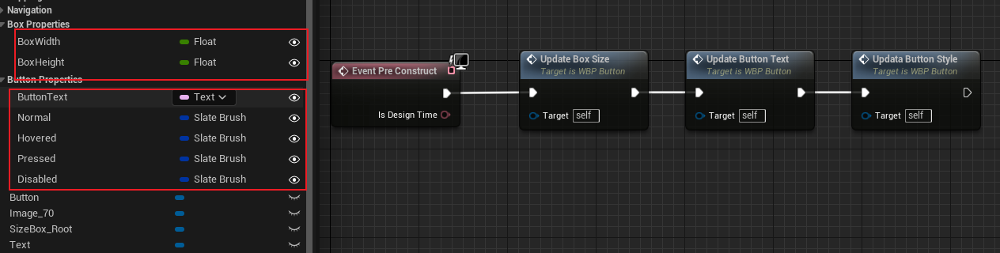

在应用时，就可以通过修改属性，改变按钮的样式：

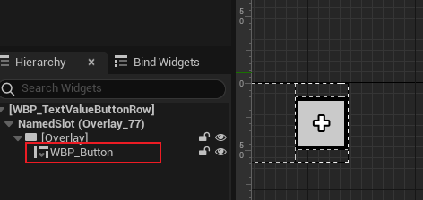

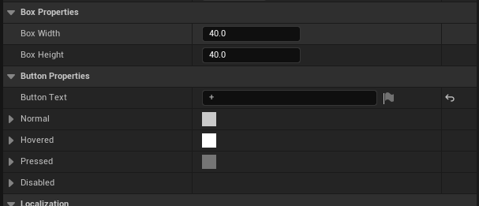

如上图，可以在细节面板看到所有暴露的属性。

## Attribute Menu

现在我们来制作属性菜单，这里需要介绍一些 `UI` 的控件

### Wrap Box

这个控件可以让其底下的控件进行水平分布（行）：

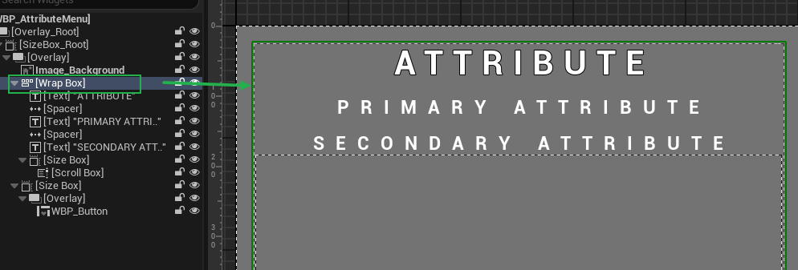

如上图，可以看到，在 `Wrap Box` 下的子控件会一行一行的进行排布，当然需要注意的是，如果我们的 `Spacer` 的长度加上 `ATTRIBUTE` 的长度没有超过 `Wrap Box`：

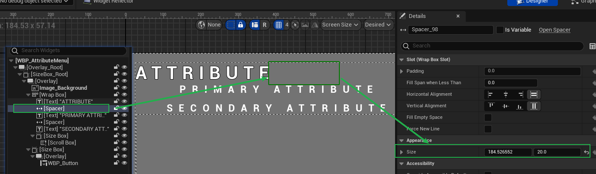

`Spacer` 就会像上图一样，和 `ATTRIBUTE` 排列在同一行中。或者可以选中 `Force New Line`：

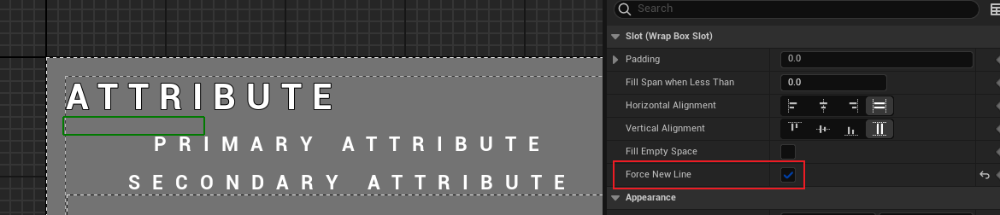

这样就可以让 `Spacer` 强制处于下一行，当然，`Primary Attribute` 也得进行相同的设置，或者让其长度之和大于 `Wrap Box`，否则两者会处于同一行。

> 这里事后发生了一些有意思的 `BUG`：
>
> <u>当对该控件进行 **编译后**，发现其并没有强制将 `Spacer` 控件归入下一行，还是需要将其宽度进行设置。。。。。</u>

另外，为了让 `ATTRIBUTE` 这类文字信息居中：

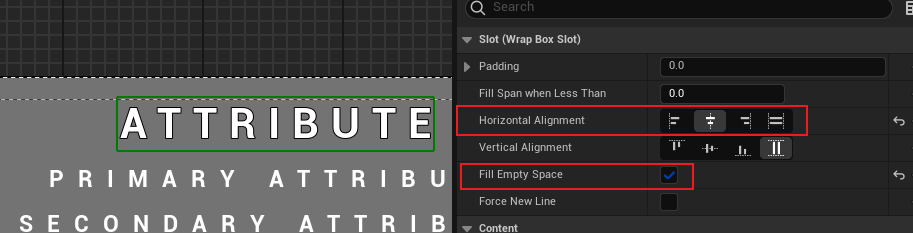

可以进行上图般的设置。

### Scroll Box

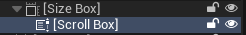

该控件可以挂载多个子控件，当子控件无法显示完全时，会提供滚动条，用于进行浏览。

## 打开 / 关闭 Attribute Menu

在制作完相关的 `UI` 控件后，我们尝试在 `Overlay`（见 [4.游戏UI架构](./4.游戏UI架构.md)）中添加打开属性菜单的方式。

首先我们创建一个宽一点的按钮：

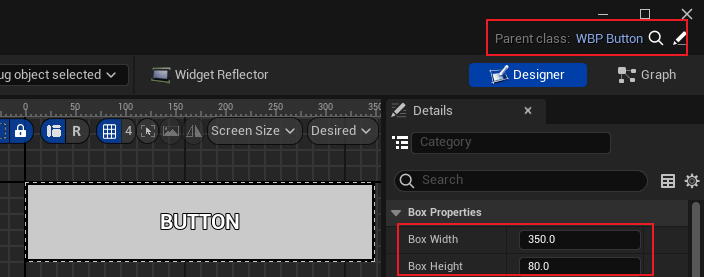

如上图所示，这个按钮继承自 `WBP_Button`，然后我们在细节面板中更改其属性，使其改变对应的大小。

然后我们将这个控件置于 `Overlay` 中：

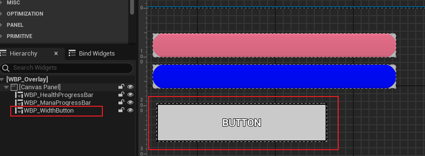

这样我们在运行游戏时，便可以看到这个按钮。

### 打开

首先我们对属性菜单的打开进行蓝图编写：

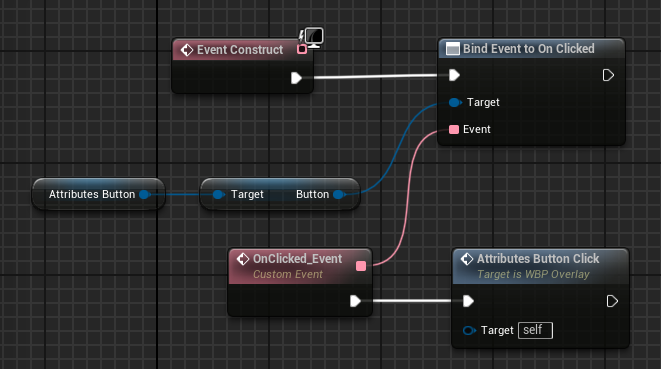

如上图，在 `Overlay` 控件中，对 `Attributes` 按钮控件进行点击事件绑定，并且生成属性菜单，同时还要将这个按钮设置为不可点击：

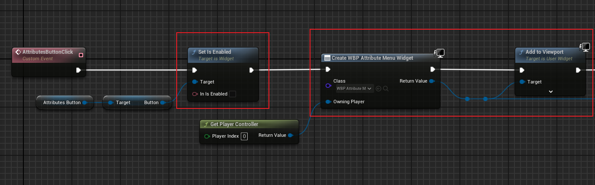

> 这里顺便调整一下生成位置

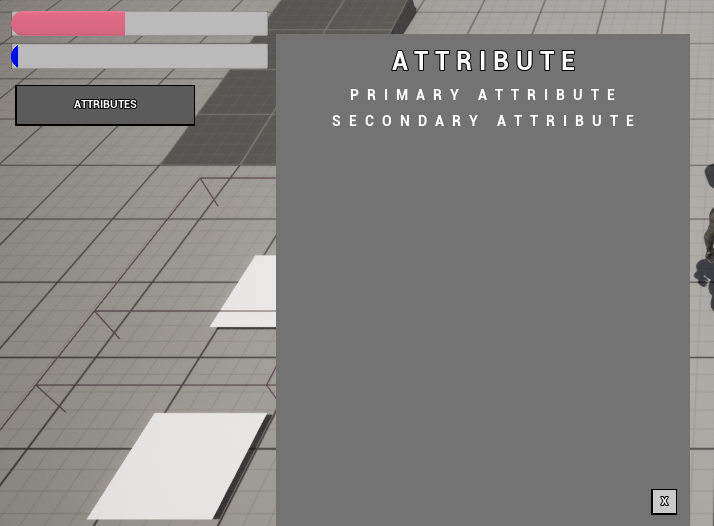

可以看到，当我们点击 `ATTRIBUTES` 按钮后，生成了属性菜单，并且按钮不可点击。

### 关闭

关闭操作需要点击属性菜单中的关闭按钮后执行，这里我们同样绑定关闭按钮的点击事件：

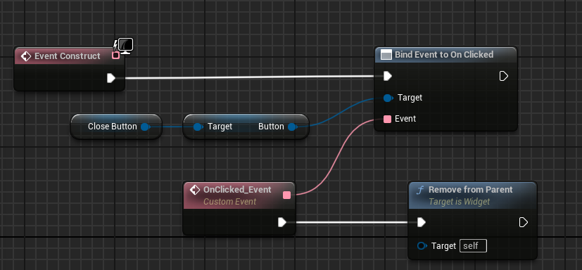

另外调用 `Remove from Parent`，来移除这个控件。

> 这样做会遗留一个问题，此时的 `ATTRIBUTES` 是不可点击的状态，这时要如何调整呢？
>
> *我们也不希望属性菜单依赖于 `Overlay`*

这时我们就要使用蓝图的委托（事件分发 `Event Dispatchers`）：

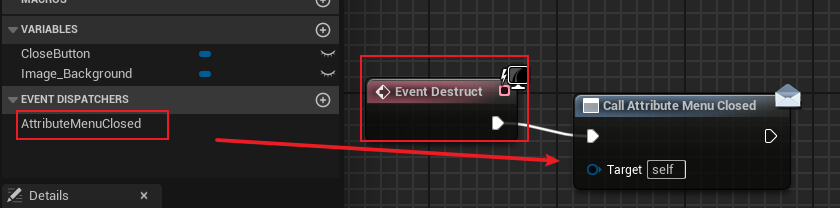

在控件进行 `Destruct` 时（之前），我们广播这个事件。

同样的，我们需要在 `Overlay` 中进行绑定：

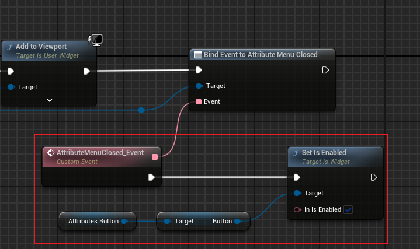

这样我们的属性菜单打开、关闭就制作完成了。

### 效果

