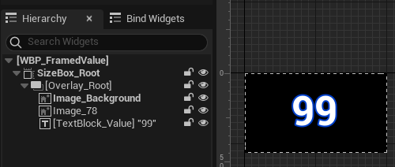

## 简介

通过之前一系列属性的添加，我们发现 `Show Debug AbilitySystem` 已经不能将所有属性完整的显示出来，所以在本篇中，我们将制作一个属性菜单，用于展示所有的属性，大致效果如下：

## Row

按照上图所示，我们先创建几个行相关的蓝图 `UI` 控件：

先看 `Framed` 和 `TextValue`：

如上图，是 `Framed` 控件，特别的点不多，主要注意 `SizeBox`、`Overlay` 的配合使用，另外这里还设置了一点 `Text` 的 `Outline Color`，仅此而已。

而 `TextValueRow` 比较值得我们注意，除了组合了 `Framed` 用于显示数值外，还添加了一个 `NamedSlot`，这个控件的作用是：<u>当有 `UI` 继承时，那么它将有一个 `NamedSlot` 的根布局</u>。

> *如何理解呢？* 且看 `TextValueButtonRow`：

可以看到，`ButtonRow` 继承自 `TextValueRow`，那么其 `NamedSlot` 则会进入到子类 `UI` 中（但是其他的控件不会），然后可以通过往这个控件（`NamedSlot`）中添加新的控件。

## Button

在上述的各种控件的创建过程中，可以看到按钮是一个重复的过程，那么我们可以将其做成一个蓝图控件：

然后将需要设置的属性暴露出来：

在应用时，就可以通过修改属性，改变按钮的样式：

如上图，可以在细节面板看到所有暴露的属性。

