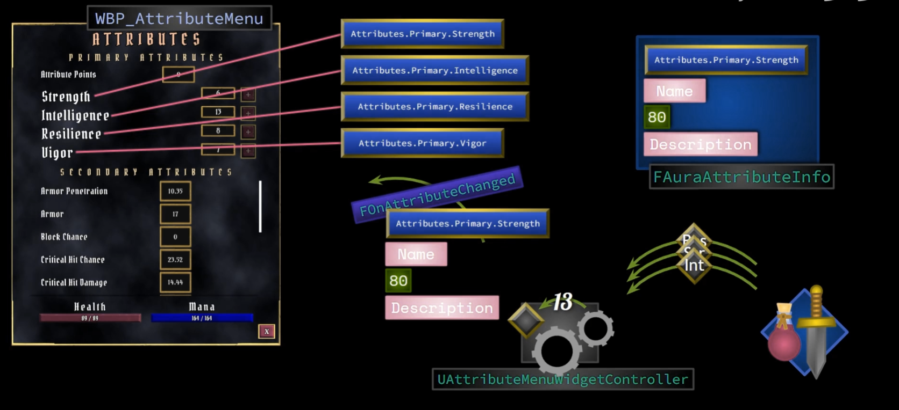

## 简介

这里我们需要设计一套 `数据 —— 视图` 的结构，当数据进行改变时，在我们的 `UI` 中需要进行对应的改变。

我们先来回忆一下之前的设计（[4.游戏UI架构](./4.游戏UI架构.md)）：

我们在自己的基类蓝图控件中（`MyUserWidget`），添加了 `WidgetController`，这个控制器存储了 `ASC`、`AS` 等关键信息，并且提供了很多的委托，在 `UI` 蓝图控件中可以为这些委托绑定对应的方法，当 `WidgetController` 检测到属性进行改变时，那么就会去广播这些委托，来达到 `数据 —— 视图` 的解耦：

如上图所示，现在是目前的架构，但其缺乏灵活性、可配置性，虽然运行效率很高，但这不是一个很好的设计。

下面的设计将更适合：

如上图所示，`WidgetController` 的数据监测统一走一个委托（`FOnAttributeChange`），然后这个委托会传出一个封装好的数据结构，这个数据结构最关键的信息是 `GameplayTag`，用于广播后通过 `Tag` 来进行判断是哪个属性进行了更改，然后执行对应操作。

这里需要引入一个新的概念：`DataAsset`，相较于 `DataTable`，他不仅可以按照名字（`RowName`）进行查找，还可以通过任何方式，例如 `GameplayTag`。

所以我们这里不使用 `DataTable`，而去使用更加灵活的 `DataAsset`。

## 前置工作

首先第一步，为了将我们设置的属性展示到 `UI` 上，我们需要定义一些数据结构，这些数据结构用于 <u>存储我们需要用到的 `Attributes`，以及需要将这些 `Attribute` 和其对应的描述信息（名字、描述等）一 一组合起来</u>。

> 这样当我们获得一个 `GameplayTag` 时，则可以获得其对应的信息，并且进行后续的展示。

### Native Gameplay Tags

在这里，我们定义一个容器，用于存储所有的 `Attribute` 对应的 `Tag` ，并且它是一个单例：

如上图，红色部分是单例的设计，绿色部分则是所有的属性。

> 其实应该不需要这种硬编码的方式，后续可能进行一个重构。

其中的初始化函数：`InitalizeNativeGameplayTags` ：

使用的是 `UGameplayTagsManager::Get().AddNativeGameplayTag`，表示要添加一个 `GameplayTag`；

第一个参数传入 `Tag`，第二个参数传入对应的注释；

和在项目设置中进行添加的效果大致相同，这里需要 **注意时机**。

### Asset Manager

> `Asset Manager` 是一个 <u>单一的全局 `UObject`</u>。 这非常类似于引擎子系统，这是一个较新的概念。但这比引擎子系统要老一些。它不是特定于地图或模式的。 即使您在编辑器或游戏中，也只有一个。
>
> 它要做的主要事情之一是使用称为 Asset Registry 的东西对卸载的资产进行分类和查询。它还保持全局资产加载状态，这意味着它会跟踪哪些内容在内存中，哪些内容不在内存中。而且它还集成了许多分散的现有系统，例如 Cooking 和异步加载。它也被设计为可以被单个游戏项目覆盖和扩展。
>
> 引自博客 ： [E4：Asset Manager 学习笔记](https://zhuanlan.zhihu.com/p/360543561)

为了在合适的时机调用 `GameplayTags` 的初始化函数，这里定义一个类，继承自 `UAssetManager`：

同样的，这个类也是一个单例，我们为其定义一个 `Get` 方法，并且通过重写 `StartInitialLoading`，来调用 `GameplayTags`：

这时再启动 `Editor`，发现可以在项目设置中看到这些 `Tag` 了：

### Data Asset

接下来我们就可以将这些 `Gameplay Tag` 以及其对应的信息使用一个数据结构存储起来（类似 `DataTable`），当然这里选用 `DataAsset`。

关于 `DataAsset`：

> - 用来存储数据，每一个`DataAsset` 都是一份数据
> - 可以派生，系统自带派生 `UPrimaryDataAsset` 方便数据对象的加载和释放
> - 可以引用其他的 `UDataAsset`
> - 可以存储`UObject` 实例
> - 可以 `BulkEdit` 批量编辑多个 `UDataAsset`
> - 灵活配置数据，但不好管理大量的配置对象
> - 方便配置树状组织数据，全局配置，数据对象集合
>
> 引自博客：[UDataAsset 简介](https://www.cnblogs.com/shiroe/p/14770421.html)

这里我们定义一个数据结构，用于组合信息：

如上图，是 `GameplayTag` 和 描述信息的组合体，其中 `Tag` 、`Name`、`Description` 相关信息可以通过蓝图进行配置。

然后定义 `DataAsset` 类：

可以看到，其中最主要的结构就是 `FMyAttributeInfo` 的一个数组，这个数组也是蓝图可编辑，和 `DataTable` 相似。

然后我们打开编辑器：

创建蓝图 `DataAsset` 资产，然后在编辑界面中：

添加对应的信息。

> 这样我们的数据工作就先做完了。