## 简介

在介绍完如何初始化、存储 `GameplayTag` 及其对应的数据后，本篇将介绍如何在 `UI` 中进行展示，以及如何在属性更改时做出对应的变化。

## Widget Controller

### 定义

和之前的 [4.游戏UI架构](./4.游戏UI架构.md) 一样，我们在 `Attribute Menu` 中，同样需要一个 `widget controller`，用来控制数据更改时，`UI` 做出对应的改变。

通过 [上一篇：8_1.展示数据至 Attribute Menu_01_DataAsset](./8_1.展示数据至 Attribute Menu_01_DataAsset.md) 中，我们定义了 `DataAsset` 以及其数据结构 `FMyAttributeInfo`，用于绑定 `tag` 和 `info`，那么我们在设计 `widget controller` 时，为了其灵活性和可复用性，我们在定义广播委托时需要用上这些数据结构：

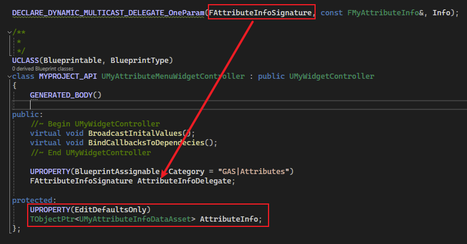

如上图所示，定义委托 `FAttributeInfoSignature`，用于将 `FMyAttributeInfo` 信息传出，而这个信息要从 `DataAsset` 中来，所以需要其类型成员。

### Blueprint Library

`Widget Controller` 定义完后，接下来应该考虑如何构造。

在 `Overlay Widget Controller` 的构造中，我们是在 `MyHUD` 中进行构造的：

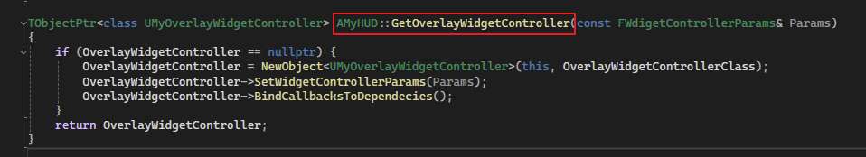

如上图，这个方法会使 `OverlayWidgetController` 为一个单例，存在于 `MyHUD` 中。

> 这时我们不禁会想：*如果每次我们要获取 `Widget Controller` 时，每次都需要依赖于 `MyHUD`，是不是会比较麻烦？*

这时我们可以参考 `MyAttributeSet` 中，获取 `ASC` 的方法：

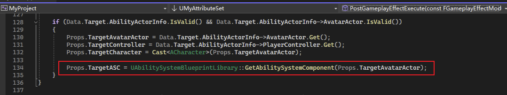

如上图，可以看到是 `GAS` 中的蓝图函数库 `UAbilitySystemBlueprintLibrary` 中的方法，这个方法和不同的获取不同，无需继承自 `IAbilitySystemInterface`，可以从 `Actor` 中进行查找（即 蓝图类 也可以）。

我们也希望通过和这种方式一样，创建一系列的蓝图函数库，用于获取我们项目中的各种组件：

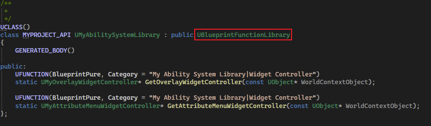

如上图，这时我们创建一个 `C++` 类，该类继承自 `UBlueprintFunctionLibrary` 蓝图函数库，然后实现获取 `OverlayWidgetController` 和 `AttributeMenuWidgetController` ：

> 另外，`BlueprintPure` 表示是一个 <u>**纯蓝图函数，不带流程引脚**</u>

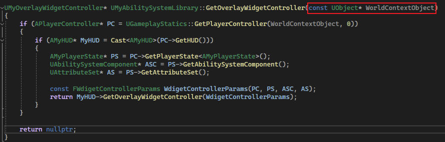

这里需要注意，`WorldContextObject` 其实是一个 `World` 上下文对象，主要用于使用这个对象，来找到其存在的 `World` ：

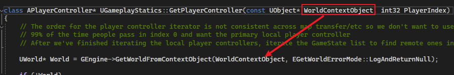

> 这时我们就有了蓝图函数库，用于获取各种 `WidgetController`，而无需依赖于 `MyHUD`：
>
> 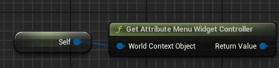

### Attribute Set 映射 Tag 和 Attribute

做完上述的前置工作，这时我们发现，`GameplayTag` 好像还没有跟 `Attribute` 关联起来？！

所以我们只能在 `Widget Controller` 中通过硬编码的方式，根据 `Tag` 来广播对应的 `Attribute` ：

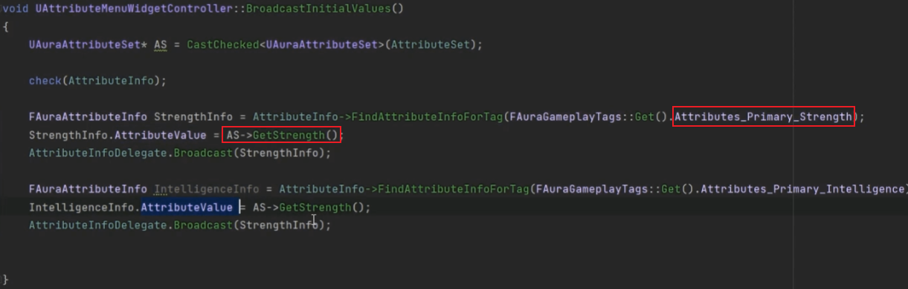

如上图，这是一个非常不好的编码方式，我们希望通过通过一个类似循环的操作，遍历 `Tag` 的同时，将其对应的 `Attribute`，并且获得其值，然后进行广播：

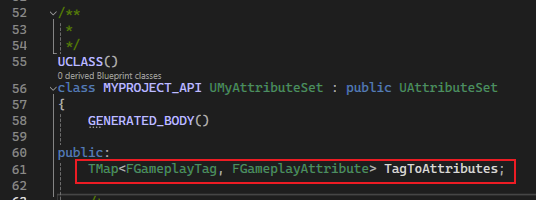

如上图，这时我们需要借助 `MyAttributeSet`，在其成员中定义一个 `Map`，用于关联 `Tag` 和 `Attribute`（这里的 `FGameplayAttribute` 为元数据，通过宏 `ATTRIBUTE_ACCESSORS` 定义），并且在其构造函数中进行初始化：

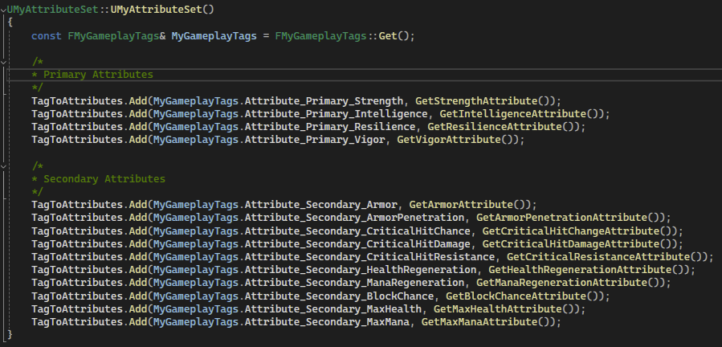

> 当然这里就避免不了硬编码了。。。。

### Broadcast

然后我们在 `WidgetController` 中进行广播：

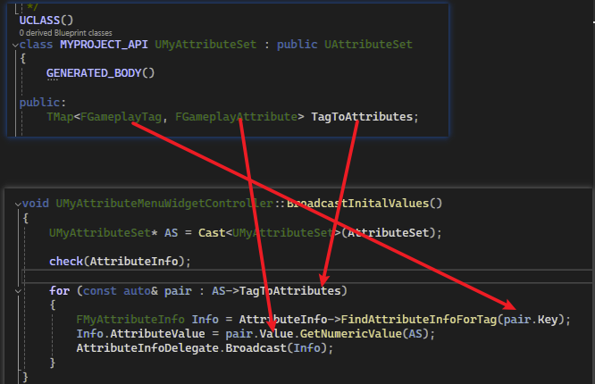

这样我们就可以通过 `Tag`，不仅可以获取 `AttributeInfo`，并且还能够获取对应的值了。

这里我们还需要绑定属性更改时的委托：（参考 [4.游戏UI架构](./4.游戏UI架构.md)）

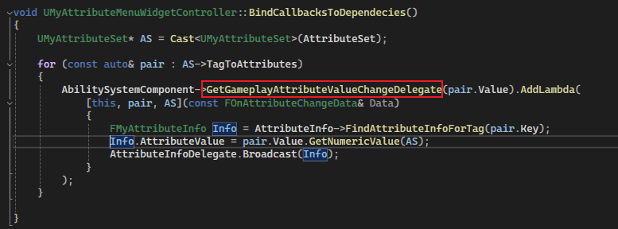

如上图，我们通过往 `ASC` 中监测 `Attribute` 更改时的委托进行可调用对象添加，这样在属性更改时，也能够进行对应的广播了。

## Attribute Menu

现在，所有的前置工作已经完成，剩下的就是需要在蓝图中进行配置。

### 基本配置

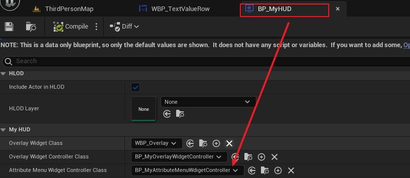

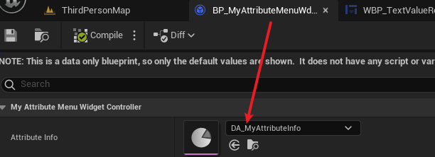

如上图，将 `AttributeMenuWidgetController` 和 `DataAsset` 进行配置。

### Row 设置

首先我们打开 `WBP_TextValueRow`，添加 `GameplayTag` 成员，并且进行 `widget Controller` 初始化：

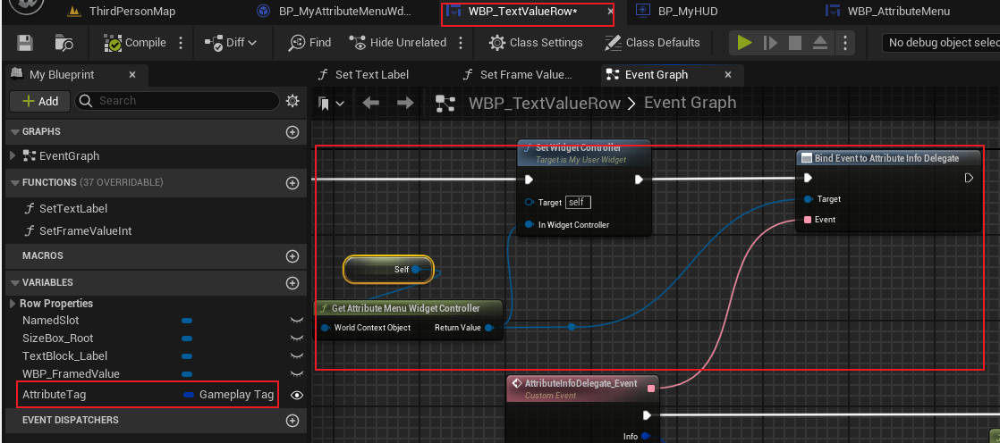

然后我们添加对应的设置 `Text` 和 `Value` 的方法：

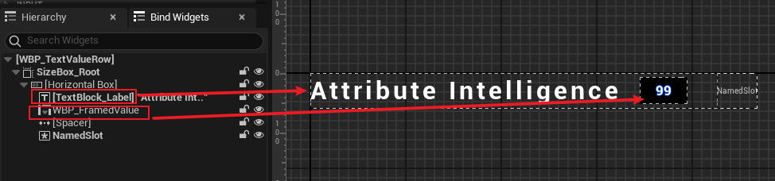

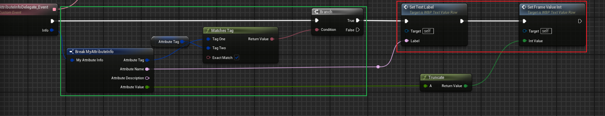

注意这里的是广播模式，因此我们在被通知执行事件时，我们需要提前进行 `GameplayTag` 的判断，然后根据传入的 `AttributeInfo` 进行对应信息的设置。

### Attribute Menu 配置 Tag

这里我们打开 `Attribute Menu`，添加上对应数量的 `WBP_TextValueRow`：

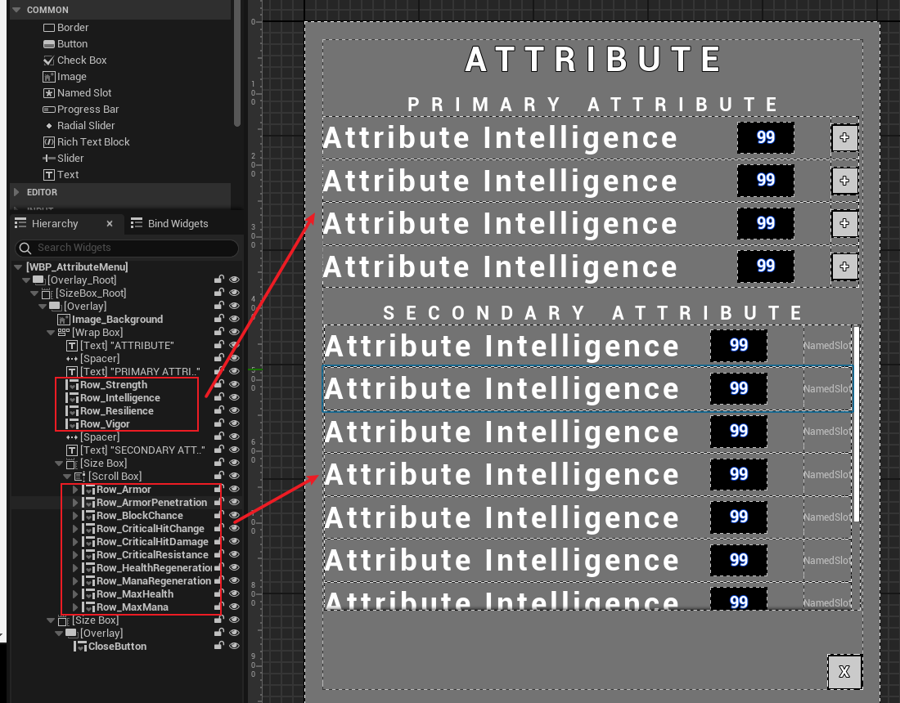

数量对应 `Primary Attribute` 以及 `Secondary Attribute`，然后在其构造函数中：

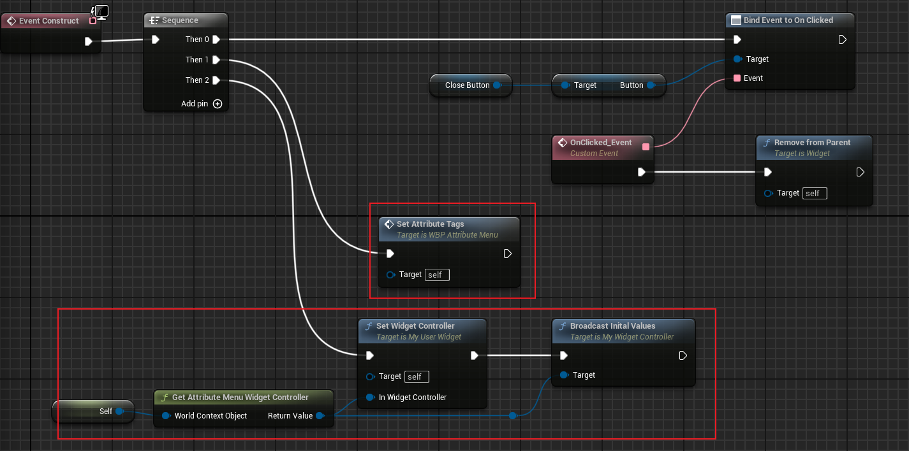

首先设置每一行对应的 `Tag(SetAttributeTags)`：

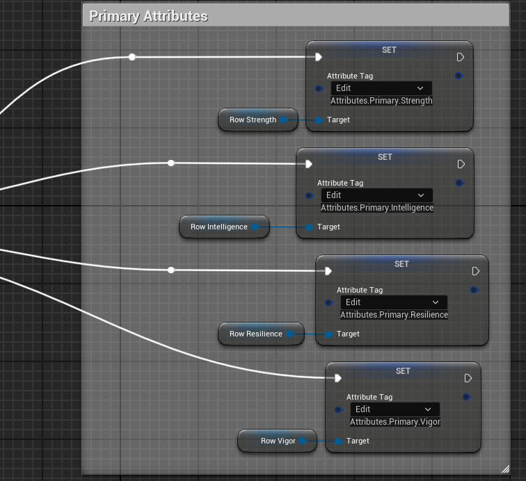

如上图，通过设置 `Tag` 后，其对应的判断：

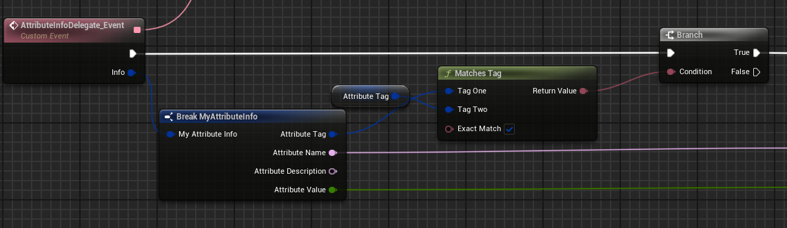

也能够起作用，用于执行特定 `Tag` 下的 `AttributeInfo` 的设置。

最后我们直接广播。

## 最终效果

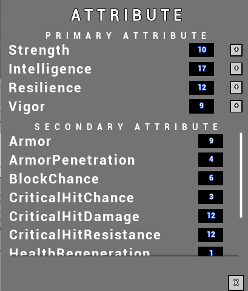

可以看到，我们的 `Attribute Menu` 上正确的排布上 `AttributeSet` 中的信息。

当然，当属性进行改动时，其界面上的值也会进行更改：

这不仅是因为我们在 `WidgetController` 绑定了 `Attribute` 更改时的委托，而且还依赖于我们使用 `Infinite GE` 使我们的 `Secondary Attribute` 根据 `Primary Attribute` 进行改变 （[7. Attribute 深入使用_初始化](./7. Attribute 深入使用_初始化.md)）