## 简介

接下来我们将讲述 `GAS` 中最核心的部分，`Gameplay Ability`。

`GA` 是一个能够异步执行的一个实例，通过 `Ability Task` 可以在不同的时间段执行指定的 `GE`、`Gameplay Cue` 等；

同样的，类似消耗和冷却的功能，`GA` 同样能够支持：

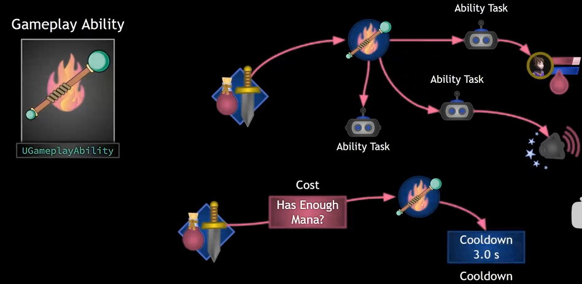

`GA` 使用 `Ability Task` 来执行异步任务，这个异步任务可以在蓝图中通过各种 `Delegate` 来控制流程，当然也可以在 `C++` 中进行控制：

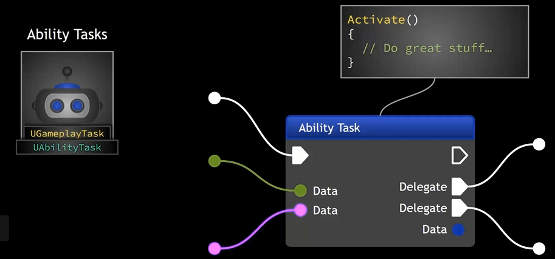

和 `GE` 类似，`ASC` 同样可以通过 `GA Spec` 来激活 `GA`，一般来说 `GA Spce` 存在于服务端，通过复制，在客户端中也可以进行调用：

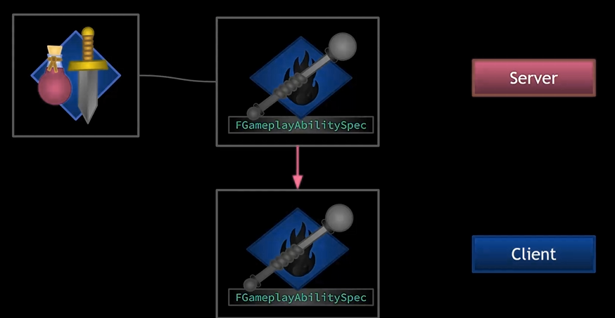

`GA` 通常有三种状态：`Active`、`End`、`Cancel`，只有在 `Active` 状态下在会被激活，`GA` 通常可以自己结束（`End`），或者被外部取消（`Cancel`）：

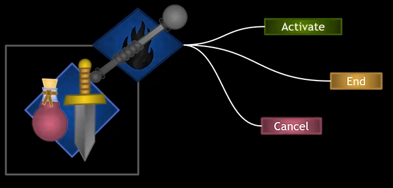

现在我们总结一下 `GA`：

> 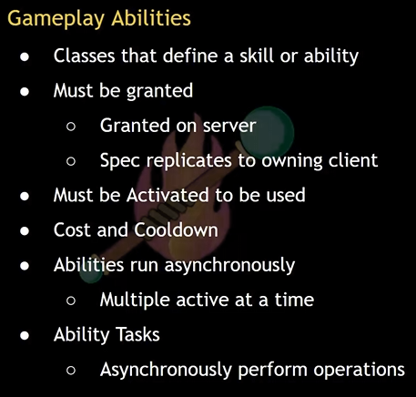
>
> 如上图：
>
> - `GA` 可以定义为一个技能、能力
> - 它必须要被赋予，一般在服务端通过 `GA Spec` 进行创建并赋予；然后将其复制到拥有这个 `GA` 的客户端
> - 只能在 `Active` 下才能使用
> - 拥有消耗和冷却功能
> - `GA` 是异步执行状态，可以在多个时间进行激活
> - 使用 `Ability Task` 可以异步地执行各种操作

## 获得 Gameplay Ability

基于本篇只是一个简介，这里先提前准备一个代码框架，来实现一个基本的获取、激活 `GA` 的操作。

首先准备一个 `GA` 的基类：

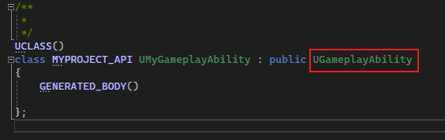

继承自 `UGameplayAbility`，目前什么功能都没有。

紧接着，在我们的 `MyCharacter` 中，我们需要添加 `GA`：

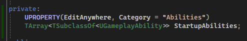

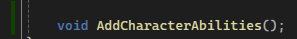

我们这里在 `MyCharacter` 中添加了一个 `TArray<TSubclassOf<UGameplayAbility>>` 的成员，该成员用于记录 `MyCharacter` 中包括了那些类型的 `GA`，这些 `GA` 会在 `Character` 初始化时添加到 `ASC` 中（即执行 `AddCharacterAbilities`）。

即然是添加到 `ASC` 中，我们也得改改 `MyAbilitySystemComponent` 组件：

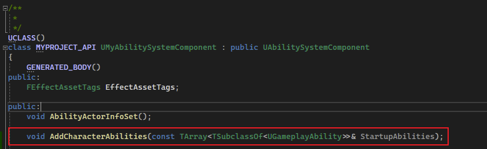

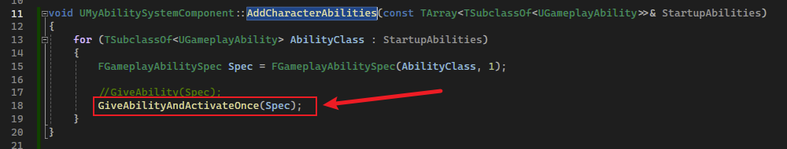

如上图所示，我们同样在 `MyASC` 中添加 `Add` 方法，该方法通过 `GA Class` 来构建 `Spec`，然后通过 `ASC` 的 `GiveAbilityAndActivateOnce` 将其赋予至 `ASC` 中，并且激活这个 `GA`。当使用普通的 `GiveAbility` 方法，则不会激活。

然后我们在 `Character` 中进行调用：

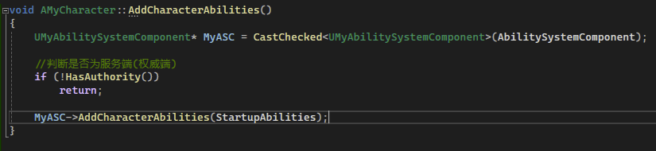

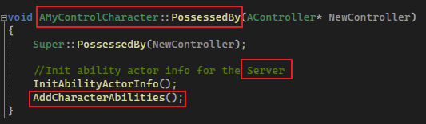

这里使用 `HasAuthority` 判断是否为服务端，在服务端中才能够赋予 `GA`。

## 配置

这里我们创建 `GA` 蓝图类：

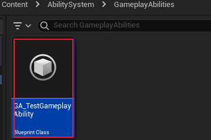

然后在 `Character` 蓝图中进行添加：

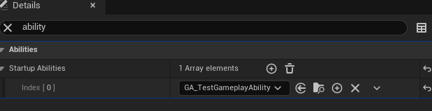

这样我们的 `Character` 就拥有了一个 `GA`。