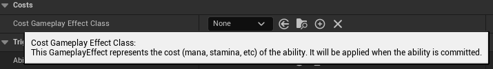

## 简介

在本篇中，将介绍 `GA` 中的各项设置的作用：

## Tags

如上图，在 `GA` 细节面板中，有很多不同类型的 `Tag` 可以进行配置，这些配置可以让 `GA` 有不同的表现：

| Gameplay Tag              | Description                                                  |
| ------------------------- | :----------------------------------------------------------- |
| Ability Tags              | 表示 GA 拥有的 Tag                                           |
| Cancel Abilities with Tag | 当执行这个 GA 时，其他拥有（Ability Tags）这些标签的 GA 将会被取消 |
| Block Abilities with Tags | 当这个 GA 是 Active 状态时，在其他拥有这些标签的 GA 尝试激活时，将会被阻断 |
| Activation Owned Tags     | 将这些 Tag 分配给 GA 的 **激活者**。当 Tag 可被复制时将复制。 |
| Activation Required Tags  | 当 **激活者** Actor / Component 拥有这些 Tag 时，GA 才能被激活 |
| Activation Blocked Tags   | 当 **激活者** Actor / Component 拥有这些 Tag 时，GA 在激活时被阻断 |
| Source Required Tags      | 当 **Source** Actor / Component 拥有这些 Tag 时，GA 才能被激活 |
| Source Blocked            | 当 **Source** Actor / Component 拥有这些 Tag 时，GA 在激活时被阻断 |
| Target Required Tags      | 当 **Target** Actor / Component 拥有这些 Tag 时，GA 才能被激活 |
| Target Blocked Tags       | 当 **Target** Actor / Component 拥有这些 Tag 时，GA 在激活时被阻断 |

## Input

如上图，观察其注释，表示 `GA` 将一直将客户端的输入复制到服务端。这是个不太好的设置。

这里暂不详细介绍，这里保持取消勾选。

## Advance

### Replication Policy

如上图，复制策略，表示是否将 `state` / `event` 进行复制。

### Instancing Policy

`GA` 是一个可以被实例化的类型，其有不同的实例化策略，这些策略会影响某些具体实现：

这些策略的区别如下：

| Instancing Policy       | Description                                                  | Details                                                      |
| ----------------------- | ------------------------------------------------------------ | ------------------------------------------------------------ |
| Instanced Per Actor     | 当 GA 被激活时，会在 Actor 中实例化一个 GA 对象；当再次激活时，这个对象会被重复使用 | 每次激活时共享用一个实例，因此可以存储数据，但是需要手动重置 |
| Instanced Per Execution | 每当 GA 被激活时，都会实例化一个 GA 对象                     | 每次激活都是不同的实例，因此不存储任何数据                   |
| Non-Instanced           | 不会生成对象                                                 | 一般用于静态方法等类型相关操作                               |

> 其实在源码中 `AbilitySystemComponent_Abilities.cpp`：
>
> 
>
> 在 `GiveAbility` 函数中，发现当 `Instance Policy` 为 `InstancedPerActor` 时，即使没有进行 `GA` 激活，也会为其创建一个实例。

### Server Respects Remote Ability Cancellation

服务端是否允许客户端进行 `GA` `Cancel` 操作。

### Net Execution Policy

如上图，`Local` 表示在客户端；`Predicted` 表示预测，即执行后再复制到另外一端。

### Retrigger Instanced Ability

是否允许重新激活一个激活中的 `GA`。

## Cost

消耗：

通过选定一个 `GE` 类型，来确定激活这个 `GA` 需要执行那些 `Attribute` 上的改动（`Cost`）。

## Cooldowns

冷却：

类似 `Cost`，同样需要一个 `GE`，在这个 `GE` 结束之前，都不能够再次激活这个 `GA`。

## 注意事项

这有一些选项是不需要在意、改变的：

> - **Replication Policy**
>
>   这是一个没有用的选项，`EPIC` 同样也声称不要使用它，`GAS` 整个系统对 `GA` 的网络复制做了很多事情，包括 `GA` 会被复制到拥有自己的客户端上，我们无需关心这些事情
>
> - **Server Respects Remote Ability Cancellation**
>
>   默认是勾选上的，虽然说以服务端为准才是正确的，但我们也无需关心这个选项，保持默认即可
>
> - **Replicate Input Directly**
>
>   无需将输入传入服务端，这样会消耗比较多的性能，`EPIC` 同样不鼓励这么做，我们只需要知道即可。

