## 简介

在本篇中，我们将调整输入部分代码，让其可配置。

同样，本篇将介绍如何合理的通过配置 `Input` 来激活 `GA`。

> 这种输入的设计方式，跟 [UE官方工程 Lyra](https://www.bilibili.com/video/BV16B4y197Zy/?spm_id_from=333.788.top_right_bar_window_history.content.click&vd_source=f80853cb93b849ec007e471925aabefb) 相似。

## Input 回顾

现在我们回忆一下之前的输入是如何实现的：（[0.Input](./0.Input,md)）

主要是先通过 `EnhancedInputComponent` 绑定 `InputAction` ：

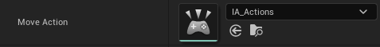

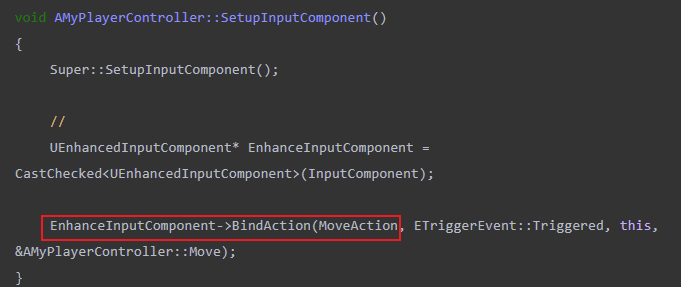

然后通过 `EnhancedInputLocalPlayerSubsystem` 添加输入映射 `AddMappingContext` ：

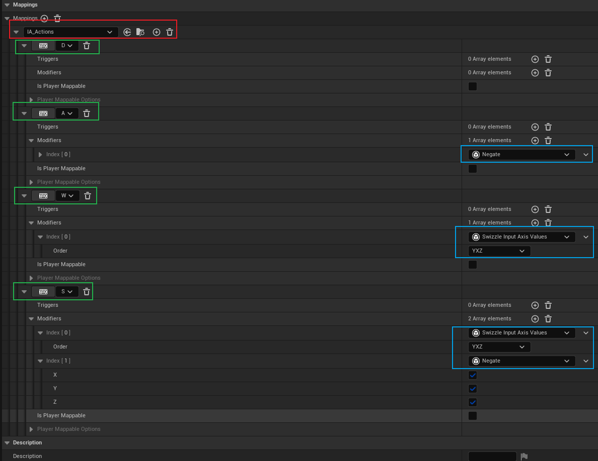

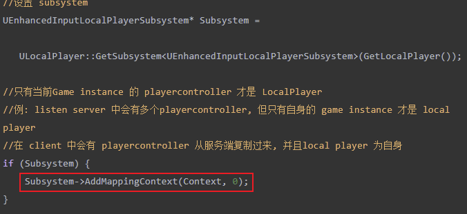

这样当外部有输入时，**<u>`SubSystem` 就会根据添加的映射，找到对应的 `InputAction`，并调用绑定的函数。</u>**

> 如果说按照这种模式，在现在的项目中，如果有多个按键去激活不同的 `GA`，虽然说 <u>`Input Mapping Context` 可以将多个输入映射到同一个 `Action` 上，但到最终执行方法时，执行的是同一个方法</u>。
>
> 因此 <u>为了使不同的输入执行不同的方法，那么就要 **创建多个 `Action`，然后绑定多个函数**</u>。
>
> 这样会频繁地修改 `PlayerController` 部分的代码，这显然不是我们希望的。

基于上述的问题，我们做了如下的输入设计：

> - 将 **<u>`InputAction` 和 `GameplayTag` 进行关联</u>**，通过 `Tag` 来与 `GA` 做一些互动的操作
> - 将 所有的 `InputAction` 的动作分为三类：<u>**按下、按住、松开**</u>，并且只绑定这三个动作
> - 在 **<u>`PlayerController` 中绑定这三个动作</u>**，然后 **<u>在 `InputComponent` 中做实际的内容</u>**

## Input Config

现在来一步步实现上述的设计，我们先将 `InputAction` 和 `GameplayTag` 映射起来，由于这是一个纯数据项的设置，所以使用 `DataAsset` 是一个不错的选择：

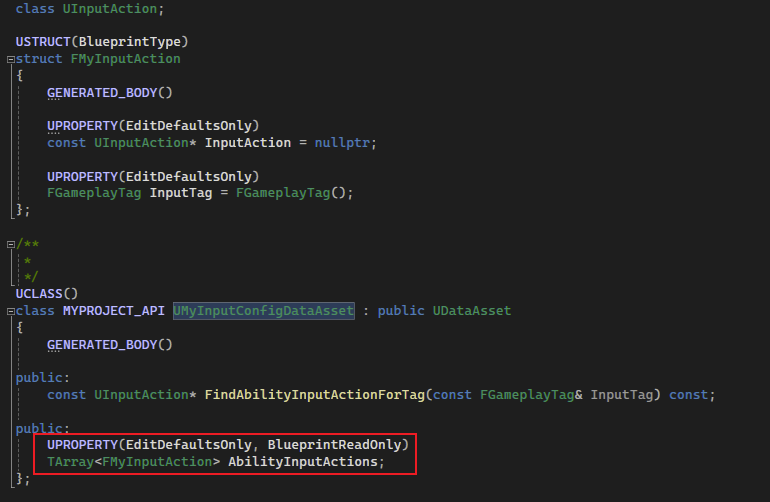

如上图所示，`DataAsset` 中只有一个成员，就是一个 `InputAction` 对应 `Tag` 的数组，紧接着我们去创建不同的 `InputAction`：

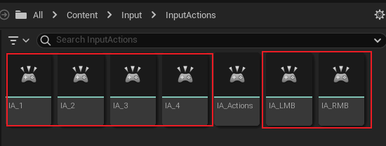

如上图，定义了数字键 `1~4`，以及 `左、右键` 的 `InputAction`，然后需要设置输入动作对应的 `Tag`：

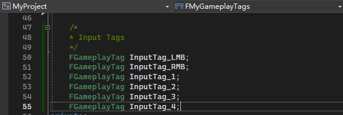

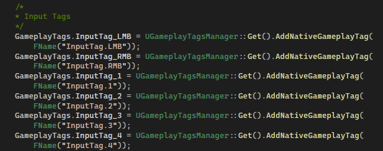

这是在 [8_1.展示数据至 Attribute Menu_01_DataAsset](./8_1.展示数据至 Attribute Menu_01_DataAsset.md) 中定义 `Native Gameplay Tag` 时所用到的类，当 `Tag` 添加完后，在 `DataAsset` 中将其映射起来：

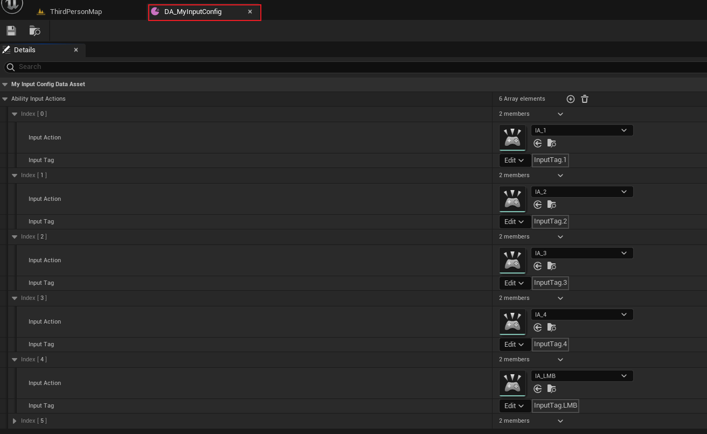

别忘了映射输入：

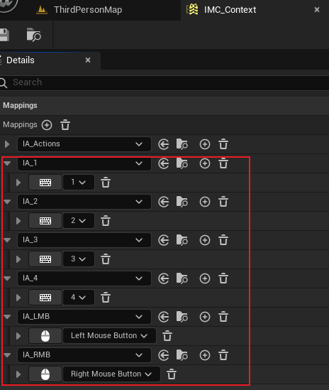

这样第一步的设计，将 `InputAction` 和 `Tag` 对应起来就完成了。

## Input Component

即然已经实现了将 `InputAction` 和 `Tag` 进行关联，那么是时候实现第二个设计，将这些 `InputAction` 同一绑定三个动作：<u>按下、按住、松开</u>。

为了不在 `PlayerController` 做多余的更改，这里使用我们自定义的 `InputComponent` ：

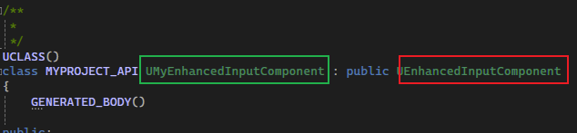

如上图，继承自 `UEnhancedInputComponent`。

对于绑定动作，也在这里实现，不过定义的是一个模板方法（实现也很简单）：

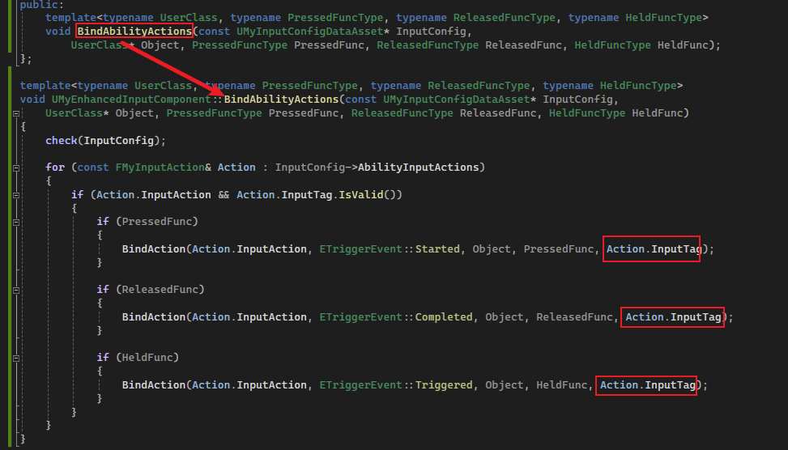

如上图，`BindAbilityActions` 传入的参数中：<u>`InputConfig` 表示需要从中获得关联了 `Tag` 的 `InputAction`</u>；<u>`Object` 表示绑定的对象</u>；<u>剩余的三个参数分别表示 按下、松开、按住 的三个函数类型指针</u>。

这个模板函数做的工作是将 `InputConfig` 中的 `InputAction` 同一进行了三个动作的绑定，并且需要注意的是，<u>**传入的三个函数类型参数，都必须要带有 `FGameplayTag` 参数（红色框）**</u>。

> 这里有三个 `ETriggerEvent` 类型：
>
> - **`Started`** 表示开始，可以表示按下
> - **`Completed`** 表示结束，可以表示松开
> - **`Trigger`** 表示触发，当有输入时就会触发，不仅仅是按下，按住时也会持续触发

## Bind Actions

紧接着我们在 `PlayerController` 中绑定这些动作：

`.h` ：

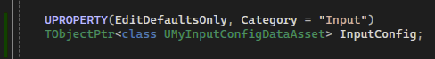

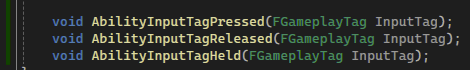

`.cpp`：

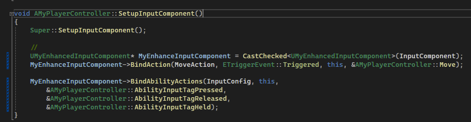

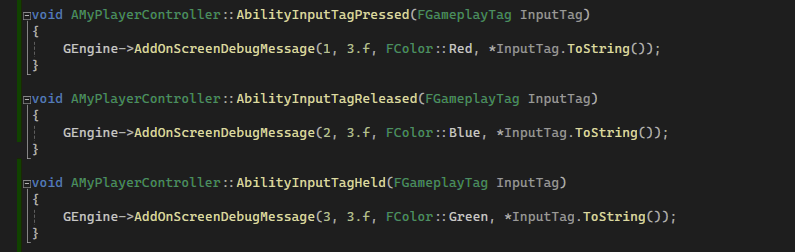

别忘了改一改项目设置：

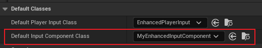

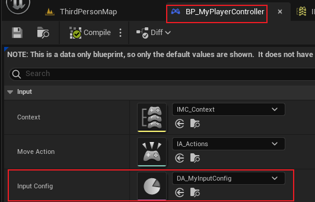

然后运行项目：

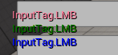

可以看到，所有配置了输入关联的 `Tag`，都正确的显示在了屏幕上。

## Activating Ability

当我们做完了上述的前置工作后，我们便可以开始实现使用输入来激活 `GA`。

首先我们是通过 `Tag` 来确认 `GA` 是否被激活，所以我们要在基类 `UMyGameplayAbility`（[9.Gameplay Ability](./9.Gameplay Ability.md)） 中添加这个 `Tag`，用于配置和标识：

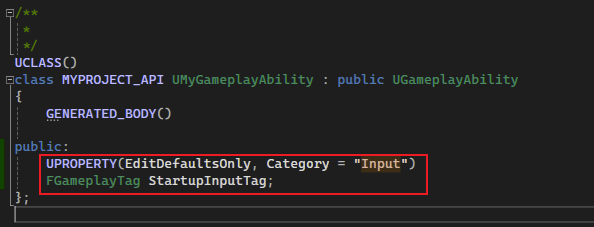

然后我们需要将这些 `Tag` 最好是存放在一个容器中，不然到时需要强制类型转换，是个比较消耗性能的操作，这里 **<u>选用在 `GA Spec` 中的成员 `DynamicAbilityTags`</u>**，这个成员是运行时存放 `Tag` 的统一容器：

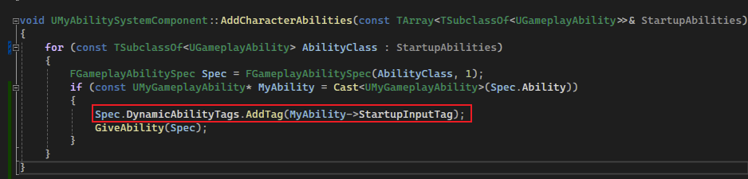

> 目前这些 `Tag` 是要为初始 `Ability` 进行设置的。

然后我们在 `ASC` 中添加 <u>按下、释放、按住</u> 三个方法，用于被 `PlayerController` 转发：

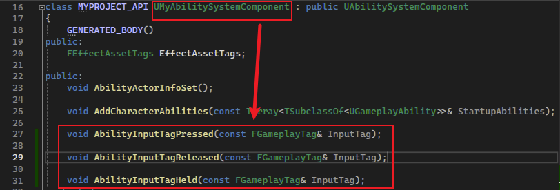

`PlayerController` 转发：

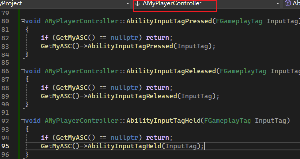

然后我们在 `ASC` 中去激活 `GA`：

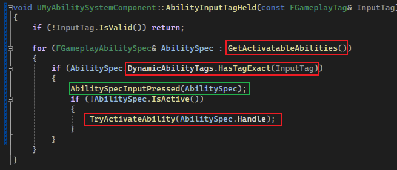

先看红色框部分，首先获得所有可以激活的 `GA`，获取其 `DynamicAbilityTags` 之后，判断有没有对应的 `InputTag`，然后通过 `TryActiveAbility` 将 `GA` 激活。

> 这里的 **绿色框部分**，`AbilitySpecInputPressed` 是 `ASC` 的一个方法：
>
> 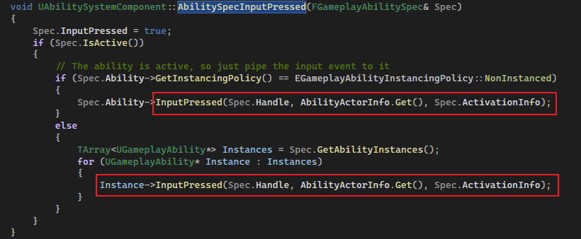
>
> 其源代码部分是调用 `GA` 的 `InputPressed` 方法，而这个方法是一个虚方法：
>
> 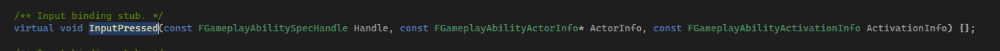
>
> 并且没有实现，其主要作用是让使用者实现这个方法后，通过上述的 `AbilitySpecInputPressed` 可以广播这个 `Input` 操作，提高 `GA` 的灵活性。

### 配置

所有代码已写完，接下来就是配置时刻，我们保持 `Character` 的设置（[9.Gameplay Ability](./9.Gameplay Ability.md)）：

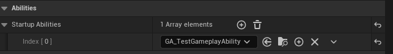

然后我们修改这个 `GA`：

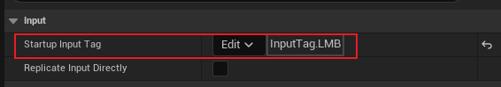

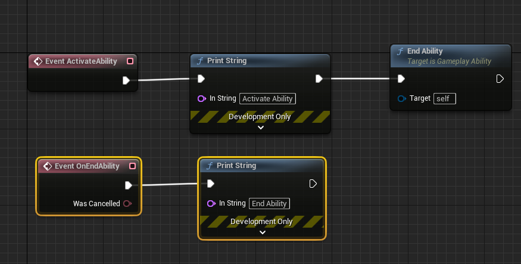

如上图所示，我们添加 `Input Tag`，并且修改 `ActivateAbility` 和 `EndAbility` 事件，当我们按住鼠标时：

我们发现其每帧都在输出，这是因为我们 `Active` 之后立刻就 `End` 了。

我们对蓝图进行修改：

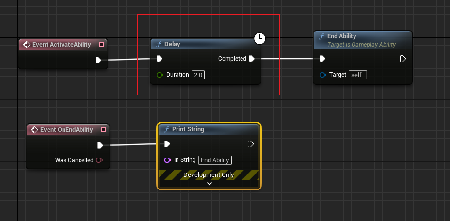

添加一个两秒的计时器，这样我们就不会频繁的激活 `GA`，因为我们做了如下判断：

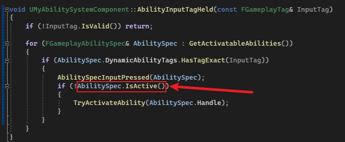

