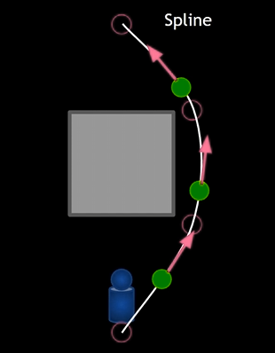
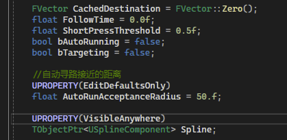
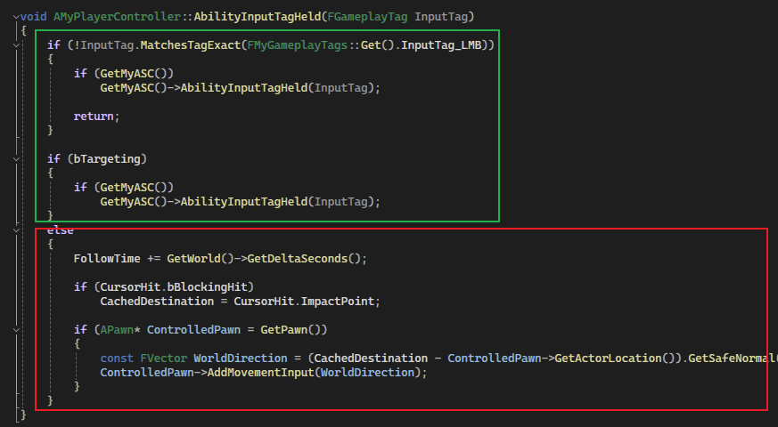
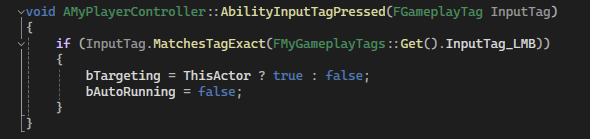
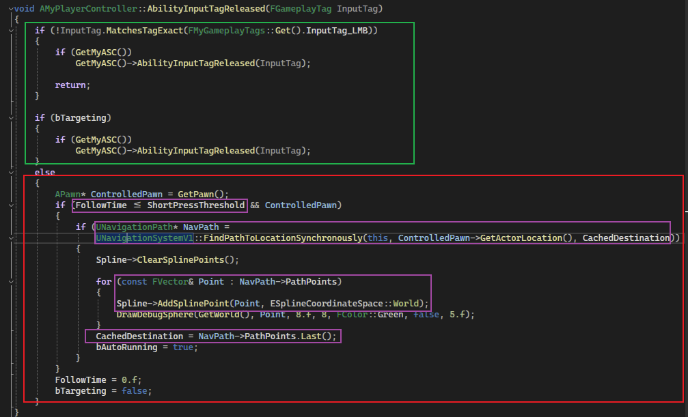
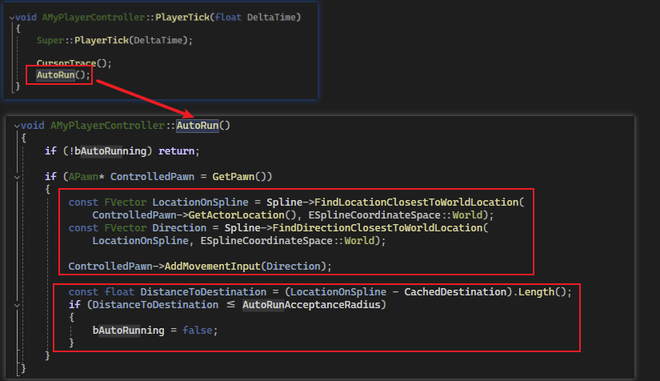
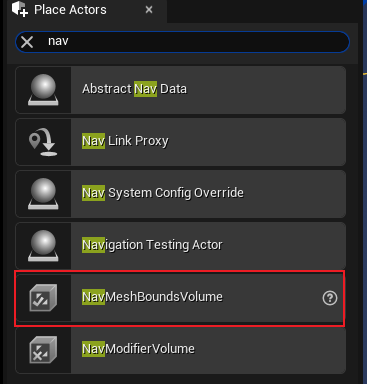
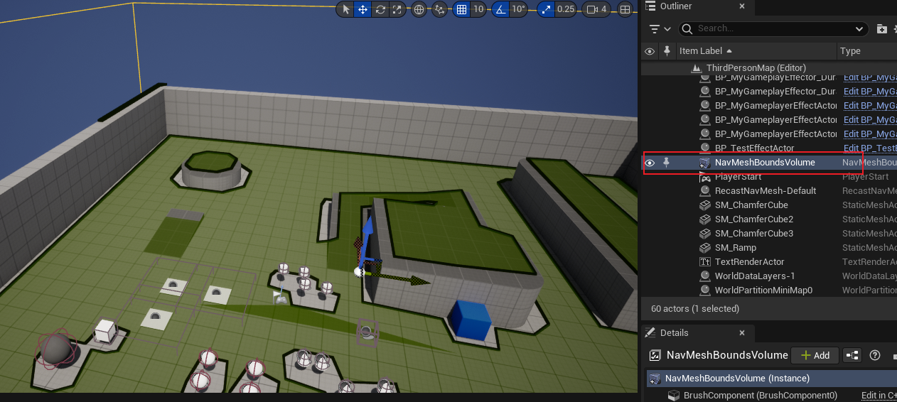
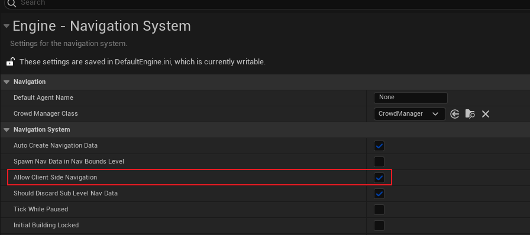

## 简介

类似许多俯视视角的游戏，我们希望通过鼠标点击使角色移动，本篇将讲解如何实现该功能：

如上图所示，当检测到鼠标点击的世界坐标时，通过生成一条 `spline`，使角色能够在有障碍物的前提下，能够平滑的避开障碍物。

> 当然，主要还是通过 `Pawn` 的 `AddMovementInput` 方法，通过 `spline` 可以获得每个方向的具体切线，来达到平滑移动的效果。

> *整个设计参考了 `UE` 的示例工程 `Top Down Game`。*

## 梳理逻辑

这里我们先梳理一下整个操作逻辑：

### 非自动寻路

首先考虑不是自动寻路的情况，在这种情况下我们进行如下操作：

> 1. 当我们 <u>**按住鼠标左键**</u> 时，首先需要获得被点击的位置，而当点击动作发生时，我们需要判断被点击的目标是不是 `AICharacter`，如果是的话，则是判断为触发 `GA`，否则移动。
> 2. 当我们获得点击的位置后，我们需要 <u>**不断地记录这个位置**</u>（因为是按住的操作，当按住时会每帧触发，为了平滑移动，这里需要不断地记录位置）。
> 3. 通过记录的点位，计算好方向后<u>**通过 `AddMovementInput` 来实现角色移动**</u>。

### 自动寻路

自动寻路是一个比较复杂的操作，考虑的因素会相对较多：

> 1. 当我们 <u>**点击鼠标左键**</u> 时，<u>**不仅会触发 `Etrigger::Started` 事件的动作，也会触发 `Etrigger::Trigger` 动作**，因此会同样进入 按住鼠标左键 的方法中</u>。
> 2. 因此为了判断我们这次操作是点击还是按住，我们在 <u>**松开鼠标左键**</u> 的方法中进行判断，即 `Etrigger::Released`。判断条件为 `Hold` 时间是否大于预设时间。
> 3. 通过 `UNavigationSystemV1` 和 `Navigation volume` 获得路径。
> 4. 根据预设的抵达终点范围，在每一帧中让角色根据路径进行移动。

## Player Controller

梳理完逻辑之后，我们来写写代码：

如上图，我们首先添加成员变量，这些变量分别为：

> 1. 缓存目标位置
> 2. 按住左键的持续时间
> 3. 判断是否按住的时间阈值
> 4. 是否为自动寻路
> 5. 是否点击了目标
> 6. 抵达距离终点的最大范围
> 7. Spline，用于记录获取的路径

### 非自动寻路

然后我们先写非自动跟随部分的代码：

如上图，这是按住鼠标左键时，角色跟随移动的逻辑，首先绿色框部分为 `GA` 的触发逻辑；红色框为移动逻辑。

可以看到，`FollowTime` 将持续添加每一帧的时间，用于计算持续按住左键的时间；然后获取点击的位置，最后通过计算 `Direction` 并且通过 `AddMovementInput` 进行角色移动设置。

整体还是非常容易的，效果如下（虽然看不到鼠标，但这就是鼠标按住时的操作🤦‍）：

### 自动寻路

> 其实做完这部分内容后，发现还是有挺多 `Bug` 的。。。
>
> 目前不清楚后续是否还会对其进行优化，鼠标点击移动的方式还是暂时不要用吧。。。。。

首先鼠标点击时，仅仅只是做一些判断而已，没什么操作可言，终点在于 `Released` 时的操作：

同样我们忽略绿色框中 `GA` 的信息，直接看红色框：

> 首先第一个紫色框的判断，这里是判断在玩家释放鼠标左键之前，是按住还是点击的操作；
>
> 如果是点击，则通过 `UNavigationSystemV1` 这个模块，获得路径，然后通过 `Spline` 进行记录；
>
> 最后需要把最后的点缓存起来。

紧接着寻路部分：

我们这里定义一个 `AutoRun` 函数，在每一帧中进行调用：

> 首先第一个红色框，要求计算当前角色里 `Spline` 最近的点，然后通过 `AddMovementInput` 进行平滑寻路；
>
> 然后在最后判断是否里终点的距离抵达了预设值，抵达后直接结束寻路

#### 配置

这里需要一些配置：

首先我们在场景中防止 `NavMeshBoundsVolume`，这样便可以在上图的范围中进行寻路。

> `Navigation` 的内容很多，有机会再补充。

关于多人游戏：

我们需要在项目配置中允许客户端寻路，这样无论服务端还是客户端都可以进行寻路了。