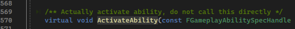

## 简介

在前面做了很多 `GA` 的铺垫，但我们未曾实现任何一个 `GA`，在本篇中，将展示如何实现一个 <u>投射物</u> 的 `GA`（`Projectile`）。

## 投射物

在这里，将投射物定义为一个 `Actor`，我们进行如下定义：

如上图，首先看红色框，很熟悉，是一个能够在 `Overlap` 时做操作的一些声明；这里主要看紫色部分，是一个新组件：`UProjectileMovementComponent`，投射物的移动组件，具体的说明，参考博客：[Unreal 抛体组件(ProjectileMovementComponent)解析](https://www.cnblogs.com/u3ddjw/p/14699817.html) 和 [虚幻4（UE4）子弹相关组件探索1（生成、移动、碰撞、声音、特效）](https://zhuanlan.zhihu.com/p/512656206)。

> 其主要作用是让拥有该组件的 `Actor` 能够根据预设的属性，模拟投射物的运动。

然后我们去到定义：

红色框部分内容很熟悉，参考：[3.Attributes & Effect Actor](./3.Attributes & Effect Actor.md)；关于紫色部分，是 `SphereComponent` 预设的碰撞属性，这些设置主要是为了 `Overlap` 进行服务，具体可参考博客：[ 【UE4 C++】碰撞检测与事件绑定 ](https://www.cnblogs.com/shiroe/p/14691263.html).

## 生成

> 这里推荐阅读 `UGameplayAbility` 的源代码，仅仅只需要看头文件的一些函数签名和注释就好了。
>
> 可以看到很多用法。

### 使用 Socket 确定生成位置

总所都周知，`SpawnActor` 需要传入一个 `Transform` 用于确认生成 `Actor` 时的姿态信息。

在这里，我们使用 `SkeletonMesh` 的 `Socket` 功能，来确认投射物的初始生成位置。

首先来科普一下 `Socket` 的概念：

如上图所示，`Socket` 是 `SkeletonMesh` 的一个类似插槽的概念。

> 当 `Socket` 在创建时，会根据选中的骨骼的 `Transform` 生成一个同样姿态的插槽，并且附加到这根骨骼上；
>
> 我们可以对其进行调整，确定插槽和骨骼的相对位置；
>
> 当这根骨骼因为播放动画等原因，姿态改变时，插槽的姿态信息会根据其相对位置信息而改变，达到附加的效果；

我们可以进行预览：

### 添加插槽

即然了解了插槽的作用，我们可以使用这个插槽，让投射物在插槽的位置中生成。

那么首先我们要为 `MyCharacter` 添加一些接口，因为我们不想根据具体的类型来访问某些变量，这样会导致程序有较高的耦合度。

借用 [7_3.Custom Calculations](./7_3.Custom Calculations.md) 中创建的接口类 `IMyCombatInterface`，为其添加一个获得 `Socket` 位置的接口：

然后我们在 `MyCharacter` 中实现它。

在此之前，我们先添加武器 `SkeletonMesh` ；并且添加 `SocketTipName`，用于根据名字查找插槽的位置：

如上图，其实 `Weapon` 并不是很重要，只是目前没有武器，因此当没武器时，使用角色自身的骨骼体模型查找插槽。

然后我们修改骨骼体模型，并且设置 `SocketTipName`：

这样我的 `Character` 就算完成了。

### Projectile GA

现在投射物有了，并且也知道了其生成位置，接下来我们就要去生成它。

这里我们创建一个 `Projectile` 类型的 `GA`，用于给角色赋予释放投射物的能力：

如上图，首先成员中有一个 `AMyProjectileActor` 的类型，用于后续投射物的生成；另外一个比较重要的方法 `ActivateAbility`，这是 `GA` 基类的方法：

如上图，在 `UGameplayAbility` 的注释中提到，<u>`ActivateAbility` 表示 `GA` 真正的能力是什么，并且在激活时会调用这个方法，这个方法其子类通常希望继承。</u>

> *如何理解？*

当我们创建一个 `GA` 的蓝图类时，在其事件图表中：

有一个在蓝图中需要实现的事件，这个事件在激活 `GA` 时会被调用。而 <u>`ActivateAbility` 方法和这个蓝图事件的作用基本一致，只不过 **在时机上是 `蓝图事件 -> ActivateAbility`，即蓝图事件先触发**。</u>

而我们需要在激活 `GA` 时，生成一个 `Projectile` ：

先看红色部分，在 `GA` 中通过方法 `GetAvatarActorFromActorInfo` 可以获得 `ASC` 的 `Avatar Actor`（参考 [2.项目构建](./2.项目构建.md)），即作用的对象，在本工程中也就是 `ControllCharacter`；

再看紫色部分，通过将 `Avatar Actor` 转换为对应的接口类，可以获得 `SocketTip` 的位置；

在接下来就是绿色部分，这里使用 `SpawnActorDeferred`，表示延迟生成 `Actor`，这里使用延迟生成的目的，是为了在完全生成投射物前，希望先生成对应的 `GE Spec`，最后在通过 `FinishSpawning` 来完全生成投射物。

### 配置

如上图，将 投射物 `Actor`、`GA` 进行设置即可。

## 效果

现在我们通过点击 `AICharacter`，便可以激活 `GA`，但其只能发射一次，因为我们只有激活，没有结束；另外就是这个投射物的方向也不对：

> 虽然还有很多问题，但我们现在能够完整的激活 `GA`，并且实现了一个类似技能的效果，无论如何这都是一个里程碑式的进展。

